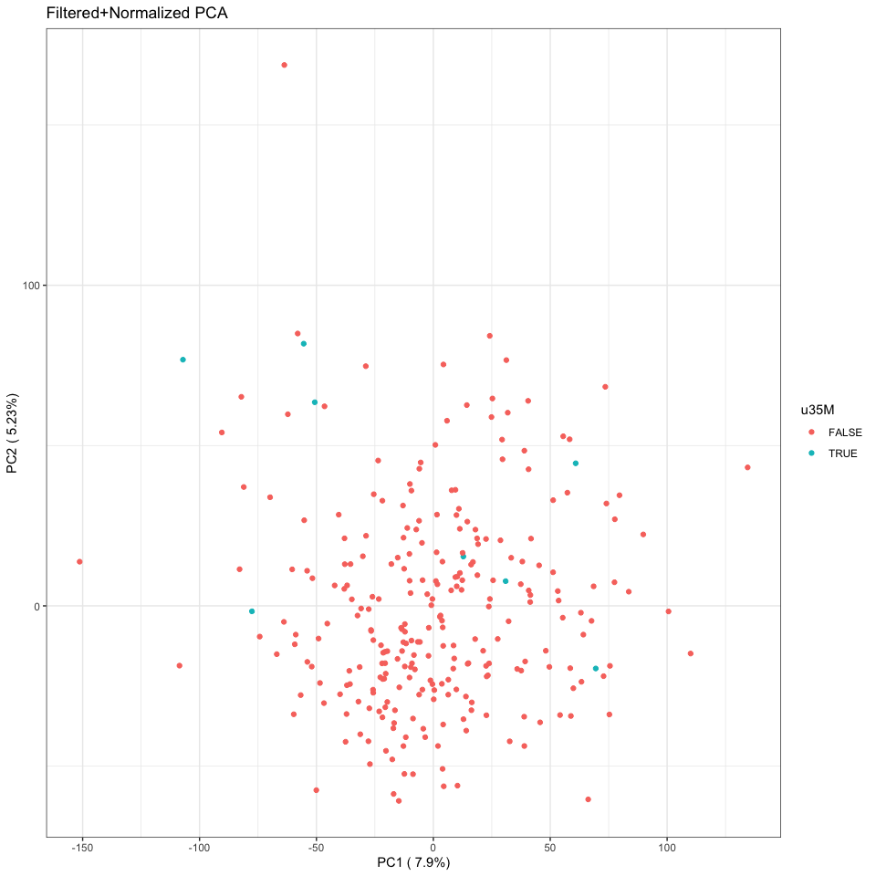

analyze_rnaseq
================
Natalie Davidson
3/11/2021

## RNASeq after Salmon Quant QC

This document is for QC checking for any anomalies in the RNA-Seq
counts:

Subtypes described in here are from the file:
`/reference_data/RNAseq_sample_selection_subtable_removed.tsv` This file
contains the NanoString predicted subtypes. This file was received in
the email from Mollie Barnard “RNAseq pilot sample summary” The original
file is called “RNAseq sample selection.csv” and has the additional
slideshow “NCOCS RNAseq pilot sample summary”.

### read in the RDS file containing gene counts

``` r
#306 samples in the full study were sent for sequencing.

#The following samples failed: 

samps_failed = c("Sample_19291X9", "Sample_19291X35", "Sample_19291X57", "Sample_19291X124", "Sample_19291X175")
failed_df = data.frame(metric=rep("failed", length(samps_failed)),
                       samp_ids = samps_failed)


#The following samples were re-sequenced to get higher yeild:
samps_reseq = c("Sample_19291X8", "Sample_19291X20", "Sample_19291X36", "Sample_19291X37", 
                 "Sample_19291X43", "Sample_19291X60", "Sample_19291X165", "Sample_19291X187",
                "Sample_19291X188", "Sample_19291X205", "Sample_19291X206", "Sample_19291X258", 
                "Sample_19291X262", "Sample_19291X263")
re_seq_df = data.frame(metric=rep("re_seq", length(samps_reseq)),
                       samp_ids = samps_reseq)


#The following samples got fewer than 35M reads
samps_35M = c("Sample_19291X20", "Sample_19291X26", "Sample_19291X36", "Sample_19291X40", 
              "Sample_19291X73", "Sample_19291X100", "Sample_19291X109", "Sample_19291X165", 
              "Sample_19291X297", "Sample_19291X303")
u35M_df = data.frame(metric=rep("u35M", length(samps_35M)),
                       samp_ids = samps_35M)

# the following had low starting material
samps_low_start = c("Sample_19291X38", "Sample_19291X39", "Sample_19291X40", 
                    "Sample_19291X43", "Sample_19291X57", "Sample_19291X60", 
                    "Sample_19291X100", "Sample_19291X102", "Sample_19291X108", 
                    "Sample_19291X124", "Sample_19291X164", "Sample_19291X175", 
                    "Sample_19291X178", "Sample_19291X190", "Sample_19291X197", 
                    "Sample_19291X206", "Sample_19291X227", "Sample_19291X236", 
                    "Sample_19291X237", "Sample_19291X247", "Sample_19291X250", 
                    "Sample_19291X252", "Sample_19291X276", "Sample_19291X293", 
                    "Sample_19291X297")
low_start_df = data.frame(metric=rep("low_start", length(samps_low_start)),
                       samp_ids = samps_low_start)


qc_degradation = do.call(rbind, list(failed_df, re_seq_df, u35M_df, low_start_df))

# add visualization
display_venn(
  list(samps_failed, samps_reseq, samps_35M, samps_low_start),
  category.names = c("Failed" , "Re-Sequenced", "under35M", "low starting material"),
  fill = brewer.pal(n = 4, name = "Set3")
  )
```


### read in the RDS file containing gene counts

# now we need to process the samples that were resequenced

The samples that were re-run are all on lane 3, the original sequencing
of them were done on either lane 1, 2, or 3. To disambiguate them we
select on the most recently sequenced sample

``` r
dim(gene_count_new)
```

    ## [1] 37788   315

``` r
idx_remove = c()
for(curr_samp_id in samps_reseq){
    
    # get the duplicate columns
    dup_idx = grep(curr_samp_id, colnames(gene_count_new))

    # chose the one sequenced later
    # assumes only 2 runs
    idx_min = which.min(as.numeric(date_new[dup_idx,]))
    
    idx_remove = c(idx_remove, dup_idx[idx_min])
}

# now remove them
gene_count_new = gene_count_new[,-idx_remove]
dim(gene_count_new)
```

    ## [1] 37788   301

``` r
assertthat::are_equal(301, ncol(gene_count_new))
```

    ## [1] TRUE

``` r
# remove the lane info
colnames(gene_count_new) = substr(colnames(gene_count_new), 1, nchar(colnames(gene_count_new)) - 5)

# write out the file
gene_count_se = SummarizedExperiment(assays=list(counts=gene_count_new),
                                        rowData=data.frame(gene_id=row.names(gene_count_new)), 
                                        colData=data.frame(gnomex_id = colnames(gene_count_new)))
gene_expr_file = file.path(proj_dir, 
                    "/data/rna_seq_full/salmon_quant_processed/salmon_gene_quant.RDS")
saveRDS(gene_count_se, file = gene_expr_file)
```

Merge together the new and old data sources

    ## [1] TRUE

    ##                 Sample_18341X10 Sample_18341X12 Sample_18341X13 Sample_18341X14
    ## ENSG00000000003         188.000         957.000        1103.000         418.000
    ## ENSG00000000005           3.000           0.000           0.000           0.000
    ## ENSG00000000419         831.999        1293.000        1953.000        2520.000
    ## ENSG00000000457        1489.001         799.999         520.000        1749.000
    ## ENSG00000000460        2121.016        1948.000        1857.001        2823.623
    ##                 Sample_18341X15
    ## ENSG00000000003        1366.001
    ## ENSG00000000005           1.000
    ## ENSG00000000419        1698.000
    ## ENSG00000000457         996.001
    ## ENSG00000000460        2813.910

### plot general stats about the samples

Here we want to see if there are any sample outliers in expression that
may be due to technical artifacts. So lets look at the raw count values
and see if any samples have much higher expression than others.


It’s a bit difficult to see, to lets filter out genes that have too low
expression. To determine this, lets look at the number of genes
remaining at different median cutoffs


A cutoff of greater than zero seems to maintain a more than 50% of
genes, so lets now replot with this filtering. Additionally, using this
level of filtering lets normalize by 85th quantile. We see that samples
43, 42, 35 have the lowest expression overall. We also see that the
samples with low starting material are also in the bottom, so we filter
out the bottom 10 samples.


Write out the data with the appropriate annotations

``` r
samp_metadata = expr_version_df
row.names(samp_metadata) = samp_metadata$sample_id
samp_metadata = samp_metadata[colnames(gene_count),]

# write out the table with sample level annotations
gene_count_se = SummarizedExperiment(assays=list(counts=gene_count),
                                        rowData=data.frame(gene_id=row.names(gene_count_new)), 
                                        colData=samp_metadata)
gene_expr_file = file.path(proj_dir, 
                    "/data/rna_seq_pilot_and_new/salmon_gene_quant_full_annotated.RDS")
saveRDS(gene_count_se, file = gene_expr_file)
```

Now lets do a PCA of ALL samples.



Now lets make a correlation map across samples.


Now lets restrict the analysis to only look at the expression of the
genes that are needed in the UBC classifier. First lets see how many of
these genes have median expression \> 0

All genes pass.


    ## [1] "Missing Genes"

    ## [1] hgnc_symbol     chromosome_name ensembl_gene_id
    ## <0 rows> (or 0-length row.names)

    ## [1] "Duplicated Genes due to ENSG translation"

    ## [1] hgnc_symbol     chromosome_name ensembl_gene_id
    ## <0 rows> (or 0-length row.names)

Now re-do the analysis on this constricted set of genes and all samples


