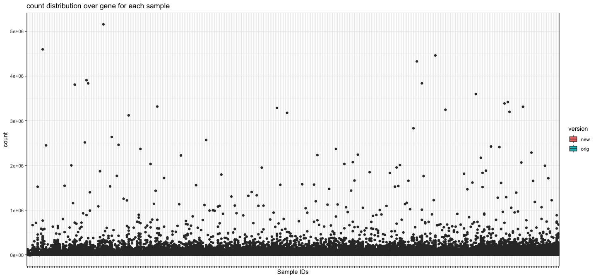

analyze_rnaseq_white_patients
================
Natalie Davidson
3/11/2021

## RNASeq after Salmon Quant QC

This document is for QC checking for any anomalies in the RNA-Seq counts
from the white samples:

Subtypes described in here are from the file:
`/reference_data/RNAseq_sample_selection_subtable_removed.tsv` This file
contains the NanoString predicted subtypes. This file was received in
the email from Mollie Barnard “RNAseq pilot sample summary” The original
file is called “RNAseq sample selection.csv” and has the additional
slideshow “NCOCS RNAseq pilot sample summary”.

### read in the RDS file containing gene counts

``` r
#306 samples in the full study were sent for sequencing.

#The following samples failed: 

samps_failed = c("Sample_20160X13")
failed_df = data.frame(metric=rep("failed", length(samps_failed)),
                       samp_ids = samps_failed)


#The following samples were re-sequenced to get higher yeild:
samps_reseq = c("Sample_20160X104", "Sample_20160X106", "Sample_20160X110", "Sample_20160X112", 
                 "Sample_20160X252", "Sample_20160X253", "Sample_20160X255", "Sample_20160X259")
re_seq_df = data.frame(metric=rep("re_seq", length(samps_reseq)),
                       samp_ids = samps_reseq)

samps_reseq_obs = c("Sample_20160X252", "Sample_20160X253", "Sample_20160X255", "Sample_20160X259")


# the following had low starting material
samps_low_quality = c("Sample_20160X107", "Sample_20160X169", "Sample_20160X171", 
                    "Sample_20160X178", "Sample_20160X185", "Sample_20160X216", 
                    "Sample_20160X217", "Sample_20160X234", "Sample_20160X254", 
                    "Sample_20160X256", "Sample_20160X260", "Sample_20160X262")
low_qual_df = data.frame(metric=rep("low_qual", length(samps_low_quality)),
                       samp_ids = samps_low_quality)


qc_degradation = do.call(rbind, list(failed_df, re_seq_df, low_qual_df))

# add visualization
display_venn(
  list(samps_failed, samps_reseq, samps_low_quality),
  category.names = c("Failed" , "Re-Sequenced", "low quality"),
  fill = brewer.pal(n = 3, name = "Set3")
  )
```


### read in the RDS file containing gene counts

    ## [1] TRUE

# now we need to process the samples that were resequenced

To disambiguate them we select on the most recently sequenced sample

``` r
dim(gene_count_new)
```

    ## [1] 37788   297

``` r
idx_remove = c()
for(curr_samp_id in samps_reseq_obs){
    
    # get the duplicate columns
    dup_idx = grep(curr_samp_id, colnames(gene_count_new))

    # chose the one sequenced later
    # assumes only 2 runs
    idx_min = which.min(as.numeric(date_new[dup_idx]))
    
    idx_remove = c(idx_remove, dup_idx[idx_min])
}

# now remove them
gene_count_new = gene_count_new[,-idx_remove]
dim(gene_count_new)
```

    ## [1] 37788   293

``` r
assertthat::are_equal(293, ncol(gene_count_new))
```

    ## [1] TRUE

``` r
# remove the lane info
#colnames(gene_count_new) = substr(colnames(gene_count_new), 1, nchar(colnames(gene_count_new)) - 5)

# write out the file
gene_count_se = SummarizedExperiment(assays=list(counts=gene_count_new),
                                        rowData=data.frame(gene_id=row.names(gene_count_new)), 
                                        colData=data.frame(gnomex_id = colnames(gene_count_new)))
gene_expr_file = file.path(proj_dir, 
                    "/data/rna_seq_whites/salmon_gene_quant_whites_filtered.RDS")
saveRDS(gene_count_se, file = gene_expr_file)
```

Merge together the new and old data sources

    ##                 Sample_18341X11 Sample_18341X18 Sample_18341X19 Sample_18341X1
    ## ENSG00000000003         819.204         409.001         653.000        169.999
    ## ENSG00000000005           9.000           3.000           0.000          0.000
    ## ENSG00000000419        1566.001        2404.000         815.000        977.000
    ## ENSG00000000457         974.937        1209.951        3287.997       1714.001
    ## ENSG00000000460        1111.776        1260.322        3498.001       1343.998
    ##                 Sample_18341X20
    ## ENSG00000000003         461.666
    ## ENSG00000000005          12.000
    ## ENSG00000000419        1038.000
    ## ENSG00000000457        1736.001
    ## ENSG00000000460        5491.623

### plot general stats about the samples

Here we want to see if there are any sample outliers in expression that
may be due to technical artifacts. So lets look at the raw count values
and see if any samples have much higher expression than others.


It’s a bit difficult to see, to lets filter out genes that have too low
expression. To determine this, lets look at the number of genes
remaining at different median cutoffs


A cutoff of greater than zero seems to maintain a more than 50% of
genes, so lets now replot with this filtering. Additionally, using this
level of filtering lets normalize by 85th quantile. We see that samples
107, 234, 144, 226 have the lowest expression overall. We also see that
the samples with low starting material are also in the bottom, so we
filter out the bottom 10 samples.


Write out the data with the appropriate annotations

``` r
samp_metadata = expr_version_df
row.names(samp_metadata) = samp_metadata$sample_id
samp_metadata = samp_metadata[colnames(gene_count),]

# write out the table with sample level annotations
gene_count_se = SummarizedExperiment(assays=list(counts=gene_count),
                                        rowData=data.frame(gene_id=row.names(gene_count_new)), 
                                        colData=samp_metadata)
gene_expr_file = file.path(proj_dir, 
                    "/data/rna_seq_whites/salmon_gene_quant_full_annotated.RDS")
saveRDS(gene_count_se, file = gene_expr_file)
```

Now lets do a PCA of ALL samples.


Now lets make a correlation map across samples.


Now lets restrict the analysis to only look at the expression of the
genes that are needed in the UBC classifier. First lets see how many of
these genes have median expression \> 0

All genes pass.


    ## [1] "Missing Genes"

    ## [1] hgnc_symbol     chromosome_name ensembl_gene_id
    ## <0 rows> (or 0-length row.names)

    ## [1] "Duplicated Genes due to ENSG translation"

    ## [1] hgnc_symbol     chromosome_name ensembl_gene_id
    ## <0 rows> (or 0-length row.names)

Now re-do the analysis on this constricted set of genes and all samples


