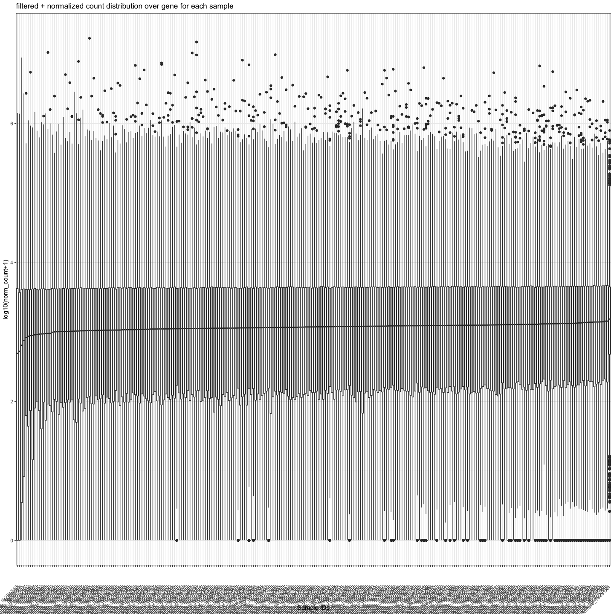
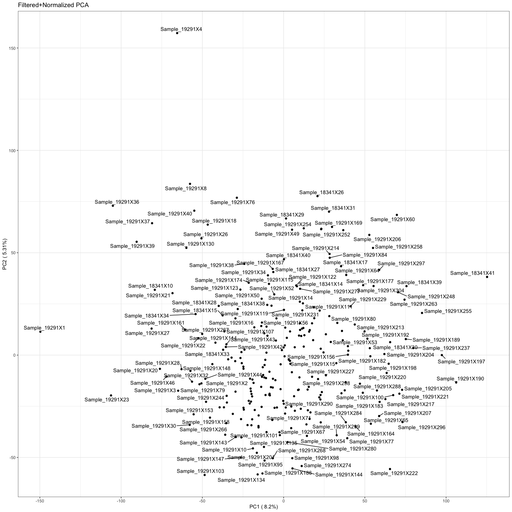

make_lognorm_AACES_data
================
Natalie Davidson
6/14/2021

    ## [1] TRUE

    ## [1] TRUE

    ## [1] TRUE

## Now normalize the samples

## Plot Normalized Samples

## Write out table for Way pipeline
