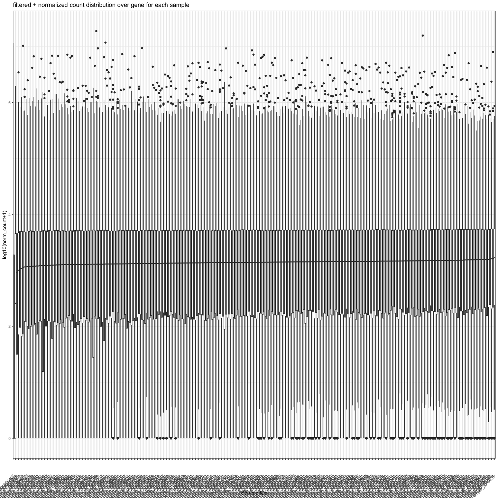
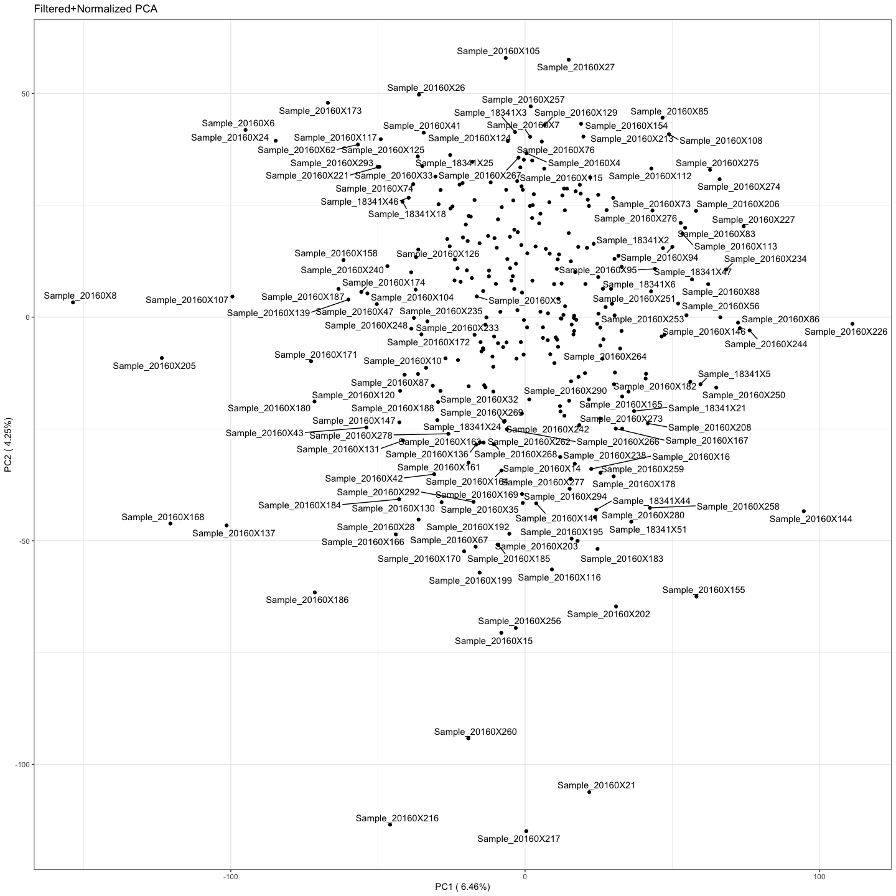

make_lognorm_whites_AACES_data
================
Natalie Davidson
4/05/2021

# read in the sample exclusions

# read in the expression table – raw counts all chromosomes even contigs

    ## [1] TRUE

# read in the expression table – raw counts no contigs

    ## [1] TRUE

    ## [1] TRUE

## Now normalize the samples

    ## [1] "Removed the following genes from consideration:"

    ## [1] 10410

    ##                  median_count        sample_id
    ## Sample_20160X107       0.0000 Sample_20160X107
    ## Sample_20160X234     257.5585 Sample_20160X234
    ## Sample_20160X144     924.8939 Sample_20160X144
    ## Sample_20160X226    1007.7912 Sample_20160X226
    ## Sample_18341X21     1079.9490  Sample_18341X21
    ## Sample_20160X213    1084.2995 Sample_20160X213
    ## Sample_20160X244    1143.7111 Sample_20160X244
    ## Sample_20160X86     1151.0818  Sample_20160X86
    ## Sample_20160X21     1156.0073  Sample_20160X21
    ## Sample_20160X227    1168.3438 Sample_20160X227
    ## Sample_18341X47     1169.5064  Sample_18341X47

## Plot Normalized Samples

## Write out table for Way pipeline
