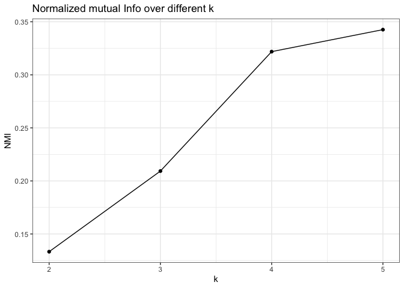
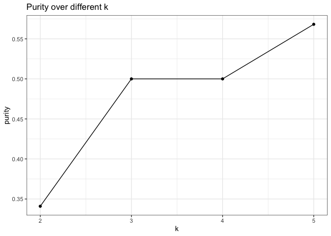
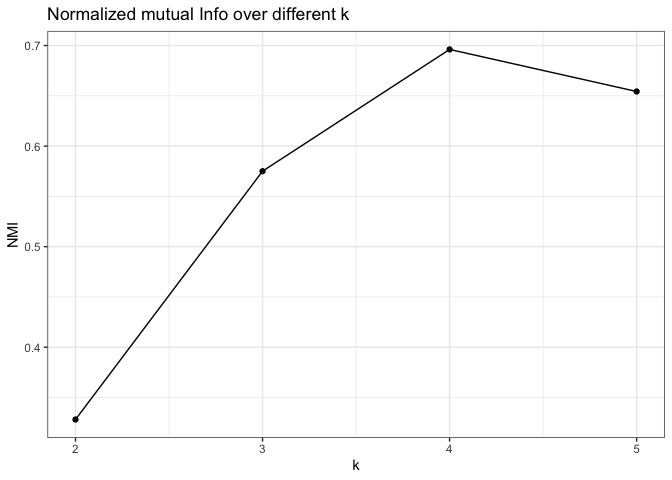
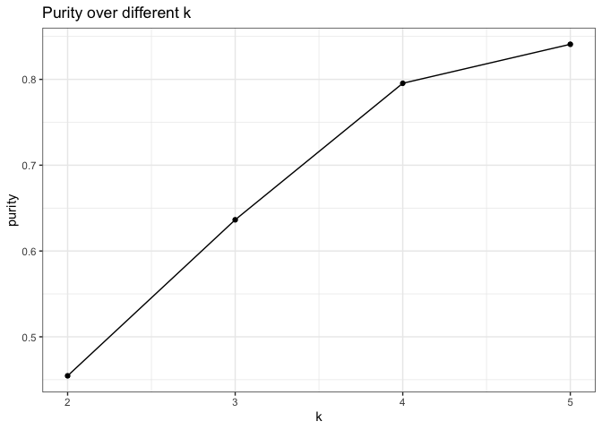

rnaseq\_explore\_clustering
================
Natalie Davidson
4/12/2021

## Overview

This document will try multiple clustering methods on the RNA-Seq data to judge how well the 4 annotated clusters are able to be recapitulated.

**Key file locations:**

-   RNA-Seq expression: `/hgsc_characterization/data/rna_seq/salmon_quant_processed/salmon_gene_quant.RDS`
-   To translate RNA-Seq sample ids to **suid**: `/hgsc_characterization/reference_data/rna_sample_metadata.txt`
-   RNA-Seq ground truth subtypes: `/reference_data/RNAseq_sample_selection_subtable_removed.tsv`
-   UBC gene set: `/reference_data/UBC_genes.txt`

**Helper Scripts**. helper scripts + methods are listed here:

-   `/hgsc_characterization/comparison/utils/file_processing_utils.R`
    -   format\_rnaseq\_data
    -   get\_gene\_id\_map
-   `/hgsc_characterization/analyze_rnaseq/plot_utils.R`
    -   plot\_pca
    -   plot\_umap

## Read in files

``` r
# read in RNASeq files
rnaseq_expr_file = file.path(proj_dir, 
                    "/data/rna_seq/salmon_quant_processed/salmon_gene_quant.RDS")

rnaseq_trans_file = file.path(proj_dir, 
                    "/reference_data/rna_sample_metadata.txt")
rnaseq_dt = format_rnaseq_data(rnaseq_expr_file, rnaseq_trans_file)

# get subtype annotation
subtype_file = file.path(proj_dir, 
                    "/reference_data/RNAseq_sample_selection_subtable_removed.tsv")
subtype_dt = fread(subtype_file)
subtype_dt = unique(subtype_dt[,c("suid", "HGSCsubtype")])

total_dt = merge(subtype_dt, rnaseq_dt, all.y=T)
total_dt = subset(total_dt, !is.na(HGSCsubtype))


# get UBC genes
ubc_file = file.path(proj_dir, "/reference_data/UBC_genes.txt")
ubc_df <- fread(ubc_file)
colnames(ubc_df)[1] = "hgnc_symbol"
gene_ids_df = get_gene_id_map(unique(ubc_df$hgnc_symbol), 
                                filter_type="hgnc_symbol",
                                attributes= c("hgnc_symbol", "ensembl_gene_id"))
ubc_df = merge(as.data.table(gene_ids_df), ubc_df, all.y=T, by="hgnc_symbol")
```

## Process / Normalize Features

``` r
# first process the data using all genes

# scale the gene expression within each sample
total_dt_scaled = total_dt %>%
                        group_by(suid) %>%
                        mutate(scaled_expr = scale(expr))

# now dcast so we can analyze them
total_dt_cast = dcast(total_dt_scaled, suid+HGSCsubtype ~ ensembl_gene_id, value.var="scaled_expr")
row.names(total_dt_cast) = total_dt_cast$suid
total_dt_cast$suid = paste0("Sample_", total_dt_cast$suid)

# now process the data using UBC genes only

# scale the gene expression within each sample
ubc_dt_scaled = subset(total_dt, hgnc_symbol %in% ubc_df$hgnc_symbol) %>%
                        group_by(suid) %>%
                        mutate(scaled_expr = scale(expr))

# now dcast so we can analyze them
ubc_dt_cast = dcast(ubc_dt_scaled, suid+HGSCsubtype ~ ensembl_gene_id, value.var="scaled_expr")
row.names(ubc_dt_cast) = ubc_dt_cast$suid
ubc_dt_cast$suid = paste0("Sample_", ubc_dt_cast$suid)


# only keep top 25% most variable genes otherwise clustering methods take too long
total_dt_cast_unnorm = dcast(total_dt_scaled, 
                             suid+HGSCsubtype ~ ensembl_gene_id, 
                             value.var="expr")
var_genes = apply(total_dt_cast_unnorm[,3:ncol(total_dt_cast_unnorm)], 2, var)
keep_genes = names(var_genes)[which(var_genes >= quantile(var_genes, 0.75))]
total_dt_cast = total_dt_cast[,c("suid", "HGSCsubtype", keep_genes)]
```

## Cluster Visualization


## Key methods for analysis

### K-means method

``` r
#' Helper method to run kmeans
#' over many possibly K's and tracking the
#' nmi and purity for each k.
#' 
#' 
#' @param in_df, dataframe to cluster
#' @param annot_df, annotation df with HGSCsubtype
#' @param cluster_size_keep, k to use in result to return
#' @param cluster_range, range of K
#' @return list, 1: the result for a specified k. 2: cluster performance df
get_kmeans <- function(in_df, annot_df, cluster_size_keep=4, cluster_range=2:5){
    cluster_num_res = NA
    nmi_df = data.frame(k=cluster_range, NMI=NA, purity=NA)
    for(curr_clust_size in cluster_range){
        
        # do kmeans
        km <- Kmeans(in_df, centers = curr_clust_size, nstart = 25, method="spearman")
        cluster_res = km$cluster
        names(cluster_res) = rownames(in_df)
        if(curr_clust_size == cluster_size_keep){
            cluster_num_res = cluster_res
        }
        
        # get nmi metric
        curr_nmi = NMI(km$cluster, annot_df$HGSCsubtype)
        nmi_df$NMI[which(nmi_df$k == curr_clust_size)] = curr_nmi
        
        # get purity metric
        curr_purity = cluster_purity(km$cluster, annot_df$HGSCsubtype)
        nmi_df$purity[which(nmi_df$k == curr_clust_size)] = curr_purity
    }
    
    return(list(cluster_num_res, nmi_df))
    
}
```

### Heirarchical clustering method

``` r
#' Helper method to run hclust, ward.d2
#' 
#' 
#' @param in_df, dataframe to cluster
#' @param annot_df, annotation df with HGSCsubtype
#' @param cluster_range, range of K
#' @param dist_method, distance metric
#' @return list, 1: the result full heirarchical tree. 2: cluster performance df
get_hclust <- function(in_df, annot_df, cluster_range=2:5, dist_method="spearman"){
        
    # do wardD2
    if(dist_method == "spearman"){
        hm <- hclust(as.dist(1-cor(t(in_df), method="spearman")), method="ward.D2")
    }else{
        hm <- hclust(dist(in_df, method=dist_method), method="ward.D2")
    }
    nmi_df = data.frame(k=cluster_range, NMI=NA, purity=NA)
    for(clust_size in cluster_range){
    
        sub_grp <- cutree(hm, k = clust_size)
        
        # get nmi metric
        curr_nmi = NMI(sub_grp, annot_df$HGSCsubtype)
        nmi_df$NMI[which(nmi_df$k == clust_size)] = curr_nmi
        
        # get purity metric
        curr_purity = cluster_purity(sub_grp, annot_df$HGSCsubtype)
        nmi_df$purity[which(nmi_df$k == clust_size)] = curr_purity
    }

    return(list(hm, nmi_df))
    
}
```

### DBScan method

``` r
#' Helper method to run DBScan
#' 
#' 
#' @param in_df, dataframe to cluster
#' @param annot_df, annotation df with HGSCsubtype
#' @param eps_est, epsilon for determining neighbors
#' @return dataframe, cluster result
get_dbscan <- function(in_df, annot_df, eps_est=0.3){
      
    tot_clust_dist = as.dist(1-cor(t(in_df), method="spearman"))
    
    # do dbscan
    dbs <- dbscan(tot_clust_dist, eps = eps_est, minPts = 4)
    cluster_res = dbs$cluster
    names(cluster_res) = rownames(in_df)
    
    
    # get nmi metric
    curr_nmi = NMI(dbs$cluster, annot_df$HGSCsubtype)
    print(paste0("NMI: ", curr_nmi))
    
    # get purity metric
    curr_purity = cluster_purity(dbs$cluster, annot_df$HGSCsubtype)
    print(paste0("Purity: ", curr_purity))
    
    return(cluster_res)

}
```

### Graph plotting method

``` r
# heavily using code from 
# https://drsimonj.svbtle.com/how-to-create-correlation-network-plots-with-corrr-and-ggraph
get_graph_cors <- function(in_df, cluster_res, min_corr){
    
    # make correlation df
    tidy_cors <- t(in_df) %>% 
      correlate(method = "spearman") %>% 
      stretch()
    # make this onto a graph, filtering low correlations
    graph_cors <- tidy_cors %>%
        filter(abs(r) > min_corr) %>%
        graph_from_data_frame(directed = FALSE)
    vert_remaining = vertex_attr(graph_cors, "name", index = V(graph_cors))
    
    # add cluster attribute to graph
    graph_cors <- set_vertex_attr(graph_cors, name="cluster", 
                                  index = V(graph_cors), 
                                  cluster_res[vert_remaining])

    return(graph_cors)
}
```

## Cluster Analyses

### K-means all genes


    ##             substr.names.cluster4_res...start...1..stop...6.
    ## cluster4_res C1.MES C2.IMM C4.DIF C5.PRO
    ##            1      1      1      1      0
    ##            2      0      0      1      1
    ##            3      3      0      1      2
    ##            4      7      8     12      6

### K-means UBC genes


    ##             substr.names.cluster4_res...start...1..stop...6.
    ## cluster4_res C1.MES C2.IMM C4.DIF C5.PRO
    ##            1      0      0      1      0
    ##            2      0      0      1      0
    ##            3     11      3      3      4
    ##            4      0      6     10      5

### Heirarchical clustering all genes, ward.d2, euclidean


    ##            substr.names.cluster_res...start...1..stop...6.
    ## cluster_res C1.MES C2.IMM C4.DIF C5.PRO
    ##           1      7      3      4      1
    ##           2      1      4      7      2
    ##           3      3      2      1      0
    ##           4      0      0      3      6

### Heirarchical clustering UBC genes, ward.d2, euclidean



    ##            substr.names.cluster_res...start...1..stop...6.
    ## cluster_res C1.MES C2.IMM C4.DIF C5.PRO
    ##           1      0      0      8      0
    ##           2      9      5      2      7
    ##           3      2      0      2      2
    ##           4      0      4      3      0

### Heirarchical clustering all genes, spearman distance ward.d2



    ##            substr.names.cluster_res...start...1..stop...6.
    ## cluster_res C1.MES C2.IMM C4.DIF C5.PRO
    ##           1      7      5      4      0
    ##           2      0      0      4      8
    ##           3      4      4      5      0
    ##           4      0      0      2      1

### Heirarchical clustering UBC genes, spearman, ward.d2



    ##            substr.names.cluster_res...start...1..stop...6.
    ## cluster_res C1.MES C2.IMM C4.DIF C5.PRO
    ##           1      0      0      7      0
    ##           2      0      8      6      0
    ##           3     11      1      0      0
    ##           4      0      0      2      9

### DBScan all genes


    ## [1] "NMI: 0.0712392424299902"
    ## [1] "Purity: 0.340909090909091"


    ##            substr.names.cluster_res...start...1..stop...6.
    ## cluster_res C1.MES C2.IMM C4.DIF C5.PRO
    ##           0      0      1      4      4
    ##           1     11      8     11      5

### DBScan UBC genes


    ## [1] "NMI: 0.0297095813196278"
    ## [1] "Purity: 0.340909090909091"


    ##            substr.names.cluster_res...start...1..stop...6.
    ## cluster_res C1.MES C2.IMM C4.DIF C5.PRO
    ##           0      0      2      2      1
    ##           1     11      7     13      8
