test_SAM_performance
================
Natalie Davidson
22/06/2022

## run simulated DE on data from Way pipeline

### get RNA-Seq data to be run in Way pipeline

The goal of this notebook is to see if the RNA-Seq data from the new
AACES study can be run in the Way pipeline. Currently, the Way pipeline
performs a differential expression test that identifies differentially
expressed genes between clusters. The pipeline currently assumes
microarray data and uses SAM to perform the test. So we will compare
results using SAM and two other RNA-Seq specific methods. If SAM
performs reasonably well in comparison to the other methods, we will
continue using SAM.

Comparison will be done on:

1)  SAM using log10(RNA-Seq counts)
2)  EdgerR using normalized counts
3)  DESeq using raw counts

### simulate differential expression

We are using binomial thinning on our input data in order to simulate
differential expression between two randomly partitioned groups.

    ## [1] 0.5000268

### run SAM

Now run the differential expression test

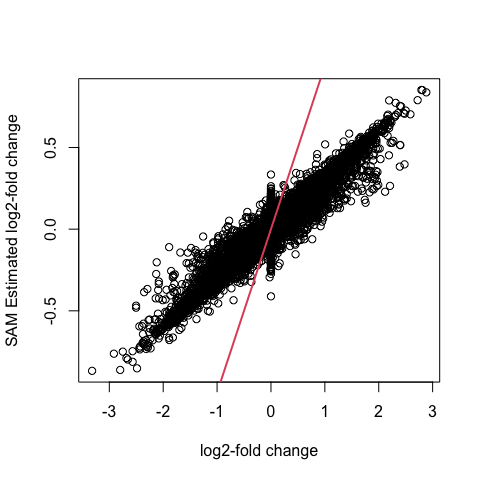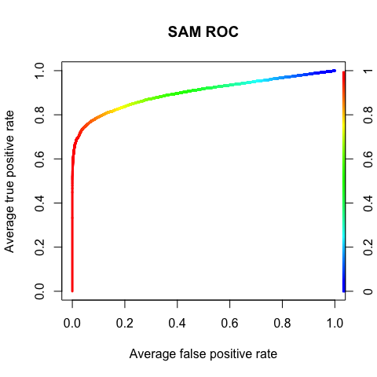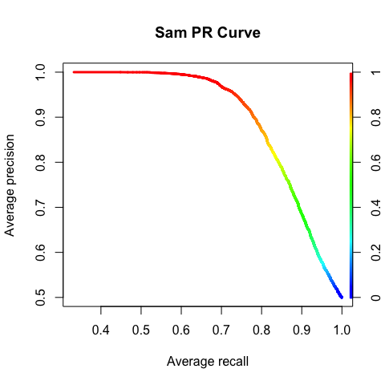

### check SAM

Since we have ground truth, report the performance

    ## Confusion Matrix and Statistics
    ## 
    ##           Reference
    ## Prediction    0    1
    ##          0 9077  260
    ##          1 2694 6642
    ##                                          
    ##                Accuracy : 0.8418         
    ##                  95% CI : (0.8365, 0.847)
    ##     No Information Rate : 0.6304         
    ##     P-Value [Acc > NIR] : < 2.2e-16      
    ##                                          
    ##                   Kappa : 0.6836         
    ##                                          
    ##  Mcnemar's Test P-Value : < 2.2e-16      
    ##                                          
    ##             Sensitivity : 0.9623         
    ##             Specificity : 0.7711         
    ##          Pos Pred Value : 0.7114         
    ##          Neg Pred Value : 0.9722         
    ##              Prevalence : 0.3696         
    ##          Detection Rate : 0.3557         
    ##    Detection Prevalence : 0.5000         
    ##       Balanced Accuracy : 0.8667         
    ##                                          
    ##        'Positive' Class : 1              
    ## 

### make SAM QQ

Check test calibration

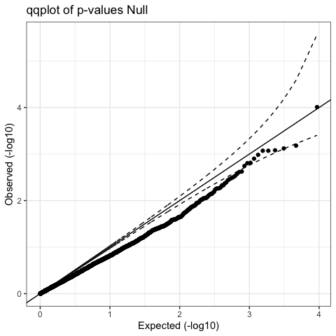

### run limma-voom

Now run the differential expression test using edgeR

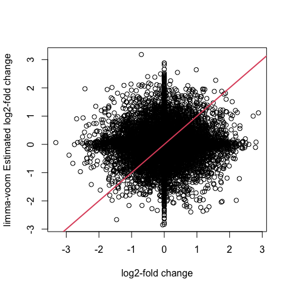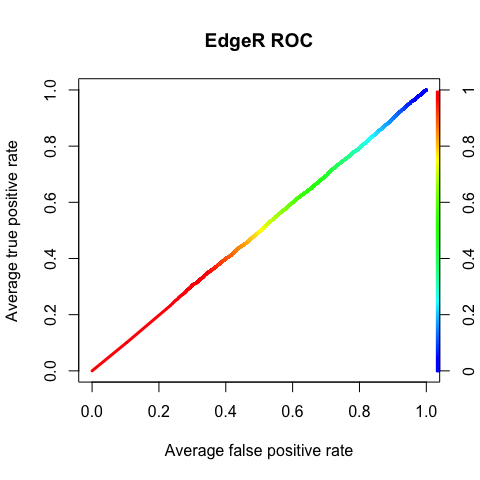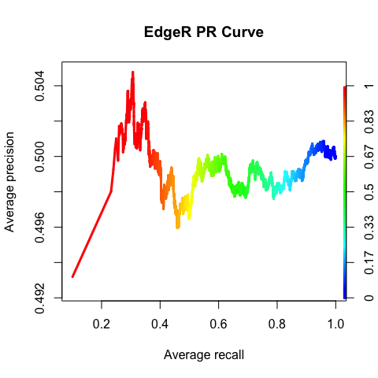

### QC

Check performance

    ## Confusion Matrix and Statistics
    ## 
    ##           Reference
    ## Prediction    0    1
    ##          0 5962 3375
    ##          1 5952 3384
    ##                                           
    ##                Accuracy : 0.5005          
    ##                  95% CI : (0.4933, 0.5077)
    ##     No Information Rate : 0.638           
    ##     P-Value [Acc > NIR] : 1               
    ##                                           
    ##                   Kappa : 0.001           
    ##                                           
    ##  Mcnemar's Test P-Value : <2e-16          
    ##                                           
    ##             Sensitivity : 0.5007          
    ##             Specificity : 0.5004          
    ##          Pos Pred Value : 0.3625          
    ##          Neg Pred Value : 0.6385          
    ##              Prevalence : 0.3620          
    ##          Detection Rate : 0.1812          
    ##    Detection Prevalence : 0.5000          
    ##       Balanced Accuracy : 0.5005          
    ##                                           
    ##        'Positive' Class : 1               
    ## 

### make limma-voom QQ

check calibration

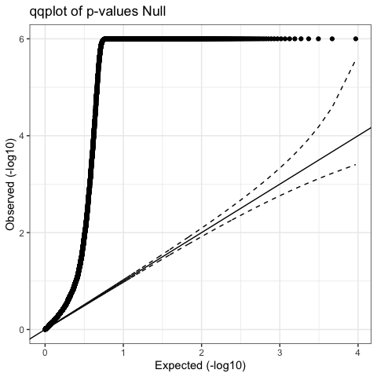

### run DESeq

Now run the differential expression test using DESeq2

    ## [1] "Intercept"   "cond_1_vs_0"

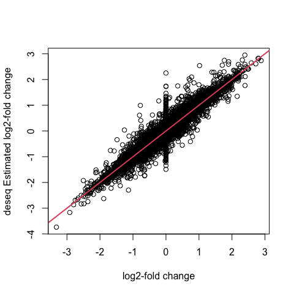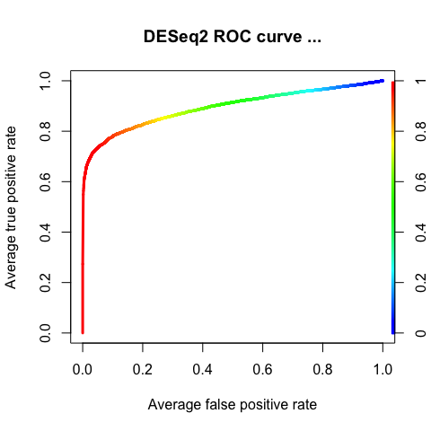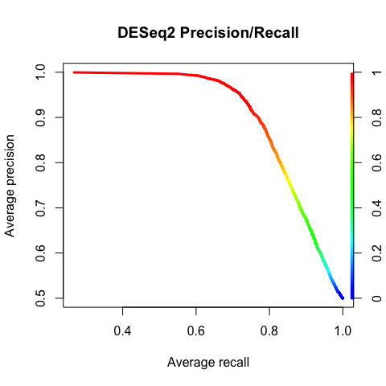

### QC DESeq

get performance

    ## Confusion Matrix and Statistics
    ## 
    ##           Reference
    ## Prediction    0    1
    ##          0 8662  675
    ##          1 2297 7039
    ##                                           
    ##                Accuracy : 0.8408          
    ##                  95% CI : (0.8355, 0.8461)
    ##     No Information Rate : 0.5869          
    ##     P-Value [Acc > NIR] : < 2.2e-16       
    ##                                           
    ##                   Kappa : 0.6817          
    ##                                           
    ##  Mcnemar's Test P-Value : < 2.2e-16       
    ##                                           
    ##             Sensitivity : 0.9125          
    ##             Specificity : 0.7904          
    ##          Pos Pred Value : 0.7540          
    ##          Neg Pred Value : 0.9277          
    ##              Prevalence : 0.4131          
    ##          Detection Rate : 0.3770          
    ##    Detection Prevalence : 0.5000          
    ##       Balanced Accuracy : 0.8514          
    ##                                           
    ##        'Positive' Class : 1               
    ## 

### make DESeq2 QQ

check calibrations

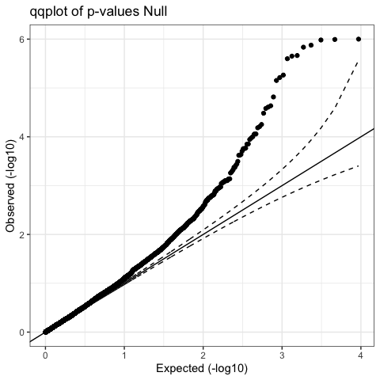

### Conclusion

In conclusion, we find that SAM performs equally as well as DESeq2 and
outperforms edgeR. Therefore, we will keep using SAM and make sure we
log10 the RNA-Seq counts.
