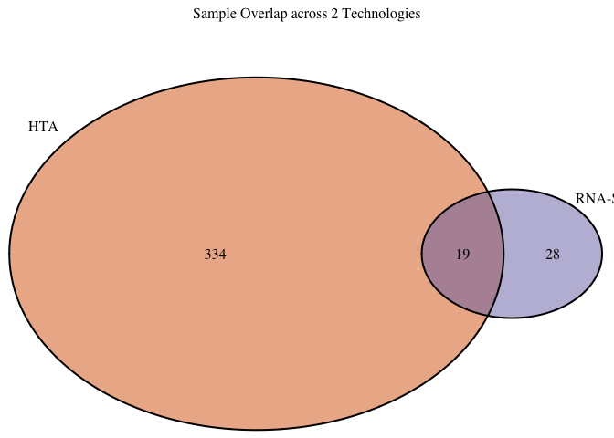

rna\_degradation\_tech\_comparison
================
Natalie Davidson
5/7/2021

``` r
knitr::opts_chunk$set(echo = TRUE)
require(here)
```

    ## Loading required package: here

    ## here() starts at /Users/natalie/Documents/projects/greenelab/checkouts/hgsc_characterization

``` r
require(data.table)
```

    ## Loading required package: data.table

``` r
require(pheatmap)
```

    ## Loading required package: pheatmap

``` r
require(dplyr)
```

    ## Loading required package: dplyr

    ## 
    ## Attaching package: 'dplyr'

    ## The following objects are masked from 'package:data.table':
    ## 
    ##     between, first, last

    ## The following objects are masked from 'package:stats':
    ## 
    ##     filter, lag

    ## The following objects are masked from 'package:base':
    ## 
    ##     intersect, setdiff, setequal, union

``` r
require(ggplot2)
```

    ## Loading required package: ggplot2

``` r
require(ggrepel)
```

    ## Loading required package: ggrepel

``` r
require(ggcorrplot)
```

    ## Loading required package: ggcorrplot

``` r
require(car)
```

    ## Loading required package: car

    ## Loading required package: carData

    ## 
    ## Attaching package: 'car'

    ## The following object is masked from 'package:dplyr':
    ## 
    ##     recode

``` r
proj_dir = here()
source(file.path(proj_dir, "/comparison/utils/file_processing_utils.R"))
source(file.path(proj_dir, "/analyze_rnaseq/plot_utils.R"))
```

## Overview

This document will try to understand if there are technical factors that cause the HTA and RNA-Seq technologies to differ. To do this we will need the expression tables and metadata table. The data is located in 2 repos: [hgsc\_characterization](https://github.com/greenelab/hgsc_characterization/) and [aaces\_ovarian](https://github.com/greenelab/aaces_ovarian/)

To re-run this analysis, it is assumed that you are in the hgsc\_characterization Rproj and both repos are in a shared folder.

**Expression Table file locations:**

-   RNA-Seq expression:
    -   repo: [hgsc\_characterization](https://github.com/greenelab/hgsc_characterization/)
    -   location: `/hgsc_characterization/data/rna_seq/salmon_quant_processed/salmon_gene_quant.RDS`
-   HTA expression:
    -   repo: [aaces\_ovarian](https://github.com/greenelab/aaces_ovarian/)
    -   location: `/aaces_ovarian/output/AACES_expression_scanned.txt`

**Sample ID mapping**. The sample ID used to index all samples in this analysis is the **suid**.

-   HTA sample IDs
    -   HTA sample IDs look like: 5716\_aaaaa\_aaaaaa\_HTA.CEL where a is 0-9.
    -   To translate HTA sample ids to **suid**: `/aaces_ovarian/data/exclusion_data.tsv`
-   RNA-Seq expression:
    -   RNA-Seq sample IDs look like 18341Xaa where a is 0-9.
    -   To translate RNA-Seq sample ids to **suid**: `/hgsc_characterization/reference_data/rna_sample_metadata.txt`

**Metadata**

-   Sample Type Annotation
    -   `/reference_data/RNAseq_sample_selection_subtable_removed.tsv`
    -   The sample subtype used to find sample patterns
    -   **HGSCsubtypeFinal** and **race** are the columns of interest.
-   HTA QC file
    -   `reference_data/5716_Project_Summary_HTA_qc_metrics.tsv`
    -   RNA concentration information for HTA samples
-   RNA QC file
    -   `reference_data/rna_sample_metadata.txt`
    -   RNA concentration information for RNA-Seq samples

**Helper Scripts**. helper scripts + methods are listed here:

-   `/hgsc_characterization/comparison/utils/file_processing_utils.R`
    -   format\_nanostring\_data
    -   format\_hta\_data
    -   format\_rnaseq\_data
    -   get\_gene\_id\_map
-   `/hgsc_characterization/analyze_rnaseq/plot_utils.R`
    -   display\_venn
    -   plot\_pca

## Read in files

### Read each data source

``` r
# load expression data
hta_expr_file = file.path(proj_dir, 
                    "../aaces_ovarian/output/AACES_expression_scanned.txt")
hta_trans_file = file.path(proj_dir,
                           "../aaces_ovarian/data/exclusion_data.tsv")
hta_dt = format_hta_data(hta_expr_file, hta_trans_file)


rnaseq_expr_file = file.path(proj_dir, 
                    "/data/rna_seq/salmon_quant_processed/salmon_gene_quant.RDS")

rnaseq_trans_file = file.path(proj_dir, 
                    "/reference_data/rna_sample_metadata.txt")
rnaseq_dt = format_rnaseq_data(rnaseq_expr_file, rnaseq_trans_file)
```

### Read in the meta data

``` r
# get subtype and race annotation
subtype_file = file.path(proj_dir, 
                    "/reference_data/RNAseq_sample_selection_subtable_removed.tsv")
subtype_dt = fread(subtype_file)
subtype_dt = unique(subtype_dt[,c("suid", "HGSCsubtype", "diagyear", "race")])

# get HTA RNA info
hta_qc_file = file.path(proj_dir, 
                    "/reference_data/5716_Project_Summary_HTA_qc_metrics.tsv")
hta_qc_dt = fread(hta_qc_file)
hta_qc_dt = subset(hta_qc_dt, select=c(2,3))
colnames(hta_qc_dt) = c("suid", "hta_conc")

# get RNAseq RNA info
rna_qc_file = file.path(proj_dir, 
                    "/reference_data/rna_sample_metadata.txt")
rna_qc_dt = fread(rna_qc_file)
rna_qc_dt = subset(rna_qc_dt, select=c(1,5,9))
colnames(rna_qc_dt) = c("rna_conc", "suid", "rna_rin")
```

### Check sample overlap

``` r
hta_suid = unique(na.omit(hta_dt$suid))
rnaseq_suid = unique(na.omit(rnaseq_dt$suid))

samp_per_tech = list(hta = hta_suid,
                     rnaseq = rnaseq_suid)
display_venn(samp_per_tech,
            category.names = c("HTA", "RNA-Seq"),
            fill = c("#D95F02", "#7570B3"),
            main = "Sample Overlap across 2 Technologies")
```



## compare the data

### Calculate the correlations of matched samples

``` r
# merge the expression tables together
colnames(hta_dt)[4] = "hta_expr"
colnames(rnaseq_dt)[4] = "rnaseq_expr"
expr_dt = merge(hta_dt, rnaseq_dt)

# to make technologies comparable scale within each sample
expr_dt = expr_dt %>%
            group_by(suid) %>%
            mutate(scaled_rna_expr = scale(rnaseq_expr))

expr_dt = expr_dt %>%
            group_by(suid) %>%
            mutate(scaled_hta_expr = scale(hta_expr))


# calculate the correlations
expr_corr_dt = subset(expr_dt,
                      select = c("suid", 
                                  "ensembl_gene_id", 
                                  "scaled_rna_expr", 
                                  "scaled_hta_expr")) %>%
                group_by(suid) %>% 
                summarise(kendall_corr = cor(scaled_rna_expr, scaled_hta_expr, method = "kendall")) 

# add meta data
expr_corr_dt = Reduce(merge, 
                      list(expr_corr_dt, subtype_dt, hta_qc_dt, rna_qc_dt))

print(expr_corr_dt)
```

    ##     suid kendall_corr HGSCsubtype diagyear  race hta_conc rna_conc rna_rin
    ## 1  41736    0.4026203      C2.IMM     1999 Black     7.35   631.70     1.9
    ## 2  42282    0.4176877      C1.MES     1999 Black     7.36   314.00     2.0
    ## 3  45369    0.4554906      C4.DIF     2002 Black     6.96   331.69     1.2
    ## 4  45809    0.2065772      C5.PRO     2002 Black     8.12   116.50     1.7
    ## 5  46196    0.4192562      C4.DIF     2003 Black     9.49   931.30      NA
    ## 6  46619    0.3307756      C5.PRO     2004 Black     8.39   383.50     1.1
    ## 7  46727    0.4010175      C5.PRO     2004 Black     8.75   585.20     1.7
    ## 8  46782    0.3337550      C2.IMM     2004 Black     8.34   557.60      NA
    ## 9  46784    0.4441047      C1.MES     2004 Black     7.82   470.60     2.5
    ## 10 47003    0.4842933      C4.DIF     2004 Black     6.94   403.90     1.8
    ## 11 47180    0.4029697      C4.DIF     2004 Black     7.55   544.30     1.5
    ## 12 47251    0.2841669      C1.MES     2005 Black     8.45   475.10     2.2
    ## 13 47255    0.3398919      C4.DIF     2005 Black    10.42   355.18     1.3
    ## 14 47261    0.4938472      C5.PRO     2005 Black     6.38   208.60     1.8
    ## 15 47791    0.3024389      C4.DIF     2006 Black     8.18   629.65     1.2
    ## 16 47916    0.4040209      C4.DIF     2006 Black     7.27   358.00     1.5
    ## 17 47927    0.2300372      C1.MES     2006 Black     8.15   183.50      NA
    ## 18 48002    0.4607679      C1.MES     2006 Black     9.37   279.70     1.3
    ## 19 48110    0.3144297      C4.DIF     2006 Black     8.77   199.30     1.5

### Run regression analysis

``` r
# plot response variable
ggplot(expr_corr_dt, aes(x=kendall_corr)) +
        geom_histogram(binwidth = 0.05) +
        geom_density(aes(y=0.05 * ..count..)) + 
        theme_bw() +  ggtitle("Distribution of Correlation btw RNASeq and HTA")
```


We find that the correlation between HTA and RNASeq samples seems to be around 0.4. While positive and significant, it is a bit lower than we would like. In the next few analyses, we would like to identify if there are systematic confounders that can account for why these samples are not more correlated.

``` r
# run regression analysis on all info
full_lm = lm(kendall_corr ~ hta_conc + rna_conc + diagyear + rna_rin + HGSCsubtype, 
               na.omit(expr_corr_dt))
summary(full_lm)
```

    ## 
    ## Call:
    ## lm(formula = kendall_corr ~ hta_conc + rna_conc + diagyear + 
    ##     rna_rin + HGSCsubtype, data = na.omit(expr_corr_dt))
    ## 
    ## Residuals:
    ##      Min       1Q   Median       3Q      Max 
    ## -0.11658 -0.02962  0.00231  0.06602  0.07931 
    ## 
    ## Coefficients:
    ##                     Estimate Std. Error t value Pr(>|t|)
    ## (Intercept)       -1.253e+01  2.864e+01  -0.438    0.673
    ## hta_conc          -4.943e-02  2.760e-02  -1.791    0.111
    ## rna_conc           3.474e-05  1.738e-04   0.200    0.847
    ## diagyear           6.698e-03  1.434e-02   0.467    0.653
    ## rna_rin           -4.482e-02  8.644e-02  -0.518    0.618
    ## HGSCsubtypeC2.IMM -2.646e-02  1.304e-01  -0.203    0.844
    ## HGSCsubtypeC4.DIF -6.156e-02  8.000e-02  -0.769    0.464
    ## HGSCsubtypeC5.PRO -7.902e-02  7.671e-02  -1.030    0.333
    ## 
    ## Residual standard error: 0.0905 on 8 degrees of freedom
    ## Multiple R-squared:  0.3244, Adjusted R-squared:  -0.2668 
    ## F-statistic: 0.5487 on 7 and 8 DF,  p-value: 0.7781

``` r
plot(full_lm)
```


Above is the full regression using all confounders. We find that there are some outlier samples, (4, 12, 15, 18) and the overall fit is not great. We don't find significant coefficient in the confounders, hta\_concentration seems possibly correlated.

``` r
# run regression analysis only using RNA QC measures
conc_lm = lm(kendall_corr ~ hta_conc + rna_conc, expr_corr_dt)
summary(conc_lm)
```

    ## 
    ## Call:
    ## lm(formula = kendall_corr ~ hta_conc + rna_conc, data = expr_corr_dt)
    ## 
    ## Residuals:
    ##       Min        1Q    Median        3Q       Max 
    ## -0.129240 -0.040398  0.006794  0.051296  0.148521 
    ## 
    ## Coefficients:
    ##               Estimate Std. Error t value Pr(>|t|)    
    ## (Intercept)  6.104e-01  1.495e-01   4.084 0.000865 ***
    ## hta_conc    -3.567e-02  1.871e-02  -1.907 0.074696 .  
    ## rna_conc     1.288e-04  9.399e-05   1.370 0.189666    
    ## ---
    ## Signif. codes:  0 '***' 0.001 '**' 0.01 '*' 0.05 '.' 0.1 ' ' 1
    ## 
    ## Residual standard error: 0.07724 on 16 degrees of freedom
    ## Multiple R-squared:  0.2237, Adjusted R-squared:  0.1267 
    ## F-statistic: 2.305 on 2 and 16 DF,  p-value: 0.1319

``` r
plot(conc_lm)
```


Above is the regression with only rna and HTA concentration as additional confounders. The fit is much better, but 4 and 18 are still outliers. hta\_concentration again may be a significant confounder, but more data is needed.

``` r
ggplot(expr_corr_dt, aes(y=kendall_corr, x=hta_conc, color=rna_conc)) +
        geom_point() + geom_smooth(method = lm) + 
        theme_bw() + ggtitle("Sample Deviation vs. starting RNA concentration") +
        annotate("text", label = paste("Adj R2 = ", 
                                       signif(summary(conc_lm)$adj.r.squared, 2),
                                       " P =",
                                       signif(summary(conc_lm)$coef[2,4], 2)),
                 x=8, y=0.5) +
        xlab("HTA concentration (ng/ul)") +
        ylab("Kendall correlation btw Technologies") +
        scale_colour_gradient(high = "yellow", low = "red") +
        labs(color = "RNASeq conc. (ng/ul)")
```


``` r
avPlots(conc_lm)
```


Above we look individually at HTA\_conc ~ Kendall\_corr after RNA\_conc correction (left) and RNA\_conc ~ Kendall\_corr after HTA\_conc correction (right.) We see a stronger correlation for HTA\_conc ~ Kendall\_corr. To visualize this in more detail, we will plot HTA\_conc ~ Kendall\_corr and color by RNA\_conc.

First we color by the RNA\_conc continuously, then stratified into high, mid, and low. This will give us a feeling of whether or not there is an interaction between RNA\_conc and HTA\_conc.

``` r
ggplot(expr_corr_dt, aes(y=kendall_corr, x=hta_conc, color=rna_conc)) +
        geom_point() + geom_smooth(method = lm) + 
        theme_bw() + ggtitle("Sample Deviation vs. starting RNA concentration") +
        annotate("text", label = paste("Adj R2 = ", 
                                       signif(summary(conc_lm)$adj.r.squared, 2),
                                       " P =",
                                       signif(summary(conc_lm)$coef[2,4], 2)),
                 x=8, y=0.5) +
        xlab("HTA concentration (ng/ul)") +
        ylab("Kendall correlation btw Technologies") +
        scale_colour_gradient(high = "yellow", low = "red") +
        labs(color = "RNASeq conc. (ng/ul)")
```


``` r
expr_corr_dt$rna_conc_factor = "low"
quantile_25 = quantile(expr_corr_dt$rna_conc, 0.33)
quantile_75 = quantile(expr_corr_dt$rna_conc, 0.66)
expr_corr_dt$rna_conc_factor[expr_corr_dt$rna_conc > quantile_25 & 
                             expr_corr_dt$rna_conc < quantile_75] = "mid"
expr_corr_dt$rna_conc_factor[expr_corr_dt$rna_conc >= quantile_75] = "high"
expr_corr_dt$rna_conc_factor = factor(expr_corr_dt$rna_conc_factor, levels = c("low", "mid", "high"))
ggplot(expr_corr_dt, aes(y=kendall_corr, x=hta_conc, color=rna_conc_factor, fill = rna_conc_factor)) +
        geom_point() + geom_smooth(method = lm) + 
        theme_bw() + ggtitle("Sample Deviation vs. starting RNA concentration") +
        annotate("text", label = paste("Adj R2 = ", 
                                       signif(summary(conc_lm)$adj.r.squared, 2),
                                       " P =",
                                       signif(summary(conc_lm)$coef[2,4], 2)),
                 x=8, y=0.5) +
        xlab("HTA concentration (ng/ul)") +
        ylab("Kendall correlation btw Technologies") +
        labs(color = "RNASeq conc. (ng/ul)", fill = "RNASeq conc. (ng/ul)")
```


Once we have all samples we can do a real interaction test. For now, from visual inspection, we see that if RNA\_conc is high, then there isn't a strong correlation between HTA\_conc and sample deviation -- indicating that if you have a high level of RNA\_conc then HTA\_conc alone is not enough to explain the sample deviation. So if you have low concentration in either protocol you will have large deviation between the two samples. If you have enough concentration in at least one protocol, there are other reasons for low correlation between samples, but we don't have enough samples to really pin down what the reasons are.
