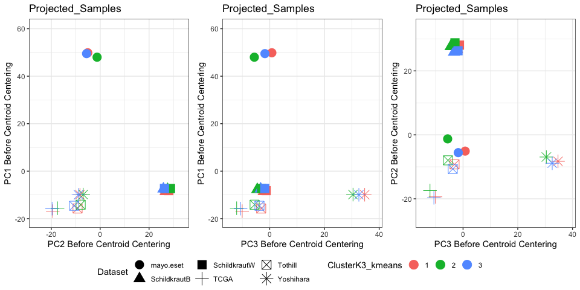

compare_centroids
================
Natalie Davidson
8/31/2023

# Comparing centoirs for uncertainty

This notebook generates figure 1, where we look at the relative
positions of centroids across all datasets. We first normalize within
dataset to make the expression of each dataset comparable. Furthermore,
we log10 the RNA-Seq values in order to deal with outlying gene
expression.

In each plot, we only use the MAD genes, which are the genes used by the
clustering pipeline. We do the following steps: 1) read in expression
and normalize 2) filter to MAD genes 3) Concatenate expression matrices
and apply PCA 4) Take top 15 PCs, calculate centroid for each dataset
and each cluster within the dataset. 5) Center the datasets such that
the centroid of the dataset is at 0,0 6) Plot the cluster centroids
after centering of dataset centroids.

## First read in all metadata

``` r
# Black metadata
samp_meta_file = file.path(proj_dir, 
                    "/reference_data/main_AA_metadata_table.tsv")
metadata_table = data.frame(fread(samp_meta_file))

# format NAs for better plotting
metadata_table$failed_seq[is.na(metadata_table$failed_seq)] = "passed"
metadata_table$resequenced[is.na(metadata_table$resequenced)] = "passed"
metadata_table$low_qual[is.na(metadata_table$low_qual)] = "passed"
metadata_table$REMOVE_LOW_EXPRESSION[is.na(metadata_table$REMOVE_LOW_EXPRESSION)] = "passed"
metadata_table$REMOVE_LOW_EXPRESSION[metadata_table$REMOVE_LOW_EXPRESSION==TRUE] = "failed"

metadata_table_AA = metadata_table

# white metadata
samp_meta_file = file.path(proj_dir, 
                    "/reference_data/main_white_metadata_table.tsv")
metadata_table = data.frame(fread(samp_meta_file))

# format NAs for better plotting
metadata_table$failed_seq[is.na(metadata_table$failed_seq)] = "passed"
metadata_table$resequenced[is.na(metadata_table$resequenced)] = "passed"
metadata_table$low_qual[is.na(metadata_table$low_qual)] = "passed"
metadata_table$REMOVE_LOW_EXPRESSION[is.na(metadata_table$REMOVE_LOW_EXPRESSION)] = "passed"
metadata_table$REMOVE_LOW_EXPRESSION[metadata_table$REMOVE_LOW_EXPRESSION==TRUE] = "failed"

metadata_table_W = metadata_table


# genes of interest

common_genes_file = file.path(proj_dir, 
                                    "/data/way_pipeline_results_10removed_NeoRemoved_inclWhites/1.DataInclusion-Data-Genes/CommonGenes_genelist.csv")
common_genes = data.frame(fread(common_genes_file))
colnames(common_genes) = "hgnc_symbol"


MAD_genes_file = file.path(proj_dir, 
                                    "/data/way_pipeline_results_10removed_NeoRemoved_inclWhites/1.DataInclusion-Data-Genes/GlobalMAD_genelist.csv")
MAD_genes = data.frame(fread(MAD_genes_file))
colnames(MAD_genes) = "hgnc_symbol"

# cluster ID labels

new_file = file.path(proj_dir, 
                    "/data/way_pipeline_results_10removed_NeoRemoved_inclWhites/2.Clustering_DiffExprs-Tables-ClusterMembership/FullClusterMembership.csv")

clust_df = data.frame(fread(new_file))
colnames(clust_df)[1] = "ID"
```

## Read in expression

``` r
read_format_MA_expr <- function(in_df, metadata_table){
    
     rnaseq_expr_df = in_df

    # format it so we can add metadata
    gene_ids = row.names(rnaseq_expr_df)
    sample_ids = colnames(rnaseq_expr_df)
    rnaseq_expr_df = data.frame(t(rnaseq_expr_df))
    colnames(rnaseq_expr_df) = gene_ids
    
    # now add column names back so we can have annotations
    rnaseq_expr_df$ID = sample_ids
    
    full_df = merge(metadata_table, rnaseq_expr_df, by = "ID")
    
    return(list(full_df, gene_ids))
}


read_format_expr <- function(in_file, metadata_table){
    
     rnaseq_expr_df = data.frame(fread(in_file))

    # format it so we can add metadata
    gene_ids = rnaseq_expr_df[,1]
    rnaseq_expr_df = rnaseq_expr_df[,-1]
    sample_ids = colnames(rnaseq_expr_df)
    rnaseq_expr_df = data.frame(t(rnaseq_expr_df))
    colnames(rnaseq_expr_df) = gene_ids
    
    # now add column names back so we can have annotations
    rnaseq_expr_df$ID = gsub("Sample_", "", row.names(rnaseq_expr_df))
    
    full_df = merge(metadata_table, rnaseq_expr_df, by = "ID")
    
    return(list(full_df, gene_ids))
}


filter_expr <- function(in_df, gene_df, metadata_table){
        
    # get samples that were used
    # get genes of interest
    gene_count_df = in_df[,gene_df$hgnc_symbol]
    gene_count_df = log10(gene_count_df+1)

    
    
    # add metadata back
    gene_count_df$ID = in_df$ID
    gene_count_df = merge(gene_count_df, metadata_table, by="ID")
    
    return(gene_count_df)
}
```

## Read Schlidkraut

``` r
# make formatted
in_file = file.path(proj_dir, 
                    "/data/rna_seq_pilot_and_new/salmon_normalized_filtered_for_way_pipeline.tsv")
res = read_format_expr(in_file, metadata_table_AA)
full_expr_B = res[[1]]

MAD_expr_B = filter_expr(full_expr_B, MAD_genes, metadata_table_AA)
MAD_expr_B = filter(MAD_expr_B, ran_in_way_pipeline == TRUE)
MAD_expr_B = subset(MAD_expr_B, select = -c(REMOVE_WHITE))
metadata_table_AA = subset(metadata_table_AA, select = -c(REMOVE_WHITE, REMOVE_NEOADJ))


# make formatted
in_file = file.path(proj_dir, 
                    "/data/rna_seq_whites/salmon_normalized_filtered_for_way_pipeline_whites.tsv")
res = read_format_expr(in_file, metadata_table_W)
full_expr_W = res[[1]]
MAD_expr_W = filter_expr(full_expr_W, MAD_genes, metadata_table_W)
MAD_expr_W = filter(MAD_expr_W, ran_in_way_pipeline == TRUE)
MAD_expr_W = subset(MAD_expr_W, select = -c(REMOVE_BLACK))
metadata_table_W = subset(metadata_table_W, select = -c(REMOVE_BLACK))

# make scaled matr
schB_scaled = as.data.frame(t(scale(t(MAD_expr_B[,MAD_genes$hgnc_symbol]))))
schB_scaled$ID = MAD_expr_B$ID
schB_scaled_df = merge(metadata_table_AA, schB_scaled, by="ID")
schB_scaled_df$Dataset = "SchildkrautB"

schW_scaled = as.data.frame(t(scale(t(MAD_expr_W[,MAD_genes$hgnc_symbol]))))
schW_scaled$ID = MAD_expr_W$ID
schW_scaled_df = merge(metadata_table_W, schW_scaled, by="ID")
schW_scaled_df$Dataset = "SchildkrautW"
```

## Read TCGA

``` r
tcga_data = data(TCGA_eset)
ExpressionData <- get(tcga_data)
tcga_dta <- exprs(ExpressionData)

tcga_metadata_table = subset(clust_df, Dataset == "TCGA")

# format the expr table
res = read_format_MA_expr(tcga_dta, tcga_metadata_table)
tcga_df = res[[1]]

# make scaled matr
tcga_scaled = t(scale(t(tcga_df[,MAD_genes$hgnc_symbol])))
tcga_scaled_df = cbind(tcga_df[,c("ID", "Dataset", "ClusterK2_kmeans", 
                                  "ClusterK3_kmeans", "ClusterK4_kmeans")], 
                       tcga_scaled)
```

## Analyze Mayo

``` r
mayo_data = load(file=file.path(proj_dir, 
                                "/data/mayo/MayoEset.Rda"))

ExpressionData <- get(mayo_data)
mayo_dta <- exprs(ExpressionData)

# read in the metadata
mayo_metadata_table = subset(clust_df, Dataset == "mayo.eset")

# format the expr table
res = read_format_MA_expr(mayo_dta, mayo_metadata_table)
mayo_df = res[[1]]


# keep scaled data
mayo_scaled = t(scale(t(mayo_df[,MAD_genes$hgnc_symbol])))
mayo_scaled_df = cbind(mayo_df[,c("ID", "Dataset", "ClusterK2_kmeans", 
                                  "ClusterK3_kmeans", "ClusterK4_kmeans")], 
                       mayo_scaled)
```

## Analyze Tothill

``` r
tothill_data = data(GSE9891_eset)
ExpressionData <- get(tothill_data)
tothill_dta <- exprs(ExpressionData)

tothill_metadata_table = subset(clust_df, Dataset == "Tothill")

# format the expr table
res = read_format_MA_expr(tothill_dta, tothill_metadata_table)
tothill_df = res[[1]]

# keep scaled data
tothill_scaled = t(scale(t(tothill_df[,MAD_genes$hgnc_symbol])))
tothill_scaled_df = cbind(tothill_df[,c("ID", "Dataset", "ClusterK2_kmeans", 
                                  "ClusterK3_kmeans", "ClusterK4_kmeans")], 
                       tothill_scaled)
```

## Analyze Yoshihara

``` r
yoshihara_data = data(GSE32062.GPL6480_eset)
ExpressionData <- get(yoshihara_data)
yoshihara_dta <- exprs(ExpressionData)

yoshihara_metadata_table = subset(clust_df, Dataset == "Yoshihara")

# format the expr table
res = read_format_MA_expr(yoshihara_dta, yoshihara_metadata_table)
yoshihara_df = res[[1]]


# keep scaled data
yoshihara_scaled = t(scale(t(yoshihara_df[,MAD_genes$hgnc_symbol])))
yoshihara_scaled_df = cbind(yoshihara_df[,c("ID", "Dataset", "ClusterK2_kmeans", 
                                  "ClusterK3_kmeans", "ClusterK4_kmeans")], 
                       yoshihara_scaled)
```

# plot new joint projection

``` r
common_cols = intersect(colnames(schB_scaled_df), colnames(tcga_scaled_df))

scaled_pca_df = rbind(schB_scaled_df[,common_cols], schW_scaled_df[,common_cols], 
                      tcga_scaled_df[,common_cols], mayo_scaled_df[,common_cols],
                      tothill_scaled_df[,common_cols], yoshihara_scaled_df[,common_cols])

# make joint PCA
pr_joint = prcomp(scaled_pca_df[,MAD_genes$hgnc_symbol], scale = FALSE)
res_pca_joint = data.frame(pr_joint$x)
res_pca_joint$ID = scaled_pca_df$ID

percentage <- round(pr_joint$sdev^2 / sum(pr_joint$sdev^2) * 100, 2)
percentage <- paste( colnames(pr_joint), "(", paste( as.character(percentage), "%", ")", sep="") )


color_id = "ClusterK3_kmeans"
title = "Projected_Samples"

pca_joint_df = merge(scaled_pca_df[,c("ID", "Dataset", "ClusterK2_kmeans", "ClusterK3_kmeans", "ClusterK4_kmeans")], res_pca_joint, by="ID")
pca_joint_df[,color_id] = as.factor(pca_joint_df[,color_id])
pca_joint_df = pca_joint_df[,c("ID", "Dataset", "ClusterK2_kmeans", "ClusterK3_kmeans", "ClusterK4_kmeans", all_PCs)]


centroids_df <- aggregate(cbind(PC1,PC2,PC3)~ClusterK3_kmeans+Dataset,pca_joint_df,mean)

gg21 = ggplot(pca_joint_df, aes_string(x="PC2",y="PC1", color=color_id, shape="Dataset")) +
    geom_point(alpha=0)  +
    theme_bw() + xlab(percentage[1]) + ylab(percentage[2]) +
    geom_point(data=centroids_df,size=5) +
    ggtitle(title) +
    xlab("PC2 Before Centroid Centering") + ylab("PC1 Before Centroid Centering")

gg31 = ggplot(pca_joint_df, aes_string(x="PC3",y="PC1", color=color_id, shape="Dataset")) +
    geom_point(alpha=0)  +
    theme_bw() + xlab(percentage[1]) + ylab(percentage[2]) +
    geom_point(data=centroids_df,size=5) +
    ggtitle(title) +
    xlab("PC3 Before Centroid Centering") + ylab("PC1 Before Centroid Centering")

gg32 = ggplot(pca_joint_df, aes_string(x="PC3",y="PC2", color=color_id, shape="Dataset")) +
    geom_point(alpha=0)  +
    theme_bw() + xlab(percentage[1]) + ylab(percentage[2]) +
    geom_point(data=centroids_df,size=5) +
    ggtitle(title) +
    xlab("PC3 Before Centroid Centering") + ylab("PC2 Before Centroid Centering")
ggarrange(gg21, gg31, gg32, ncol = 3, nrow=1, common.legend = TRUE, legend="bottom")
```



``` r
gg_pca_schB = ggplot(subset(pca_joint_df, Dataset == "SchildkrautB"), aes_string(x="PC1",y="PC2", color=color_id, shape="Dataset")) +
    geom_point(alpha=0)  +
    theme_bw() + xlab(percentage[1]) + ylab(percentage[2]) +
    geom_point(data=subset(centroids_df, Dataset == "SchildkrautB"),size=5) +
    ggtitle("SchildkrautB") +
    xlab("PC1 Before Centroid Centering") + ylab("PC2 Before Centroid Centering")

gg_pca_schB
```


``` r
gg_pca_schW = ggplot(subset(pca_joint_df, Dataset == "SchildkrautW"), aes_string(x="PC1",y="PC2", color=color_id, shape="Dataset")) +
    geom_point(alpha=0)  +
    theme_bw() + xlab(percentage[1]) + ylab(percentage[2]) +
    geom_point(data=subset(centroids_df, Dataset == "SchildkrautW"),size=5) +
    ggtitle("SchildkrautW") +
    xlab("PC1 Before Centroid Centering") + ylab("PC2 Before Centroid Centering")

gg_pca_schW
```


``` r
gg_pca_tcga = ggplot(subset(pca_joint_df, Dataset == "TCGA"), aes_string(x="PC1",y="PC2", color=color_id, shape="Dataset")) +
    geom_point(alpha=0)  +
    theme_bw() + xlab(percentage[1]) + ylab(percentage[2]) +
    geom_point(data=subset(centroids_df, Dataset == "TCGA"),size=5) +
    ggtitle("TCGA") +
    xlab("PC1 Before Centroid Centering") + ylab("PC2 Before Centroid Centering")

gg_pca_tcga
```


``` r
gg_pca_mayo = ggplot(subset(pca_joint_df, Dataset == "mayo.eset"), aes_string(x="PC1",y="PC2", color=color_id, shape="Dataset")) +
    geom_point(alpha=0)  +
    theme_bw() + xlab(percentage[1]) + ylab(percentage[2]) +
    geom_point(data=subset(centroids_df, Dataset == "mayo.eset"),size=5) +
    ggtitle("Mayo") +
    xlab("PC1 Before Centroid Centering") + ylab("PC2 Before Centroid Centering")

gg_pca_mayo
```


``` r
gg_pca_tothill = ggplot(subset(pca_joint_df, Dataset == "Tothill"), aes_string(x="PC1",y="PC2", color=color_id, shape="Dataset")) +
    geom_point(alpha=0)  +
    theme_bw() + xlab(percentage[1]) + ylab(percentage[2]) +
    geom_point(data=subset(centroids_df, Dataset == "Tothill"),size=5) +
    ggtitle("Tothill") +
    xlab("PC1 Before Centroid Centering") + ylab("PC2 Before Centroid Centering")

gg_pca_tothill
```


``` r
gg_pca_yoshihara = ggplot(subset(pca_joint_df, Dataset == "Yoshihara"), aes_string(x="PC1",y="PC2", color=color_id, shape="Dataset")) +
    geom_point(alpha=0)  +
    theme_bw() + xlab(percentage[1]) + ylab(percentage[2]) +
    geom_point(data=subset(centroids_df, Dataset == "Yoshihara"),size=5) +
    ggtitle("Yoshihara") +
    xlab("PC1 Before Centroid Centering") + ylab("PC2 Before Centroid Centering")

gg_pca_yoshihara
```


# distance all

``` r
# calc centroids
centroids_df <- aggregate(cbind(PC1,PC2,PC3,PC4,PC5,PC6,PC7,PC8,PC9,PC10,PC11,PC12,PC13,PC14,PC15)~ClusterK3_kmeans+Dataset,pca_joint_df,mean)
centroids_all_df <- aggregate(cbind(PC1,PC2,PC3,PC4,PC5,PC6,PC7,PC8,PC9,PC10,PC11,PC12,PC13,PC14,PC15)~Dataset,pca_joint_df,mean)
centroids_all_df = cbind(data.frame(clusterID=NA),centroids_all_df)

# write them out
centroids_df
```

    ##    ClusterK3_kmeans      Dataset        PC1        PC2        PC3          PC4
    ## 1                 1    mayo.eset  49.871644  -5.090284   0.783235  16.58378895
    ## 2                 2    mayo.eset  47.995658  -1.264433  -5.621311 -23.60585585
    ## 3                 3    mayo.eset  49.510293  -5.568032  -1.752591  -3.31626712
    ## 4                 1 SchildkrautB  -8.602687  26.740249  -2.213378   6.49248944
    ## 5                 2 SchildkrautB  -7.704854  27.598669  -4.550374  -6.84292110
    ## 6                 3 SchildkrautB  -7.487595  25.867952  -3.307790   1.75674933
    ## 7                 1 SchildkrautW  -8.201803  28.069436  -1.305143   3.85943265
    ## 8                 2 SchildkrautW  -7.309635  28.773316  -2.951955  -5.34016336
    ## 9                 3 SchildkrautW  -7.283707  26.298922  -1.828551   2.52735161
    ## 10                1         TCGA -16.841277 -19.384861 -10.063203   5.70597305
    ## 11                2         TCGA -15.603657 -17.443903 -12.072465  -6.97682709
    ## 12                3         TCGA -15.765280 -19.674231 -10.651619   0.03442792
    ## 13                1      Tothill -15.729352  -9.243713  -3.114172   8.60370230
    ## 14                2      Tothill -14.117102  -7.976746  -5.513252  -8.16117206
    ## 15                3      Tothill -14.585385 -10.670528  -3.746138   0.30165674
    ## 16                1    Yoshihara  -9.915763  -8.280434  34.706761   3.82312206
    ## 17                2    Yoshihara  -9.865234  -6.938637  30.437872 -12.36132758
    ## 18                3    Yoshihara  -9.951469  -8.878407  32.580629  -5.36284972
    ##           PC5         PC6         PC7         PC8         PC9        PC10
    ## 1  -7.7624620   1.0160958  0.02887155  1.42988511 -0.61374370  0.49544674
    ## 2  -9.3245230  -0.6027910 -2.33890917 -2.09291414 -0.62459866  0.72778347
    ## 3  13.1292704  -1.1914788  2.62059138  0.78350550  1.08139881 -1.07887212
    ## 4  -0.8376931   1.6170309 -0.17808823 -0.76315228  0.60391655  0.27907000
    ## 5  -2.8893141   0.6920961 -0.28778193 -1.63180419  0.58551162 -0.26412325
    ## 6   4.1161875   1.6209128 -1.64953162 -0.07065291 -0.38728744 -0.78541660
    ## 7  -0.5003959   1.3657086 -0.74608379  1.28452227  0.13615998  0.63331996
    ## 8  -0.3720219   0.7864874  1.78014650 -1.27284183  0.27312468  0.09181884
    ## 9   5.4784887   1.4265456 -0.34282865  0.55239219 -0.05470032  0.20894660
    ## 10 -3.7390362   6.2223724  0.88071495  1.58451856  0.78373782 -0.51390760
    ## 11 -3.1146483   5.2528395 -2.22446574 -0.76242849 -0.95536952  1.09562268
    ## 12  4.0219458   5.6071097  1.25687764 -0.43951302 -0.30087900  0.17999768
    ## 13 -4.5990792 -16.0440053  0.68179797  0.75411925  0.62869078 -1.46470451
    ## 14 -5.4180990 -16.8295571 -2.69906242 -1.49056918  0.05378476  0.41326465
    ## 15  4.0456456 -16.8305825  1.39844226 -0.25393614 -0.36966834  0.31360575
    ## 16 -4.1568237   2.3998509 -0.46973153 -0.24239850 -0.19263842 -0.47818395
    ## 17 -6.1119951   1.2425079 -3.31883544 -0.98129576  1.56100697 -0.62348763
    ## 18  4.8282048   1.7210519 -0.39085521  0.29293355 -0.76700166  0.14183192
    ##           PC11        PC12        PC13         PC14        PC15
    ## 1   0.51416139 -0.15509163  0.35838750  0.514162998  0.29255112
    ## 2   1.25048205  0.83791363  0.77700407  0.400078469 -1.07224613
    ## 3  -0.97077250 -0.45457104 -0.90476509 -0.604716602  0.04924717
    ## 4  -0.40190529 -0.55631208  0.41755588 -0.430930352 -0.10571943
    ## 5   1.00878160 -0.42104448 -0.47655207 -0.079318384 -0.14213075
    ## 6   1.90219351 -0.15725647  0.34739081 -1.219532319 -0.07704839
    ## 7  -1.97606801  0.56943307  0.06742619  0.969821296  0.69519302
    ## 8  -0.61577906 -0.34636905 -0.88167346  0.900797246 -0.55629451
    ## 9   0.66052855  0.47032119  0.22954033 -0.313306714  0.56419371
    ## 10 -0.51583577 -0.45307404 -0.32618621 -0.061699960 -0.24921655
    ## 11 -1.36212012 -0.23458644  0.58848244  0.072714222  1.06974430
    ## 12 -0.21935955  0.68428366 -0.26638543  0.160458921 -0.31180382
    ## 13  0.57025827  0.04634885 -0.04476562 -0.642296416 -1.07794591
    ## 14 -0.51838959 -0.60172404  1.18204768 -0.399808381  1.06662862
    ## 15  0.21563080  0.20916848 -0.09298076  0.009118508 -0.45585903
    ## 16  0.09070581 -0.01611812 -0.42462182 -0.041684061  0.56885614
    ## 17  0.94421146  0.53088337 -0.44871378  1.075246594  1.16250822
    ## 18  1.61845390 -0.34156913  0.54544920 -0.338717935 -0.36926843

``` r
centroids_all_df
```

    ##   clusterID      Dataset        PC1        PC2        PC3        PC4
    ## 1        NA    mayo.eset  49.298601  -4.375928  -1.660138 -0.2400748
    ## 2        NA SchildkrautB  -7.967822  26.666571  -3.230983  1.2157633
    ## 3        NA SchildkrautW  -7.663244  27.791901  -1.969471  0.5964816
    ## 4        NA         TCGA -16.024409 -19.003058 -10.862387 -0.2290377
    ## 5        NA      Tothill -14.949748  -9.576827  -3.839025  1.9582684
    ## 6        NA    Yoshihara  -9.925456  -8.368914  33.045067 -3.0195588
    ##           PC5         PC6        PC7         PC8         PC9        PC10
    ## 1 -0.31346226  -0.1874322  0.4454970  0.36583774  0.01771481 -0.03912442
    ## 2  0.34586387   1.3677438 -0.7245044 -0.75538260  0.25087259 -0.24192041
    ## 3  1.22327804   1.2010107  0.1604778  0.27559141  0.12541800  0.34385041
    ## 4 -0.04332051   5.6860137  0.2304245  0.04293103 -0.16970945  0.22752425
    ## 5 -1.24352279 -16.5170571  0.3138756 -0.09355621  0.11060042 -0.37533125
    ## 6 -0.11422763   1.8999634 -0.8562577 -0.09428969 -0.20835667 -0.20077057
    ##         PC11        PC12        PC13        PC14        PC15
    ## 1  0.1306615 -0.03530949 -0.01632406  0.06906628 -0.11701921
    ## 2  0.7894530 -0.37952919  0.15062134 -0.61255986 -0.10551892
    ## 3 -0.8067090  0.25404298 -0.18486746  0.58688450  0.26544794
    ## 4 -0.6048326  0.12211747 -0.05702581  0.07491875  0.07121536
    ## 5  0.2137440 -0.01383000  0.17488227 -0.33011550 -0.40674459
    ## 6  0.9548087 -0.09158642  0.03970461 -0.01851466  0.20481479

``` r
PCs = paste0("PC", 1:3)

# center dataset-specific cluster centroids
k1 = filter(centroids_df, Dataset=="mayo.eset" & ClusterK3_kmeans == 1)[,PCs] - filter(centroids_all_df, Dataset=="mayo.eset" )[,PCs]
k2 = filter(centroids_df, Dataset=="mayo.eset" & ClusterK3_kmeans == 2)[,PCs] - filter(centroids_all_df, Dataset=="mayo.eset" )[,PCs]
k3 = filter(centroids_df, Dataset=="mayo.eset" & ClusterK3_kmeans == 3)[,PCs] - filter(centroids_all_df, Dataset=="mayo.eset" )[,PCs]
mayo_pc = rbind(k1, k2, k3)

k1 = filter(centroids_df, Dataset=="Tothill" & ClusterK3_kmeans == 1)[,PCs] - filter(centroids_all_df, Dataset=="Tothill" )[,PCs]
k2 = filter(centroids_df, Dataset=="Tothill" & ClusterK3_kmeans == 2)[,PCs] - filter(centroids_all_df, Dataset=="Tothill" )[,PCs]
k3 = filter(centroids_df, Dataset=="Tothill" & ClusterK3_kmeans == 3)[,PCs] - filter(centroids_all_df, Dataset=="Tothill" )[,PCs]
tothill_pc = rbind(k1, k2, k3)


k1 = filter(centroids_df, Dataset=="TCGA" & ClusterK3_kmeans == 1)[,PCs] - filter(centroids_all_df, Dataset=="TCGA" )[,PCs]
k2 = filter(centroids_df, Dataset=="TCGA" & ClusterK3_kmeans == 2)[,PCs] - filter(centroids_all_df, Dataset=="TCGA" )[,PCs]
k3 = filter(centroids_df, Dataset=="TCGA" & ClusterK3_kmeans == 3)[,PCs] - filter(centroids_all_df, Dataset=="TCGA" )[,PCs]
tcga_pc = rbind(k1, k2, k3)


k1 = filter(centroids_df, Dataset=="Yoshihara" & ClusterK3_kmeans == 1)[,PCs] - filter(centroids_all_df, Dataset=="Yoshihara" )[,PCs]
k2 = filter(centroids_df, Dataset=="Yoshihara" & ClusterK3_kmeans == 2)[,PCs] - filter(centroids_all_df, Dataset=="Yoshihara" )[,PCs]
k3 = filter(centroids_df, Dataset=="Yoshihara" & ClusterK3_kmeans == 3)[,PCs] - filter(centroids_all_df, Dataset=="Yoshihara" )[,PCs]
yoshihara_pc = rbind(k1, k2, k3)


k1 = filter(centroids_df, Dataset=="SchildkrautB" & ClusterK3_kmeans == 1)[,PCs] - filter(centroids_all_df, Dataset=="SchildkrautB" )[,PCs]
k2 = filter(centroids_df, Dataset=="SchildkrautB" & ClusterK3_kmeans == 2)[,PCs] - filter(centroids_all_df, Dataset=="SchildkrautB" )[,PCs]
k3 = filter(centroids_df, Dataset=="SchildkrautB" & ClusterK3_kmeans == 3)[,PCs] - filter(centroids_all_df, Dataset=="SchildkrautB" )[,PCs]
schB_pc = rbind(k1, k2, k3)


k1 = filter(centroids_df, Dataset=="SchildkrautW" & ClusterK3_kmeans == 1)[,PCs] - filter(centroids_all_df, Dataset=="SchildkrautW" )[,PCs]
k2 = filter(centroids_df, Dataset=="SchildkrautW" & ClusterK3_kmeans == 2)[,PCs] - filter(centroids_all_df, Dataset=="SchildkrautW" )[,PCs]
k3 = filter(centroids_df, Dataset=="SchildkrautW" & ClusterK3_kmeans == 3)[,PCs] - filter(centroids_all_df, Dataset=="SchildkrautW" )[,PCs]
schW_pc = rbind(k1, k2, k3)

centered_pc_df = rbind(mayo_pc, tothill_pc, tcga_pc, yoshihara_pc, schB_pc, schW_pc)
centered_pc_df$Dataset = c(rep("Mayo", 3), rep("Tothill", 3), rep("TCGA", 3),
                           rep("Yoshihara", 3), rep("SchildkrautB", 3), rep("SchildkrautW", 3))
centered_pc_df$Cluster = as.factor(rep(c(1, 2, 3), 6))

# plot
gg12 = ggplot(centered_pc_df, aes(x=PC2, y=PC1, color = Cluster, shape=Dataset)) +
        geom_point() +
        theme_bw()+ theme(legend.position = "none") +
        xlab("PC2 After Centroid Centering") + ylab("PC1 After Centroid Centering")


gg13 = ggplot(centered_pc_df, aes(x=PC3, y=PC1, color = Cluster, shape=Dataset)) +
        geom_point() +
        theme_bw() +
        xlab("PC3 After Centroid Centering") + ylab("PC1 After Centroid Centering")


gg23 = ggplot(centered_pc_df, aes(x=PC2, y=PC3, color = Cluster, shape=Dataset)) +
        geom_point() +
        theme_bw()+ theme(legend.position = "none") +
        xlab("PC2 After Centroid Centering") + ylab("PC3 After Centroid Centering")


gg = ggarrange(gg12, gg13, gg23, ncol = 3, nrow=1, common.legend = TRUE, legend="bottom")

outfile = paste0(proj_dir, "/figure_notebooks/manuscript_figs/centroids_k3.pdf")
ggsave(outfile,
       gg, width = 12, height = 4, units = "in", device = "pdf")

gg
```


``` r
# calculater K2 centroid
centroids_df <- aggregate(cbind(PC1,PC2,PC3,PC4,PC5,PC6,PC7,PC8,PC9,PC10,PC11,PC12,PC13,PC14,PC15)~ClusterK2_kmeans+Dataset,pca_joint_df,mean)
centroids_all_df <- aggregate(cbind(PC1,PC2,PC3,PC4,PC5,PC6,PC7,PC8,PC9,PC10,PC11,PC12,PC13,PC14,PC15)~Dataset,pca_joint_df,mean)
centroids_all_df = cbind(data.frame(clusterID=NA),centroids_all_df)

centroids_df
```

    ##    ClusterK2_kmeans      Dataset        PC1        PC2         PC3         PC4
    ## 1                 1    mayo.eset  50.333941  -5.836388   0.3713589  15.0070410
    ## 2                 2    mayo.eset  48.246650  -2.892037  -3.7242251 -15.7317968
    ## 3                 1 SchildkrautB  -8.431044  26.533793  -2.5216127   5.4411609
    ## 4                 2 SchildkrautB  -7.490236  26.803467  -3.9623496  -3.1406543
    ## 5                 1 SchildkrautW  -8.063914  28.395269  -1.8356069   0.5240805
    ## 6                 2 SchildkrautW  -7.005735  26.801758  -2.1891446   0.7152937
    ## 7                 1         TCGA -16.279714 -19.752457 -10.1907838   3.6601699
    ## 8                 2         TCGA -15.667227 -17.954620 -11.8019860  -5.6701887
    ## 9                 1      Tothill -15.549243  -9.558459  -3.0234976   8.1263349
    ## 10                2      Tothill -14.374623  -9.594448  -4.6214002  -3.9590636
    ## 11                1    Yoshihara  -9.854451  -8.303757  34.6620298   3.6406057
    ## 12                2    Yoshihara  -9.969777  -8.409585  32.0357525  -7.1768589
    ##           PC5         PC6         PC7         PC8         PC9         PC10
    ## 1  -2.6037439   0.5786804 -1.41475705  0.96093496  0.17840907  0.180281857
    ## 2   2.0135619  -0.9658354  2.33559469 -0.23880650 -0.14555743 -0.262050581
    ## 3  -0.4477788   1.5750026 -1.04700670 -0.41346221  0.33125123 -0.014902260
    ## 4   1.1641156   1.1540583 -0.39200209 -1.10790517  0.16800160 -0.475977888
    ## 5  -0.4609819   1.0930810  0.39623150  0.06096755  0.14851439  0.380909460
    ## 6   3.9871918   1.3781262 -0.22640003  0.62779468  0.08751625  0.283035564
    ## 7   0.3856884   5.9161814  1.12352327  0.53696630  0.30383647 -0.146578784
    ## 8  -0.6435205   5.3640003 -1.01905498 -0.64824333 -0.83221840  0.750908794
    ## 9  -3.2097113 -16.1151616  0.66103875  0.36190455  0.40089677 -1.053436111
    ## 10  0.6427394 -16.9026155 -0.01917529 -0.53050230 -0.16789527  0.275208375
    ## 11 -4.1467154   2.3577149 -0.49126194 -0.56762869 -0.18550267 -0.532547916
    ## 12  2.4028666   1.6142332 -1.08408937  0.20117032 -0.22262222  0.006326118
    ##            PC11        PC12        PC13         PC14         PC15
    ## 1   0.469039553 -0.36413540  0.05994914  0.212781132  0.291250374
    ## 2  -0.213145086  0.29879169 -0.09382088 -0.076954155 -0.531838582
    ## 3  -0.128884679 -0.49794465  0.35531408 -0.215433677  0.004869231
    ## 4   1.736266167 -0.25744195 -0.06041847 -1.022000034 -0.219329967
    ## 5  -1.642437038  0.19000494 -0.29140649  1.124807552  0.145519783
    ## 6   0.564742089  0.35913104 -0.01003417 -0.295861018  0.462253115
    ## 7  -0.317855867  0.14994826 -0.46882345  0.135202053 -0.196969264
    ## 8  -1.006324162  0.08318111  0.51909492 -0.009419903  0.446415957
    ## 9   0.430549183 -0.06686666  0.02595891 -0.586680875 -1.079014186
    ## 10  0.005752014  0.03705070  0.31775184 -0.083979616  0.238196968
    ## 11  0.072911448  0.13825442 -0.37912127  0.047194010  0.685527847
    ## 12  1.505292290 -0.23505396  0.30113733 -0.059530256 -0.095248130

``` r
centroids_all_df
```

    ##   clusterID      Dataset        PC1        PC2        PC3        PC4
    ## 1        NA    mayo.eset  49.298601  -4.375928  -1.660138 -0.2400748
    ## 2        NA SchildkrautB  -7.967822  26.666571  -3.230983  1.2157633
    ## 3        NA SchildkrautW  -7.663244  27.791901  -1.969471  0.5964816
    ## 4        NA         TCGA -16.024409 -19.003058 -10.862387 -0.2290377
    ## 5        NA      Tothill -14.949748  -9.576827  -3.839025  1.9582684
    ## 6        NA    Yoshihara  -9.925456  -8.368914  33.045067 -3.0195588
    ##           PC5         PC6        PC7         PC8         PC9        PC10
    ## 1 -0.31346226  -0.1874322  0.4454970  0.36583774  0.01771481 -0.03912442
    ## 2  0.34586387   1.3677438 -0.7245044 -0.75538260  0.25087259 -0.24192041
    ## 3  1.22327804   1.2010107  0.1604778  0.27559141  0.12541800  0.34385041
    ## 4 -0.04332051   5.6860137  0.2304245  0.04293103 -0.16970945  0.22752425
    ## 5 -1.24352279 -16.5170571  0.3138756 -0.09355621  0.11060042 -0.37533125
    ## 6 -0.11422763   1.8999634 -0.8562577 -0.09428969 -0.20835667 -0.20077057
    ##         PC11        PC12        PC13        PC14        PC15
    ## 1  0.1306615 -0.03530949 -0.01632406  0.06906628 -0.11701921
    ## 2  0.7894530 -0.37952919  0.15062134 -0.61255986 -0.10551892
    ## 3 -0.8067090  0.25404298 -0.18486746  0.58688450  0.26544794
    ## 4 -0.6048326  0.12211747 -0.05702581  0.07491875  0.07121536
    ## 5  0.2137440 -0.01383000  0.17488227 -0.33011550 -0.40674459
    ## 6  0.9548087 -0.09158642  0.03970461 -0.01851466  0.20481479

``` r
PCs = paste0("PC", 1:3)

# center dataset-specific cluster centroids
k1 = filter(centroids_df, Dataset=="mayo.eset" & ClusterK2_kmeans == 1)[,PCs] - filter(centroids_all_df, Dataset=="mayo.eset" )[,PCs]
k2 = filter(centroids_df, Dataset=="mayo.eset" & ClusterK2_kmeans == 2)[,PCs] - filter(centroids_all_df, Dataset=="mayo.eset" )[,PCs]
mayo_pc = rbind(k1, k2)

k1 = filter(centroids_df, Dataset=="Tothill" & ClusterK2_kmeans == 1)[,PCs] - filter(centroids_all_df, Dataset=="Tothill" )[,PCs]
k2 = filter(centroids_df, Dataset=="Tothill" & ClusterK2_kmeans == 2)[,PCs] - filter(centroids_all_df, Dataset=="Tothill" )[,PCs]
tothill_pc = rbind(k1, k2)


k1 = filter(centroids_df, Dataset=="TCGA" & ClusterK2_kmeans == 1)[,PCs] - filter(centroids_all_df, Dataset=="TCGA" )[,PCs]
k2 = filter(centroids_df, Dataset=="TCGA" & ClusterK2_kmeans == 2)[,PCs] - filter(centroids_all_df, Dataset=="TCGA" )[,PCs]
tcga_pc = rbind(k1, k2)


k1 = filter(centroids_df, Dataset=="Yoshihara" & ClusterK2_kmeans == 1)[,PCs] - filter(centroids_all_df, Dataset=="Yoshihara" )[,PCs]
k2 = filter(centroids_df, Dataset=="Yoshihara" & ClusterK2_kmeans == 2)[,PCs] - filter(centroids_all_df, Dataset=="Yoshihara" )[,PCs]
yoshihara_pc = rbind(k1, k2)


k1 = filter(centroids_df, Dataset=="SchildkrautB" & ClusterK2_kmeans == 1)[,PCs] - filter(centroids_all_df, Dataset=="SchildkrautB" )[,PCs]
k2 = filter(centroids_df, Dataset=="SchildkrautB" & ClusterK2_kmeans == 2)[,PCs] - filter(centroids_all_df, Dataset=="SchildkrautB" )[,PCs]
schB_pc = rbind(k1, k2)


k1 = filter(centroids_df, Dataset=="SchildkrautW" & ClusterK2_kmeans == 1)[,PCs] - filter(centroids_all_df, Dataset=="SchildkrautW" )[,PCs]
k2 = filter(centroids_df, Dataset=="SchildkrautW" & ClusterK2_kmeans == 2)[,PCs] - filter(centroids_all_df, Dataset=="SchildkrautW" )[,PCs]
schW_pc = rbind(k1, k2)

centered_pc_df = rbind(mayo_pc, tothill_pc, tcga_pc, yoshihara_pc, schB_pc, schW_pc)
centered_pc_df$Dataset = c(rep("Mayo", 2), rep("Tothill", 2), rep("TCGA", 2),
                           rep("Yoshihara", 2), rep("SchildkrautB", 2), rep("SchildkrautW", 2))
centered_pc_df$Cluster = as.factor(rep(c(1, 2), 6))

# plot
gg12 = ggplot(centered_pc_df, aes(x=PC2, y=PC1, color = Cluster, shape=Dataset)) +
        geom_point() +
        theme_bw()+ theme(legend.position = "none") +
        xlab("PC2 After Centroid Centering") + ylab("PC1 After Centroid Centering")


gg13 = ggplot(centered_pc_df, aes(x=PC3, y=PC1, color = Cluster, shape=Dataset)) +
        geom_point() +
        theme_bw() +
        xlab("PC3 After Centroid Centering") + ylab("PC1 After Centroid Centering")


gg23 = ggplot(centered_pc_df, aes(x=PC2, y=PC3, color = Cluster, shape=Dataset)) +
        geom_point() +
        theme_bw()+ theme(legend.position = "none") +
        xlab("PC2 After Centroid Centering") + ylab("PC3 After Centroid Centering")


gg = ggarrange(gg12, gg13, gg23, ncol = 3, nrow=1, common.legend = TRUE, legend="bottom")

outfile = paste0(proj_dir, "/figure_notebooks/manuscript_figs/centroids_k2.pdf")
ggsave(outfile,
       gg, width = 12, height = 4, units = "in", device = "pdf")

gg
```


``` r
# calculate K4 clusters
centroids_df <- aggregate(cbind(PC1,PC2,PC3,PC4,PC5,PC6,PC7,PC8,PC9,PC10,PC11,PC12,PC13,PC14,PC15)~ClusterK4_kmeans+Dataset,pca_joint_df,mean)
centroids_all_df <- aggregate(cbind(PC1,PC2,PC3,PC4,PC5,PC6,PC7,PC8,PC9,PC10,PC11,PC12,PC13,PC14,PC15)~Dataset,pca_joint_df,mean)
centroids_all_df = cbind(data.frame(clusterID=NA),centroids_all_df)

# write it out
centroids_df
```

    ##    ClusterK4_kmeans      Dataset        PC1        PC2         PC3         PC4
    ## 1                 1    mayo.eset  48.361902  -3.641976   0.7226051  14.0565922
    ## 2                 2    mayo.eset  48.230895  -1.614513  -6.1360370 -23.6508538
    ## 3                 3    mayo.eset  52.499653  -8.219115  -0.5326999  14.2796777
    ## 4                 4    mayo.eset  48.148643  -3.753929  -1.6745744 -10.2604296
    ## 5                 1 SchildkrautB  -8.580327  27.170973  -2.2779996   6.9594477
    ## 6                 2 SchildkrautB  -7.904870  27.601385  -4.5372737  -7.3238024
    ## 7                 3 SchildkrautB  -7.966057  25.558416  -3.0294368   2.4411929
    ## 8                 4 SchildkrautB  -5.639212  27.360400  -3.9333821  -0.8645951
    ## 9                 1 SchildkrautW  -7.883680  27.934387  -1.3426596   4.0959648
    ## 10                2 SchildkrautW  -5.929399  28.509807  -3.7060686  -8.1236269
    ## 11                3 SchildkrautW  -7.257604  26.281486  -1.7999588   2.5346795
    ## 12                4 SchildkrautW  -8.676679  28.843232  -2.1114587  -1.7446513
    ## 13                1         TCGA -16.956632 -19.107446 -10.1009985   5.6594029
    ## 14                2         TCGA -15.427785 -17.410449 -12.1365913  -7.5360821
    ## 15                3         TCGA -15.260375 -20.879304 -10.1294848   2.9295037
    ## 16                4         TCGA -16.235663 -18.565579 -11.1843195  -2.5183156
    ## 17                1      Tothill -15.894777  -8.978537  -2.9886519   8.9834084
    ## 18                2      Tothill -14.070989  -7.983193  -5.5221232  -8.2326124
    ## 19                3      Tothill -14.874337 -10.734432  -3.2677994   5.0129421
    ## 20                4      Tothill -14.463074 -10.299525  -4.3262582  -3.0965278
    ## 21                1    Yoshihara  -9.906500  -8.270964  34.8079863   3.9168609
    ## 22                2    Yoshihara  -9.774154  -6.610031  30.0903640 -13.1430804
    ## 23                3    Yoshihara  -9.240187  -9.500403  32.3082144  -2.8606966
    ## 24                4    Yoshihara -10.769767  -8.078888  32.7998021  -8.0182498
    ##            PC5         PC6        PC7        PC8         PC9        PC10
    ## 1  -12.4626308   1.1910497  3.2529279  5.2626824 -0.08426706 -0.68186418
    ## 2   -9.9820160  -0.7040072 -5.0396262 -2.6411484 -0.30112314  0.58657485
    ## 3    9.5208467  -0.2613267 -6.8927996 -3.5624798 -0.54713696  1.21323850
    ## 4   10.9354149  -1.1580220  8.6555576  1.2530052  0.90198988 -1.02324761
    ## 5   -1.9962339   1.7016775  0.1814636 -0.8987414  0.25173838 -0.02650025
    ## 6   -2.5601394   0.6602513 -1.3225129 -0.7321086  0.12975072 -0.08272943
    ## 7    4.5119580   1.5343220 -2.1226137  0.4139075 -0.08191403 -0.33457915
    ## 8   -2.4263247   1.4396839  4.9235002 -6.4521835  2.41791104 -1.17290418
    ## 9   -0.8797359   1.3779039 -1.9392513  2.0173021  0.32964552  0.76098123
    ## 10  -2.8032041   0.7498165 -2.2990165  0.1710177 -0.27160750  0.50604649
    ## 11   5.5455767   1.4159441 -0.3284609  0.5138580 -0.02223098  0.24060999
    ## 12   1.4879068   0.9635763  4.7430336 -2.2617855  0.20941063 -0.18819407
    ## 13  -4.3614426   6.2153492  1.0300176  1.7823880  0.68406941 -0.37620120
    ## 14  -4.2033110   5.2342385 -2.8551299 -1.2136340 -0.72345620  1.29121549
    ## 15   4.3089995   5.7495574 -0.2668401 -1.7534583  0.50377304 -0.24549679
    ## 16   2.9003664   5.5100078  1.9769638  0.8065122 -0.99255661  0.36752180
    ## 17  -5.7472349 -16.0762746  1.8188702  1.1478437  0.74742029 -1.13032856
    ## 18  -5.6600514 -16.8740694 -2.8843407 -1.5351324  0.01982993  0.56103180
    ## 19   2.5079469 -16.2430454 -1.0242780 -1.0406242  0.00776666 -0.85274864
    ## 20   4.0374722 -17.1717223  2.5490871  0.5586566 -0.57063953  0.48532479
    ## 21  -4.4906566   2.4024427 -0.4076238 -0.2414810 -0.19085616 -0.68191740
    ## 22  -7.2471530   1.3002275 -4.6115909 -0.4135024  0.02414142 -1.21184278
    ## 23   5.8103204   1.8150156 -3.1520866  0.4687757 -1.43522990  0.34271211
    ## 24   2.6988036   1.5815436  2.7704415 -0.3604625  1.00049736  0.33102887
    ##           PC11        PC12       PC13         PC14        PC15
    ## 1   0.97394235  0.05711883  0.2323042  0.181870734 -0.51529514
    ## 2   2.24858791  0.43343285  0.7627933  0.924670258 -0.93001335
    ## 3   0.31413696 -0.88211679 -0.5716472 -0.253938098  1.68180098
    ## 4  -2.59857744  0.28486511 -0.3764358 -0.424911463 -0.72946691
    ## 5  -0.58529783 -0.46621163  0.2447988 -0.334567902 -0.10835056
    ## 6   0.91371478 -0.30788948 -0.5534987  0.182183135 -0.15885228
    ## 7   1.68974219 -0.29136811  0.5969405 -1.050806418 -0.11712012
    ## 8   1.30774786 -0.72530073 -0.2787834 -2.073995180  0.14476642
    ## 9  -2.11284981  0.73045618  0.3936562  1.150281122  0.66739512
    ## 10 -0.71093675  0.72015091 -0.2275306  1.036215764 -0.66484336
    ## 11  0.61441631  0.46655802  0.1806676 -0.282878884  0.56947726
    ## 12 -0.61372793 -0.84716438 -1.3281830  0.528236804 -0.12611171
    ## 13 -0.69935477 -0.46184449 -0.3427510 -0.083956493 -0.19821332
    ## 14 -1.33105013 -0.48422639  0.7722695  0.155904743  1.21121078
    ## 15  0.30200025  0.43972302 -0.1494708  0.277055488 -0.61404967
    ## 16 -0.72857086  0.75032306 -0.3015697 -0.001036545  0.05127815
    ## 17  0.70513754  0.10977201 -0.2922713 -0.663406405 -1.11853371
    ## 18 -0.62920102 -0.65541840  1.2277678 -0.414994784  1.02837512
    ## 19 -0.07959724 -0.43346213  0.3431923 -0.258109205 -1.41130859
    ## 20  0.59766753  0.86981225 -0.2625271  0.114180118  0.63232180
    ## 21 -0.01989796  0.02825929 -0.3787174 -0.010702672  0.60021674
    ## 22  1.14921513  0.70535485 -0.4793631  1.334607765  1.15776910
    ## 23  1.88246354  0.79345584  0.5378468 -0.409357139 -0.15868580
    ## 24  1.18639638 -1.59024039  0.3080660 -0.226808853 -0.37935229

``` r
centroids_all_df
```

    ##   clusterID      Dataset        PC1        PC2        PC3        PC4
    ## 1        NA    mayo.eset  49.298601  -4.375928  -1.660138 -0.2400748
    ## 2        NA SchildkrautB  -7.967822  26.666571  -3.230983  1.2157633
    ## 3        NA SchildkrautW  -7.663244  27.791901  -1.969471  0.5964816
    ## 4        NA         TCGA -16.024409 -19.003058 -10.862387 -0.2290377
    ## 5        NA      Tothill -14.949748  -9.576827  -3.839025  1.9582684
    ## 6        NA    Yoshihara  -9.925456  -8.368914  33.045067 -3.0195588
    ##           PC5         PC6        PC7         PC8         PC9        PC10
    ## 1 -0.31346226  -0.1874322  0.4454970  0.36583774  0.01771481 -0.03912442
    ## 2  0.34586387   1.3677438 -0.7245044 -0.75538260  0.25087259 -0.24192041
    ## 3  1.22327804   1.2010107  0.1604778  0.27559141  0.12541800  0.34385041
    ## 4 -0.04332051   5.6860137  0.2304245  0.04293103 -0.16970945  0.22752425
    ## 5 -1.24352279 -16.5170571  0.3138756 -0.09355621  0.11060042 -0.37533125
    ## 6 -0.11422763   1.8999634 -0.8562577 -0.09428969 -0.20835667 -0.20077057
    ##         PC11        PC12        PC13        PC14        PC15
    ## 1  0.1306615 -0.03530949 -0.01632406  0.06906628 -0.11701921
    ## 2  0.7894530 -0.37952919  0.15062134 -0.61255986 -0.10551892
    ## 3 -0.8067090  0.25404298 -0.18486746  0.58688450  0.26544794
    ## 4 -0.6048326  0.12211747 -0.05702581  0.07491875  0.07121536
    ## 5  0.2137440 -0.01383000  0.17488227 -0.33011550 -0.40674459
    ## 6  0.9548087 -0.09158642  0.03970461 -0.01851466  0.20481479

``` r
PCs = paste0("PC", 1:3)

# center dataset-specific cluster centroids
k1 = filter(centroids_df, Dataset=="mayo.eset" & ClusterK4_kmeans == 1)[,PCs] - filter(centroids_all_df, Dataset=="mayo.eset" )[,PCs]
k2 = filter(centroids_df, Dataset=="mayo.eset" & ClusterK4_kmeans == 2)[,PCs] - filter(centroids_all_df, Dataset=="mayo.eset" )[,PCs]
k3 = filter(centroids_df, Dataset=="mayo.eset" & ClusterK4_kmeans == 3)[,PCs] - filter(centroids_all_df, Dataset=="mayo.eset" )[,PCs]
k4 = filter(centroids_df, Dataset=="mayo.eset" & ClusterK4_kmeans == 4)[,PCs] - filter(centroids_all_df, Dataset=="mayo.eset" )[,PCs]
mayo_pc = rbind(k1, k2, k3, k4)

k1 = filter(centroids_df, Dataset=="Tothill" & ClusterK4_kmeans == 1)[,PCs] - filter(centroids_all_df, Dataset=="Tothill" )[,PCs]
k2 = filter(centroids_df, Dataset=="Tothill" & ClusterK4_kmeans == 2)[,PCs] - filter(centroids_all_df, Dataset=="Tothill" )[,PCs]
k3 = filter(centroids_df, Dataset=="Tothill" & ClusterK4_kmeans == 3)[,PCs] - filter(centroids_all_df, Dataset=="Tothill" )[,PCs]
k4 = filter(centroids_df, Dataset=="Tothill" & ClusterK4_kmeans == 4)[,PCs] - filter(centroids_all_df, Dataset=="Tothill" )[,PCs]
tothill_pc = rbind(k1, k2, k3, k4)


k1 = filter(centroids_df, Dataset=="TCGA" & ClusterK4_kmeans == 1)[,PCs] - filter(centroids_all_df, Dataset=="TCGA" )[,PCs]
k2 = filter(centroids_df, Dataset=="TCGA" & ClusterK4_kmeans == 2)[,PCs] - filter(centroids_all_df, Dataset=="TCGA" )[,PCs]
k3 = filter(centroids_df, Dataset=="TCGA" & ClusterK4_kmeans == 3)[,PCs] - filter(centroids_all_df, Dataset=="TCGA" )[,PCs]
k4 = filter(centroids_df, Dataset=="TCGA" & ClusterK4_kmeans == 4)[,PCs] - filter(centroids_all_df, Dataset=="TCGA" )[,PCs]
tcga_pc = rbind(k1, k2, k3, k4)


k1 = filter(centroids_df, Dataset=="Yoshihara" & ClusterK4_kmeans == 1)[,PCs] - filter(centroids_all_df, Dataset=="Yoshihara" )[,PCs]
k2 = filter(centroids_df, Dataset=="Yoshihara" & ClusterK4_kmeans == 2)[,PCs] - filter(centroids_all_df, Dataset=="Yoshihara" )[,PCs]
k3 = filter(centroids_df, Dataset=="Yoshihara" & ClusterK4_kmeans == 3)[,PCs] - filter(centroids_all_df, Dataset=="Yoshihara" )[,PCs]
k4 = filter(centroids_df, Dataset=="Yoshihara" & ClusterK4_kmeans == 4)[,PCs] - filter(centroids_all_df, Dataset=="Yoshihara" )[,PCs]
yoshihara_pc = rbind(k1, k2, k3, k4)


k1 = filter(centroids_df, Dataset=="SchildkrautB" & ClusterK4_kmeans == 1)[,PCs] - filter(centroids_all_df, Dataset=="SchildkrautB" )[,PCs]
k2 = filter(centroids_df, Dataset=="SchildkrautB" & ClusterK4_kmeans == 2)[,PCs] - filter(centroids_all_df, Dataset=="SchildkrautB" )[,PCs]
k3 = filter(centroids_df, Dataset=="SchildkrautB" & ClusterK4_kmeans == 3)[,PCs] - filter(centroids_all_df, Dataset=="SchildkrautB" )[,PCs]
k4 = filter(centroids_df, Dataset=="SchildkrautB" & ClusterK4_kmeans == 4)[,PCs] - filter(centroids_all_df, Dataset=="SchildkrautB" )[,PCs]
schB_pc = rbind(k1, k2, k3, k4)


k1 = filter(centroids_df, Dataset=="SchildkrautW" & ClusterK4_kmeans == 1)[,PCs] - filter(centroids_all_df, Dataset=="SchildkrautW" )[,PCs]
k2 = filter(centroids_df, Dataset=="SchildkrautW" & ClusterK4_kmeans == 2)[,PCs] - filter(centroids_all_df, Dataset=="SchildkrautW" )[,PCs]
k3 = filter(centroids_df, Dataset=="SchildkrautW" & ClusterK4_kmeans == 3)[,PCs] - filter(centroids_all_df, Dataset=="SchildkrautW" )[,PCs]
k4 = filter(centroids_df, Dataset=="SchildkrautW" & ClusterK4_kmeans == 4)[,PCs] - filter(centroids_all_df, Dataset=="SchildkrautW" )[,PCs]
schW_pc = rbind(k1, k2, k3, k4)

centered_pc_df = rbind(mayo_pc, tothill_pc, tcga_pc, yoshihara_pc, schB_pc, schW_pc)
centered_pc_df$Dataset = c(rep("Mayo", 4), rep("Tothill", 4), rep("TCGA", 4),
                           rep("Yoshihara", 4), rep("SchildkrautB", 4), rep("SchildkrautW", 4))
centered_pc_df$Dataset <- factor(centered_pc_df$Dataset, 
                                 levels=c("SchildkrautB", "SchildkrautW", "TCGA", "Mayo", "Tothill", "Yoshihara"))

centered_pc_df$Cluster = as.factor(rep(c(1, 2, 3, 4), 6))

# plot
gg12 = ggplot(centered_pc_df, aes(x=PC2, y=PC1, color = Cluster, shape=Dataset)) +
        geom_point() +
        theme_bw()+ theme(legend.position = "none") +
        xlab("PC2 After Centroid Centering") + ylab("PC1 After Centroid Centering")


gg13 = ggplot(centered_pc_df, aes(x=PC3, y=PC1, color = Cluster, shape=Dataset)) +
        geom_point() +
        theme_bw() +
        xlab("PC3 After Centroid Centering") + ylab("PC1 After Centroid Centering")


gg23 = ggplot(centered_pc_df, aes(x=PC2, y=PC3, color = Cluster, shape=Dataset)) +
        geom_point() +
        theme_bw()+ theme(legend.position = "none") +
        xlab("PC2 After Centroid Centering") + ylab("PC3 After Centroid Centering")

gg = ggarrange(gg12, gg13, gg23, ncol = 3, nrow=1, common.legend = TRUE, legend="bottom")

outfile = paste0(proj_dir, "/figure_notebooks/manuscript_figs/centroids_k4.pdf")
ggsave(outfile,
       gg, width = 12, height = 4, units = "in", device = "pdf")

gg
```


