format_figures
================
Natalie Davidson
11/02/2022

# Format Figures

Using the PDFs generated in the other notebooks, we will put them
together into multi-panel figures.

### format Figure 1 – all sankeys

``` r
# font size of panel labels
annot_size = 120
title_size = 170
title_location = "+700"

####################  
# Make panels of sankey diagrams
####################  

aaces_sankey_ggAA = image_read(file.path(proj_dir,
                                  "/figure_notebooks/manuscript_figs/sankey_aaces_AA.png"))
aaces_sankey_ggAA = image_border(aaces_sankey_ggAA, "white", "100x120")
aaces_sankey_ggAA = image_scale(aaces_sankey_ggAA, 2100)
aaces_sankey_ggAA = image_annotate(aaces_sankey_ggAA, "a", size = annot_size)
aaces_sankey_ggAA = image_annotate(aaces_sankey_ggAA, "Schildkraut B", size = title_size, location="+400")


aaces_sankey_ggW = image_read(file.path(proj_dir,
                                  "/figure_notebooks/manuscript_figs/sankey_aaces_W.png"))
aaces_sankey_ggW = image_border(aaces_sankey_ggW, "white", "100x120")
aaces_sankey_ggW = image_scale(aaces_sankey_ggW, 2100)
aaces_sankey_ggW = image_annotate(aaces_sankey_ggW, "b", size = annot_size)
aaces_sankey_ggW = image_annotate(aaces_sankey_ggW, "Schildkraut W", size = title_size, location="+400")


tcga_sankey_gg = image_read(file.path(proj_dir,
                                  "/figure_notebooks/manuscript_figs/sankey_tcga.png"))
tcga_sankey_gg = image_border(tcga_sankey_gg, "white", "100x120")
tcga_sankey_gg = image_scale(tcga_sankey_gg, 2100)
tcga_sankey_gg = image_annotate(tcga_sankey_gg, "c", size = annot_size)
tcga_sankey_gg = image_annotate(tcga_sankey_gg, "TCGA", size = title_size, location=title_location)

mayo_sankey_gg = image_read(file.path(proj_dir,
                                  "/figure_notebooks/manuscript_figs/sankey_mayo.png"))
mayo_sankey_gg = image_border(mayo_sankey_gg, "white", "100x120")
mayo_sankey_gg = image_scale(mayo_sankey_gg, 2100)
mayo_sankey_gg = image_annotate(mayo_sankey_gg, "d", size = annot_size)
mayo_sankey_gg = image_annotate(mayo_sankey_gg, "Mayo", size = title_size, location=title_location)

tothill_sankey_gg = image_read(file.path(proj_dir,
                                  "/figure_notebooks/manuscript_figs/sankey_tothill.png"))
tothill_sankey_gg = image_border(tothill_sankey_gg, "white", "100x120")
tothill_sankey_gg = image_scale(tothill_sankey_gg, 2100)
tothill_sankey_gg = image_annotate(tothill_sankey_gg, "e", size = annot_size)
tothill_sankey_gg = image_annotate(tothill_sankey_gg, "Tothill", size = title_size, location=title_location)


yoshihara_sankey_gg = image_read(file.path(proj_dir,
                                  "/figure_notebooks/manuscript_figs/sankey_yoshihara.png"))
yoshihara_sankey_gg = image_border(yoshihara_sankey_gg, "white", "100x120")
yoshihara_sankey_gg = image_scale(yoshihara_sankey_gg, 2100)
yoshihara_sankey_gg = image_annotate(yoshihara_sankey_gg, "f", size = annot_size)
yoshihara_sankey_gg = image_annotate(yoshihara_sankey_gg, "Yoshihara", size = title_size, location="+500")

top_panel = image_append(c(aaces_sankey_ggAA, aaces_sankey_ggW), stack = FALSE)
mid_panel = image_append(c(tcga_sankey_gg, mayo_sankey_gg), stack = FALSE)
bot_panel = image_append(c(tothill_sankey_gg, yoshihara_sankey_gg), stack = FALSE)

full_panel <- image_append(c(top_panel,
                             mid_panel,
                             bot_panel), stack = TRUE)
full_panel
```

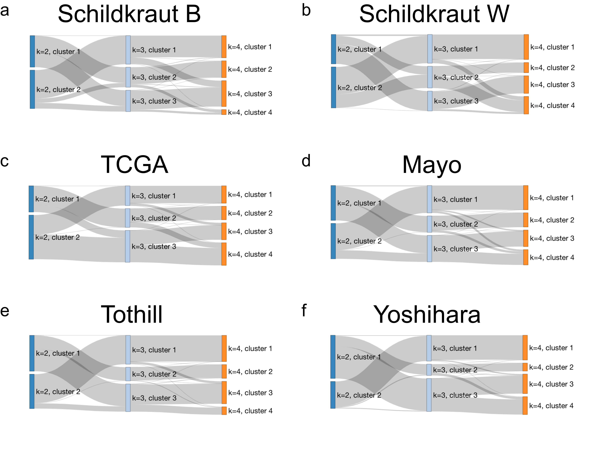<!-- -->

``` r
outfile = paste0(proj_dir, "/figure_notebooks/manuscript_figs/final_figs/supp_sankey_fig.pdf")
image_write(full_panel, format = "pdf", outfile)


full_panel = image_append(c(aaces_sankey_ggAA, aaces_sankey_ggW,
                           tcga_sankey_gg), stack = TRUE)

outfile = paste0(proj_dir, "/figure_notebooks/manuscript_figs/final_figs/main_sankey_fig.pdf")
image_write(full_panel, format = "pdf", outfile)
```

### format Figure 1

``` r
# font size of panel labels
annot_size = 120

####################  
# Make the top panel with kmeans vs. NMF anf sankey diagram
####################  
# aaces_K3_kmeans_NMF_gg = image_read_pdf(file.path(proj_dir,
#                                   "/figure_notebooks/manuscript_figs/aaces_K3_kmeans_v_nmf.pdf"))
# aaces_K3_kmeans_NMF_gg = image_border(aaces_K3_kmeans_NMF_gg, "white", "60x40")
# aaces_K3_kmeans_NMF_gg = image_scale(aaces_K3_kmeans_NMF_gg, 900)
# 
# 
# aaces_sankey_gg = image_read(file.path(proj_dir,
#                                   "/figure_notebooks/manuscript_figs/nov_8_sankey_aaces.png"))
# aaces_sankey_gg = image_border(aaces_sankey_gg, "white", "100x100")
# aaces_sankey_gg = image_scale(aaces_sankey_gg, 2100)
# 
# 
# top_panel <- image_append(c(aaces_K3_kmeans_NMF_gg, aaces_sankey_gg), stack = FALSE)
# top_panel = image_annotate(top_panel, "a", size = annot_size)
# top_panel = image_annotate(top_panel, "b", size = annot_size, location = "+900+0")
# top_panel

####################  
# Make the bottom 2 panels K=3 and K=4 
#################### 

aaces_K3_method_compare_gg = image_read_pdf(file.path(proj_dir,
                                  "/figure_notebooks/manuscript_figs/K3_method_comparison_AA.pdf"))
aaces_K3_method_compare_gg = image_border(aaces_K3_method_compare_gg, "white", "60x60")
aaces_K3_method_compare_gg = image_scale(aaces_K3_method_compare_gg, 3000)


aaces_K4_method_compare_gg = image_read_pdf(file.path(proj_dir,
                                  "/figure_notebooks/manuscript_figs/K4_method_comparison_AA.pdf"))
aaces_K4_method_compare_gg = image_border(aaces_K4_method_compare_gg, "white", "60x60")
aaces_K4_method_compare_gg = image_scale(aaces_K4_method_compare_gg, 3000)


bottom_panel <- image_append(c(aaces_K3_method_compare_gg, aaces_K4_method_compare_gg), stack = TRUE)
bottom_panel = image_annotate(bottom_panel, "a", size = annot_size)
bottom_panel = image_annotate(bottom_panel, "b", size = annot_size, location = "+0+600")
bottom_panel
```

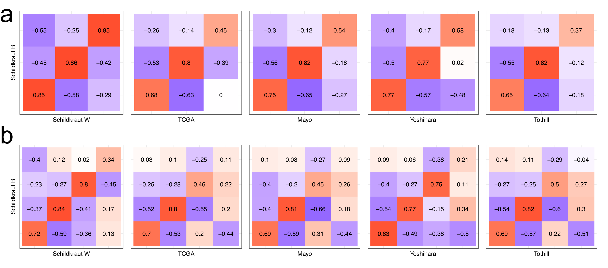<!-- -->

``` r
# full_panel <- image_append(c(top_panel, bottom_panel), stack = TRUE)
# full_panel

outfile = paste0(proj_dir, "/figure_notebooks/manuscript_figs/final_figs/main_clust_fig_aaces.pdf")
image_write(bottom_panel, format = "pdf", outfile)
```

### format supp figure Kmeans vs NMF

### Supp Figure XX

``` r
# font size of panel labels
annot_size = 40

####################  
# Make each panel -- 1 data set is one panel
#################### 

## AACES -- AA
aaces_kmeans_NMF_ggAA = image_read_pdf(file.path(proj_dir,
                                  "/figure_notebooks/manuscript_figs/schildkraut_AA_all_kmeans_v_nmf.pdf"))
aaces_kmeans_NMF_ggAA = image_scale(aaces_kmeans_NMF_ggAA, 3000)
aaces_kmeans_NMF_ggAA = image_border(aaces_kmeans_NMF_ggAA, "white", "60x60")
aaces_kmeans_NMF_ggAA = image_annotate(aaces_kmeans_NMF_ggAA, "a", size = annot_size)
aaces_kmeans_NMF_ggAA
```

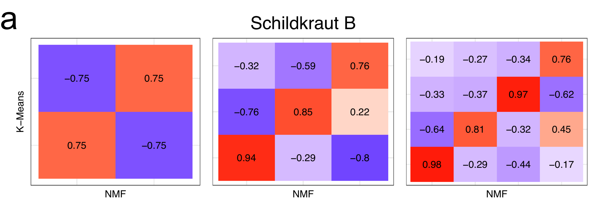<!-- -->

``` r
## AACES -- W
aaces_kmeans_NMF_ggW = image_read_pdf(file.path(proj_dir,
                                  "/figure_notebooks/manuscript_figs/schildkraut_W_all_kmeans_v_nmf.pdf"))
aaces_kmeans_NMF_ggW = image_scale(aaces_kmeans_NMF_ggW, 3000)
aaces_kmeans_NMF_ggW = image_border(aaces_kmeans_NMF_ggW, "white", "60x60")
aaces_kmeans_NMF_ggW = image_annotate(aaces_kmeans_NMF_ggW, "a", size = annot_size)
aaces_kmeans_NMF_ggW
```

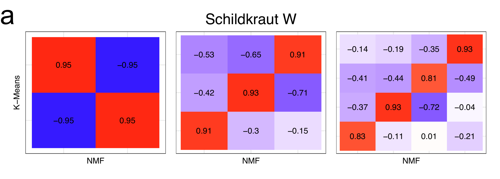<!-- -->

``` r
## TCGA
tcga_kmeans_NMF_gg = image_read_pdf(file.path(proj_dir,
                                  "/figure_notebooks/manuscript_figs/tcga_all_kmeans_v_nmf.pdf"))
tcga_kmeans_NMF_gg = image_scale(tcga_kmeans_NMF_gg, 3000)
tcga_kmeans_NMF_gg = image_border(tcga_kmeans_NMF_gg, "white", "60x60")
tcga_kmeans_NMF_gg = image_annotate(tcga_kmeans_NMF_gg, "b", size = annot_size)
tcga_kmeans_NMF_gg
```

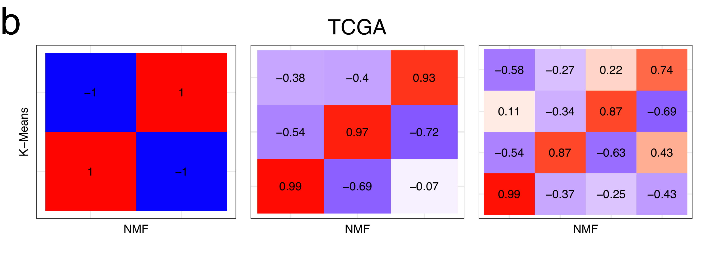<!-- -->

``` r
## Mayo
mayo_kmeans_NMF_gg = image_read_pdf(file.path(proj_dir,
                                  "/figure_notebooks/manuscript_figs/mayo_all_kmeans_v_nmf.pdf"))
mayo_kmeans_NMF_gg = image_scale(mayo_kmeans_NMF_gg, 3000)
mayo_kmeans_NMF_gg = image_border(mayo_kmeans_NMF_gg, "white", "60x60")
mayo_kmeans_NMF_gg = image_annotate(mayo_kmeans_NMF_gg, "c", size = annot_size)
mayo_kmeans_NMF_gg
```

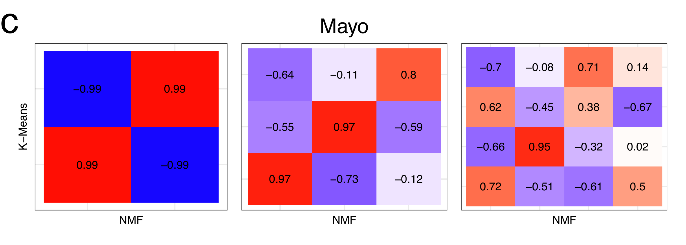<!-- -->

``` r
## Yoshihara
yoshihara_kmeans_NMF_gg = image_read_pdf(file.path(proj_dir,
                                  "/figure_notebooks/manuscript_figs/yoshihara_all_kmeans_v_nmf.pdf"))
yoshihara_kmeans_NMF_gg = image_scale(yoshihara_kmeans_NMF_gg, 3000)
yoshihara_kmeans_NMF_gg = image_border(yoshihara_kmeans_NMF_gg, "white", "60x60")
yoshihara_kmeans_NMF_gg = image_annotate(yoshihara_kmeans_NMF_gg, "d", size = annot_size)
yoshihara_kmeans_NMF_gg
```

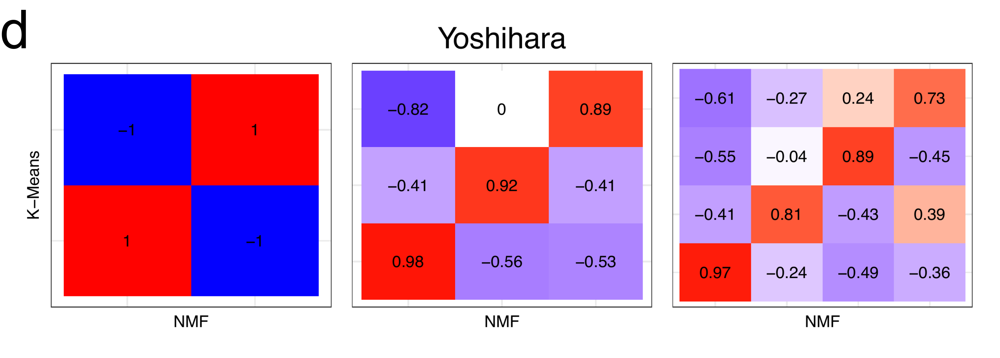<!-- -->

``` r
## Tothill
tothill_kmeans_NMF_gg = image_read_pdf(file.path(proj_dir,
                                  "/figure_notebooks/manuscript_figs/tothill_all_kmeans_v_nmf.pdf"))
tothill_kmeans_NMF_gg = image_scale(tothill_kmeans_NMF_gg, 3000)
tothill_kmeans_NMF_gg = image_border(tothill_kmeans_NMF_gg, "white", "60x60")
tothill_kmeans_NMF_gg = image_annotate(tothill_kmeans_NMF_gg, "e", size = annot_size)
tothill_kmeans_NMF_gg
```

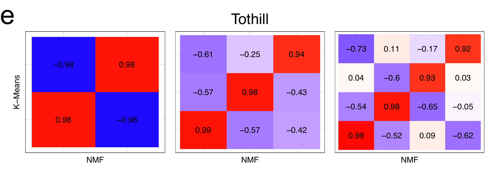<!-- -->

``` r
top_panel = image_append(c(aaces_kmeans_NMF_ggAA, aaces_kmeans_NMF_ggW), stack = FALSE)
mid_panel = image_append(c(tcga_kmeans_NMF_gg, mayo_kmeans_NMF_gg), stack = FALSE)
bot_panel = image_append(c(tothill_kmeans_NMF_gg, tothill_kmeans_NMF_gg), stack = FALSE)

full_panel <- image_append(c(top_panel,
                             mid_panel,
                             bot_panel), stack = TRUE)
full_panel
```

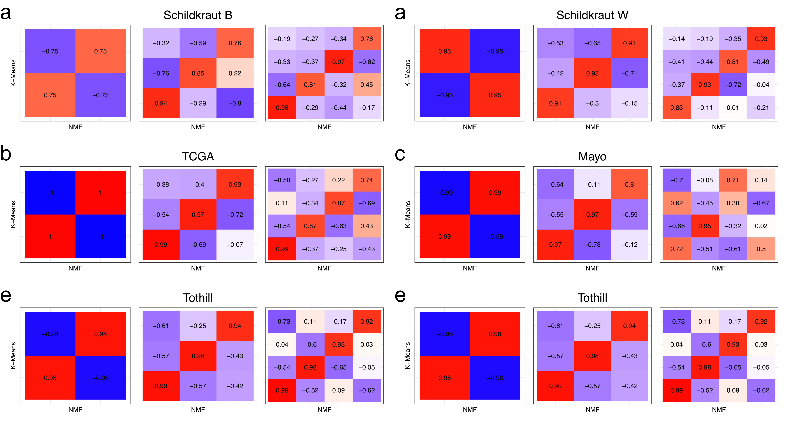<!-- -->

``` r
outfile = paste0(proj_dir, "/figure_notebooks/manuscript_figs/final_figs/supp_kmeans_vs_nmf_all.pdf")
image_write(full_panel, format = "pdf", outfile)
```

### format supp figure dataset comparison K=3 and K=4

### Supp Figure XX

``` r
####################  
# panel for K=3 and K-4
#################### 

## K=3
kmeans_K3_gg = image_read_pdf(file.path(proj_dir,
                                  "/figure_notebooks/manuscript_figs/K3_full_method_comparison.pdf"))
kmeans_K3_gg = image_trim(kmeans_K3_gg)
kmeans_K3_gg
```

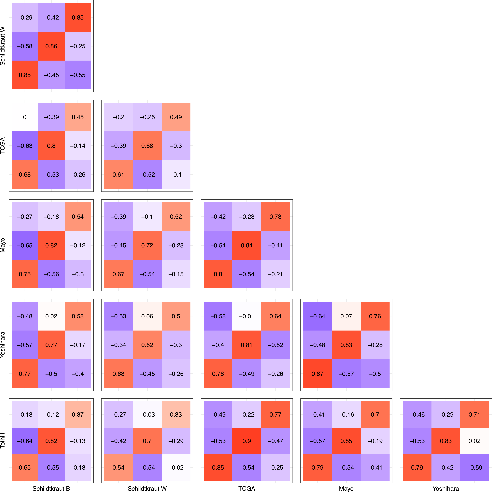<!-- -->

``` r
outfile = paste0(proj_dir, "/figure_notebooks/manuscript_figs/final_figs/supp_dataset_comparison_K3.pdf")
image_write(kmeans_K3_gg, format = "pdf", outfile)


## K=4
kmeans_K4_gg = image_read_pdf(file.path(proj_dir,
                                  "/figure_notebooks/manuscript_figs/K4_full_method_comparison.pdf"))
kmeans_K4_gg = image_trim(kmeans_K4_gg)
kmeans_K4_gg
```

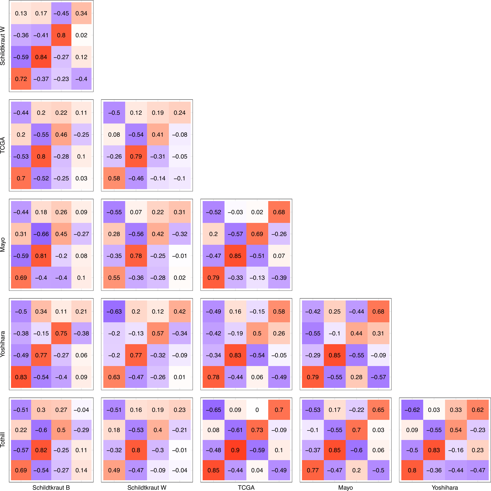<!-- -->

``` r
outfile = paste0(proj_dir, "/figure_notebooks/manuscript_figs/final_figs/supp_dataset_comparison_K4.pdf")
image_write(kmeans_K4_gg, format = "pdf", outfile)
```

### format QC supp figures – expression QC

### Supp Figure XX

``` r
# font size of panel labels
annot_size = 80


####################  
# Make the top panel -- venn diagram and T-SNE
####################  
venn_ggAA = image_read_pdf(file.path(proj_dir,
                                  "/figure_notebooks/manuscript_figs/venn_samples_AA_qc.pdf"))
venn_ggAA = image_border(venn_ggAA, "white", "60x40")
venn_ggAA = image_scale(venn_ggAA, 1000)

venn_ggW = image_read_pdf(file.path(proj_dir,
                                  "/figure_notebooks/manuscript_figs/venn_samples_W_qc.pdf"))
venn_ggW = image_border(venn_ggW, "white", "60x40")
venn_ggW = image_scale(venn_ggW, 1000)


top_panel <- image_append(c(venn_ggAA, venn_ggW), stack = FALSE)
top_panel = image_annotate(top_panel, "a", size = annot_size)
top_panel = image_annotate(top_panel, "b", size = annot_size, location = "+900+0")
top_panel
```

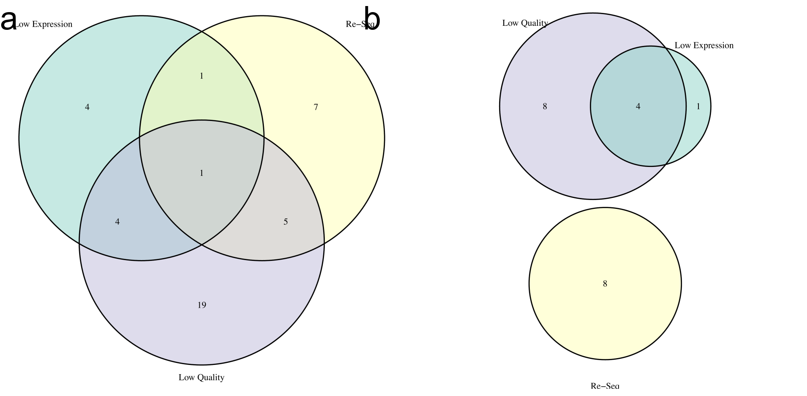<!-- -->

``` r
####################  
# Make the bottom 4 panels showing library size and effect of normalization
#################### 

#u35_gg = image_read_pdf(file.path(proj_dir,
#                                  "/figure_notebooks/manuscript_figs/u35_rnaseq_qc_normalized_box.pdf"))
#u35_gg = image_border(u35_gg, "white", "160x60")
#u35_gg = image_scale(u35_gg, 3000)

low_ggAA = image_read_pdf(file.path(proj_dir,
                                  "/figure_notebooks/manuscript_figs/low_qual_qc_normalized_box_AA.pdf"))
low_ggAA = image_border(low_ggAA, "white", "160x60")
low_ggAA = image_scale(low_ggAA, 3000)

low_ggW = image_read_pdf(file.path(proj_dir,
                                  "/figure_notebooks/manuscript_figs/low_qual_qc_normalized_box_W.pdf"))
low_ggW = image_border(low_ggW, "white", "160x60")
low_ggW = image_scale(low_ggW, 3000)


reseq_ggAA = image_read_pdf(file.path(proj_dir,
                                  "/figure_notebooks/manuscript_figs/reseq_rnaseq_qc_normalized_box_AA.pdf"))
reseq_ggAA = image_border(reseq_ggAA, "white", "160x60")
reseq_ggAA = image_scale(reseq_ggAA, 3000)

reseq_ggW = image_read_pdf(file.path(proj_dir,
                                  "/figure_notebooks/manuscript_figs/reseq_rnaseq_qc_normalized_box_W.pdf"))
reseq_ggW = image_border(reseq_ggW, "white", "160x60")
reseq_ggW = image_scale(reseq_ggW, 3000)

pilot_ggAA = image_read_pdf(file.path(proj_dir,
                                  "/figure_notebooks/manuscript_figs/pilot_rnaseq_qc_normalized_box_AA.pdf"))
pilot_ggAA = image_border(pilot_ggAA, "white", "160x60")
pilot_ggAA = image_scale(pilot_ggAA, 3000)

pilot_ggW = image_read_pdf(file.path(proj_dir,
                                  "/figure_notebooks/manuscript_figs/pilot_rnaseq_qc_normalized_box_W.pdf"))
pilot_ggW = image_border(pilot_ggW, "white", "160x60")
pilot_ggW = image_scale(pilot_ggW, 3000)


bottom_panel <- image_append(c(low_ggAA, low_ggW, reseq_ggAA, reseq_ggW, pilot_ggAA, pilot_ggW), stack = TRUE)
bottom_panel = image_annotate(bottom_panel, "c", size = annot_size)
bottom_panel = image_annotate(bottom_panel, "d", size = annot_size, location = "+0+500")
bottom_panel = image_annotate(bottom_panel, "e", size = annot_size, location = "+0+1000")
bottom_panel = image_annotate(bottom_panel, "f", size = annot_size, location = "+0+1500")
bottom_panel = image_annotate(bottom_panel, "g", size = annot_size, location = "+0+2000")
bottom_panel = image_annotate(bottom_panel, "h", size = annot_size, location = "+0+2500")
bottom_panel
```

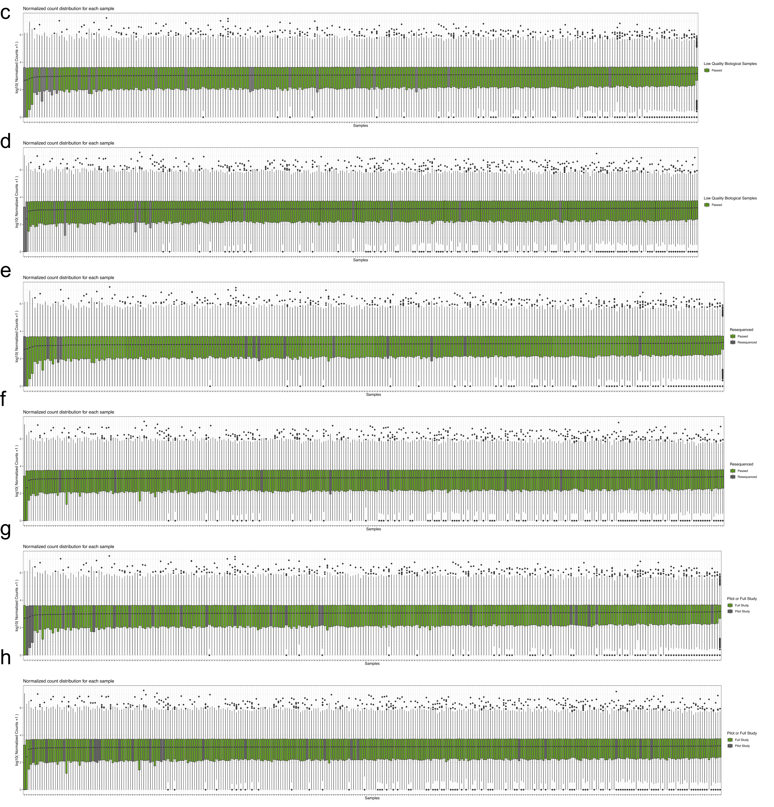<!-- -->

``` r
full_panel <- image_append(c(top_panel, bottom_panel), stack = TRUE)
full_panel
```

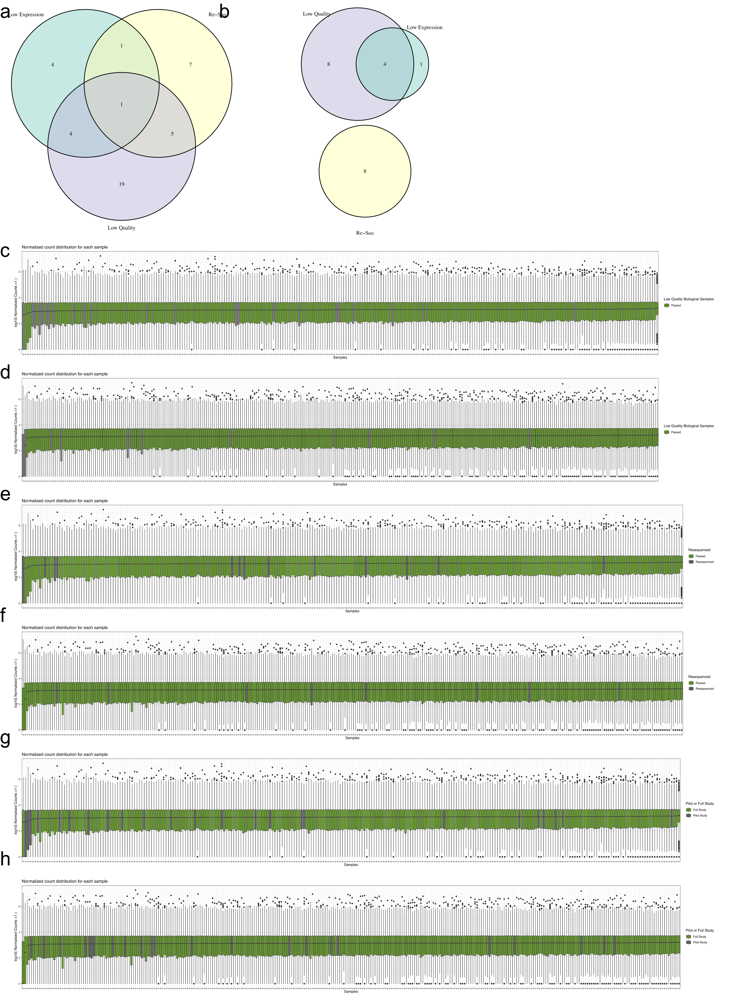<!-- -->

``` r
outfile = paste0(proj_dir, "/figure_notebooks/manuscript_figs/final_figs/supp_qc.pdf")
image_write(full_panel, format = "pdf", outfile)
```

### format QC supp figures – cluster QC

### Supp Figure XX

``` r
# font size of panel labels
annot_size = 80

####################  
# Make the top panel -- venn diagram and T-SNE
####################  
k2_tsne_ggAA = image_read_pdf(file.path(proj_dir,
                                  "/figure_notebooks/manuscript_figs/K2_mad_genes_rnaseq_tsne_normalized_AA.pdf"))
k2_tsne_ggAA = image_border(k2_tsne_ggAA, "white", "100x100")
k2_tsne_ggAA = image_scale(k2_tsne_ggAA, 1000)
#k2_tsne_ggAA = image_annotate(k2_tsne_ggAA, "Schildkraut AA", size = title_size, location="+400")

k2_tsne_ggW = image_read_pdf(file.path(proj_dir,
                                  "/figure_notebooks/manuscript_figs/K2_mad_genes_rnaseq_tsne_normalized_W.pdf"))
k2_tsne_ggW = image_border(k2_tsne_ggW, "white", "100x100")
k2_tsne_ggW = image_scale(k2_tsne_ggW, 1000)


k3_tsne_ggAA = image_read_pdf(file.path(proj_dir,
                                  "/figure_notebooks/manuscript_figs/K3_mad_genes_rnaseq_tsne_normalized_AA.pdf"))
k3_tsne_ggAA = image_border(k3_tsne_ggAA, "white", "100x100")
k3_tsne_ggAA = image_scale(k3_tsne_ggAA, 1000)

k3_tsne_ggW = image_read_pdf(file.path(proj_dir,
                                  "/figure_notebooks/manuscript_figs/K3_mad_genes_rnaseq_tsne_normalized_W.pdf"))
k3_tsne_ggW = image_border(k3_tsne_ggW, "white", "100x100")
k3_tsne_ggW = image_scale(k3_tsne_ggW, 1000)


k4_tsne_ggAA = image_read_pdf(file.path(proj_dir,
                                  "/figure_notebooks/manuscript_figs/K4_mad_genes_rnaseq_tsne_normalized_AA.pdf"))
k4_tsne_ggAA = image_border(k4_tsne_ggAA, "white", "100x100")
k4_tsne_ggAA = image_scale(k4_tsne_ggAA, 1000)

k4_tsne_ggW = image_read_pdf(file.path(proj_dir,
                                  "/figure_notebooks/manuscript_figs/K4_mad_genes_rnaseq_tsne_normalized_W.pdf"))
k4_tsne_ggW = image_border(k4_tsne_ggW, "white", "100x100")
k4_tsne_ggW = image_scale(k4_tsne_ggW, 1000)


top_panelAA <- image_append(c(k2_tsne_ggAA, k3_tsne_ggAA, k4_tsne_ggAA), stack = FALSE)
top_panelAA = image_annotate(top_panelAA, "a", size = annot_size)
top_panelAA = image_annotate(top_panelAA, "b", size = annot_size, location = "+900+0")
top_panelAA = image_annotate(top_panelAA, "c", size = annot_size, location = "+1800+0")

top_panelW <- image_append(c(k2_tsne_ggW, k3_tsne_ggW, k4_tsne_ggW), stack = FALSE)
top_panelW = image_annotate(top_panelW, "d", size = annot_size)
top_panelW = image_annotate(top_panelW, "e", size = annot_size, location = "+900+0")
top_panelW = image_annotate(top_panelW, "f", size = annot_size, location = "+1800+0")

top_panel = image_append(c(top_panelAA, top_panelW), stack = TRUE)

####################  
# Make the bottom 3 panels showing library size and effect of normalization
#################### 

unnorm_ggAA = image_read_pdf(file.path(proj_dir,
                                  "/figure_notebooks/manuscript_figs/K3_rnaseq_qc_unnormalized_box_AA.pdf"))
unnorm_ggAA = image_border(unnorm_ggAA, "white", "160x60")
unnorm_ggAA = image_scale(unnorm_ggAA, 3000)


unnorm_ggW = image_read_pdf(file.path(proj_dir,
                                  "/figure_notebooks/manuscript_figs/K3_rnaseq_qc_unnormalized_box_W.pdf"))
unnorm_ggW = image_border(unnorm_ggW, "white", "160x60")
unnorm_ggW = image_scale(unnorm_ggW, 3000)


norm_ggAA = image_read_pdf(file.path(proj_dir,
                                  "/figure_notebooks/manuscript_figs/K3_rnaseq_qc_normalized_box_AA.pdf"))
norm_ggAA = image_border(norm_ggAA, "white", "160x60")
norm_ggAA = image_scale(norm_ggAA, 3000)


norm_ggW = image_read_pdf(file.path(proj_dir,
                                  "/figure_notebooks/manuscript_figs/K3_rnaseq_qc_normalized_box_W.pdf"))
norm_ggW = image_border(norm_ggW, "white", "160x60")
norm_ggW = image_scale(norm_ggW, 3000)


mad_ggAA = image_read_pdf(file.path(proj_dir,
                                  "/figure_notebooks/manuscript_figs/K3_mad_genes_rnaseq_qc_normalized_box_AA.pdf"))
mad_ggAA = image_border(mad_ggAA, "white", "160x60")
mad_ggAA = image_scale(mad_ggAA, 3000)


mad_ggW = image_read_pdf(file.path(proj_dir,
                                  "/figure_notebooks/manuscript_figs/K3_mad_genes_rnaseq_qc_normalized_box_W.pdf"))
mad_ggW = image_border(mad_ggW, "white", "160x60")
mad_ggW = image_scale(mad_ggW, 3000)


bottom_panel <- image_append(c(unnorm_ggAA, unnorm_ggW,
                               norm_ggAA, norm_ggW,
                               mad_ggAA, mad_ggW), stack = TRUE)
bottom_panel = image_annotate(bottom_panel, "a", size = annot_size)
bottom_panel = image_annotate(bottom_panel, "b", size = annot_size, location = "+0+500")
bottom_panel = image_annotate(bottom_panel, "c", size = annot_size, location = "+0+1000")
bottom_panel = image_annotate(bottom_panel, "d", size = annot_size, location = "+0+1500")
bottom_panel = image_annotate(bottom_panel, "e", size = annot_size, location = "+0+2000")
bottom_panel = image_annotate(bottom_panel, "f", size = annot_size, location = "+0+2500")
bottom_panel
```

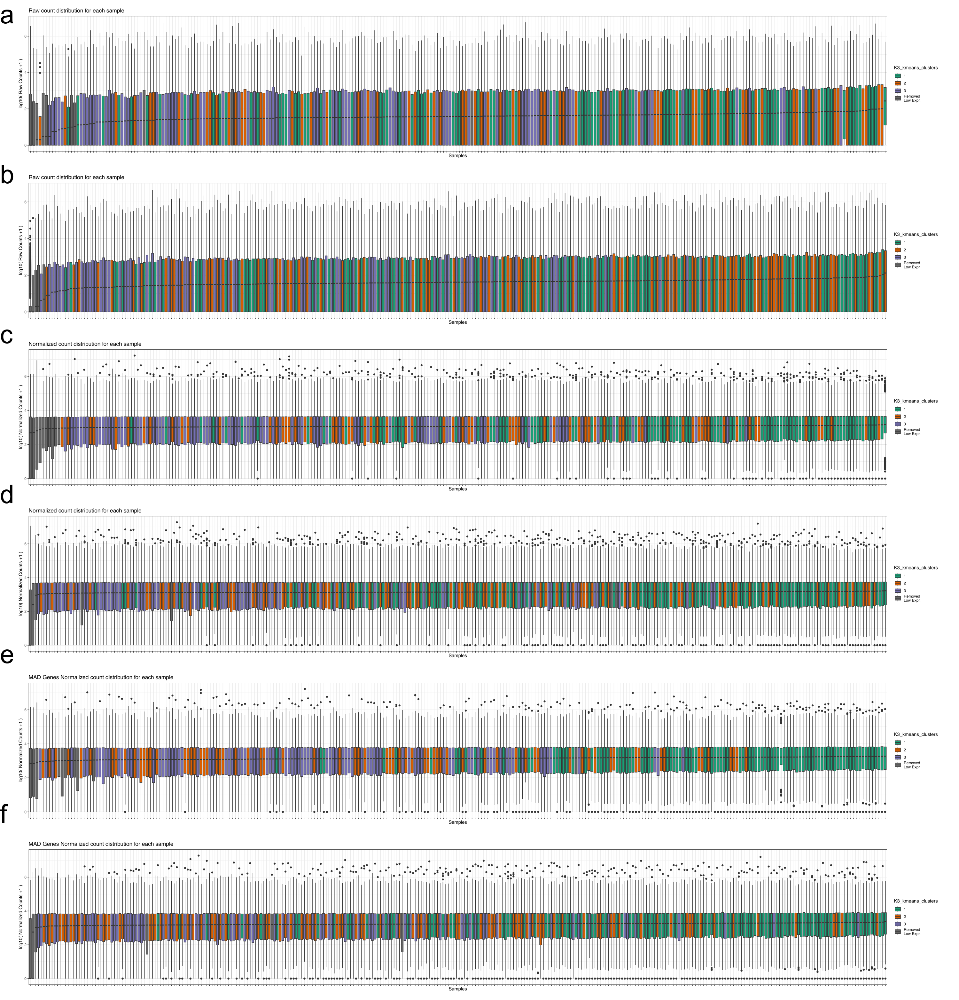<!-- -->

``` r
full_panel <- image_append(c(top_panel, bottom_panel), stack = TRUE)
full_panel
```

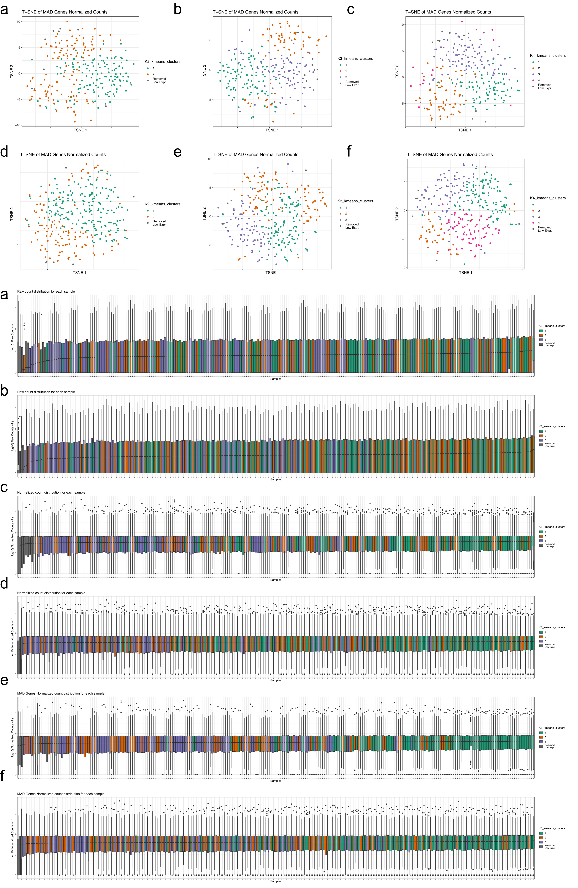<!-- -->

``` r
outfile = paste0(proj_dir, "/figure_notebooks/manuscript_figs/final_figs/clust_supp_qc_top.pdf")
image_write(top_panel, format = "pdf", outfile)

outfile = paste0(proj_dir, "/figure_notebooks/manuscript_figs/final_figs/clust_supp_qc_bot.pdf")
image_write(bottom_panel, format = "pdf", outfile)
```
