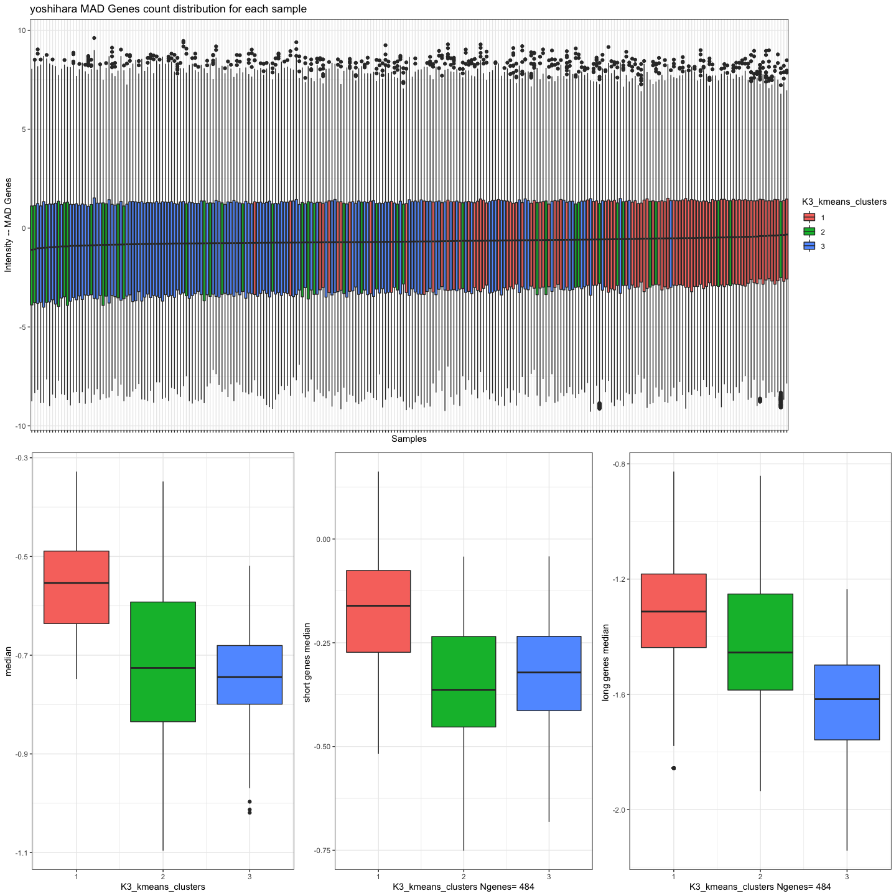
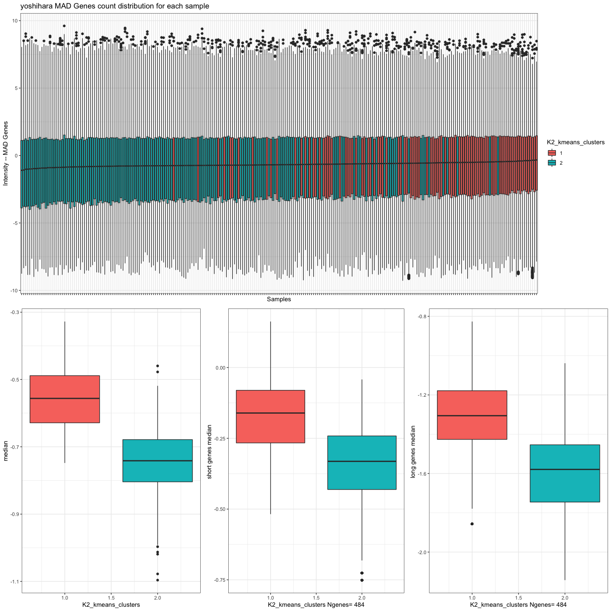
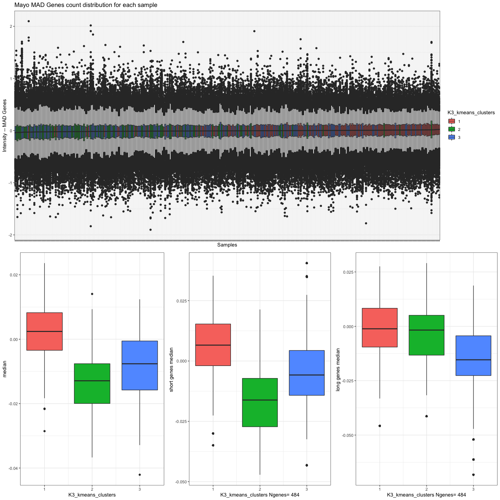
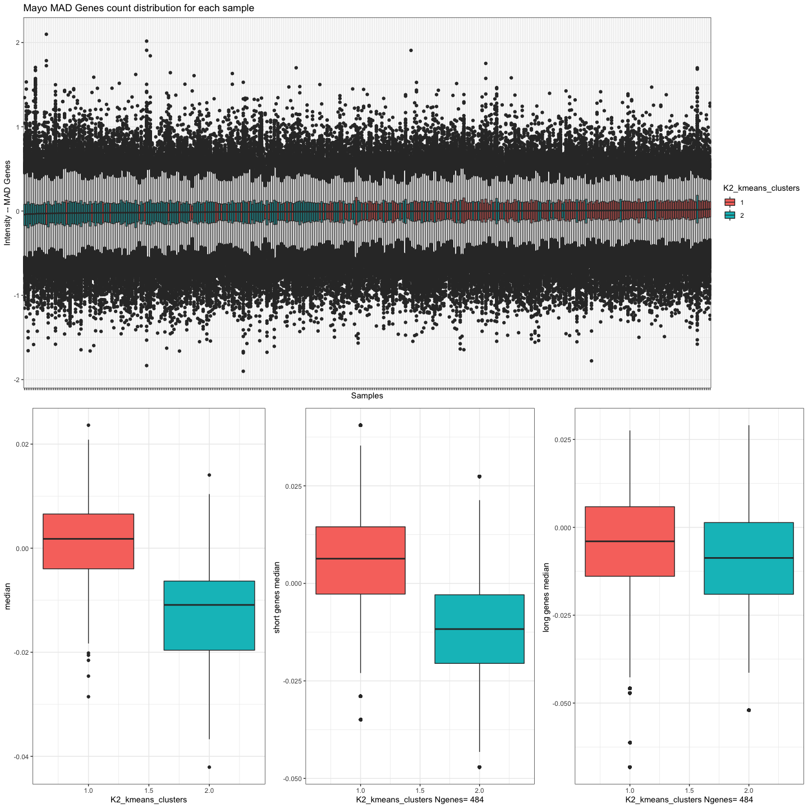

check_affy_degradation
================
Natalie Davidson
9/21/2022

In this notebook, we will show how the Tothill and TCGA datasets have
clusters that are correlated with library size, but not fully explained
by degradation. Since these are the only 2 Affy datasets in our
analysis, we are only able to calculate a degradtaion score for these
datasets. This is because Affy MAs (microarrays) use multiple probes per
gene, where we can estimate 5’/3’ bias. The other datasets are done on
agilent – we can not calculate probe bias on those MA’s, so we instead
look at biases of gene length.

## read in metadata

``` r
# current cluster labels
clust_id_file = file.path(proj_dir, 
                    "/data/way_pipeline_results_all/2.Clustering_DiffExprs-Tables-ClusterMembership/FullClusterMembership.csv")

clust_df = data.frame(fread(clust_id_file))
colnames(clust_df)[1] = "ID"

# original cluster labels
old_file = file.path(proj_dir, 
                    "/data/way_publication_results/033514_tables3.csv")

old_df = data.frame(fread(old_file))

# gene length
gene_meta_file = file.path(proj_dir, 
                    "/reference_data/temp_gene_lengths.tsv")
gene_len_df = data.frame(fread(gene_meta_file))
gene_len_df = gene_len_df[order(gene_len_df$Median, decreasing = T),]
gene_len_df = gene_len_df[!duplicated(gene_len_df$HGNC.symbol),]

# MAD genes used in clustering
gene_file = file.path(proj_dir, 
                    "/data/way_pipeline_results_10removed_NeoRemoved/1.DataInclusion-Data-Genes/GlobalMAD_genelist.csv")
gene_df <- data.frame(fread(gene_file))
colnames(gene_df)[1] = "hgnc_symbol"
```

## Make boxplots methods

``` r
read_format_expr <- function(in_df, metadata_table){
    
     rnaseq_expr_df = in_df

    # format it so we can add metadata
    gene_ids = row.names(rnaseq_expr_df)
    sample_ids = colnames(rnaseq_expr_df)
    rnaseq_expr_df = data.frame(t(rnaseq_expr_df))
    colnames(rnaseq_expr_df) = gene_ids
    
    # now add column names back so we can have annotations
    rnaseq_expr_df$ID = sample_ids
    
    full_df = merge(metadata_table, rnaseq_expr_df, by = "ID")
    
    return(list(full_df, gene_ids))
}

plot_boxplot_expr <- function(in_df, in_genes, metadata_table, gene_len_df, col_name_interest, 
                              col_plot_name, title_txt, xlab_txt, ylab_txt){
        
    # now plot the stats
    gene_count_df = in_df[,in_genes]
    gene_count_df$sample_id = in_df$ID
    gene_count_melt <- melt(gene_count_df, id.vars="sample_id")
    colnames(gene_count_melt) = c("ID", "gene_id", "count")
    
    # add version tag
    gene_count_melt = merge(gene_count_melt, metadata_table, by="ID")
    
    # order samples by median expression
    sample_order_df = data.frame(median_count = apply(in_df[,in_genes], 1, median),
                                 ID = in_df$ID)
    sample_order_df = sample_order_df[order(sample_order_df$median_count),]
    gene_count_melt = merge(gene_count_melt, sample_order_df)
    gene_count_melt$ID = factor(gene_count_melt$ID, 
                                        levels = sample_order_df$ID)

    col_idx = which(colnames(gene_count_melt) == col_name_interest)
    colnames(gene_count_melt)[col_idx] = "fill_col"
    gg = ggplot(gene_count_melt, aes(x=as.factor(ID), y=count, fill=as.factor(fill_col))) +
        geom_boxplot() + theme_bw() +
        theme(axis.text.x = element_blank()) +
        xlab(xlab_txt) + ylab(ylab_txt) +
            ggtitle(title_txt) +
        labs(fill = col_plot_name)
    
    med_df = unique(gene_count_melt[,c("ID", "fill_col", "median_count")])
    gg1 = ggplot(med_df, aes(x=fill_col, y=median_count, fill=as.factor(fill_col))) +
            geom_boxplot() + theme_bw() +
            xlab(col_plot_name) + ylab("median") +
            labs(fill = col_plot_name) + theme(legend.position = "none")

    # subset for the short/long genes only
    gene_len_df_inter = intersect(gene_count_melt$gene_id, gene_len_df$HGNC.symbol)
    gene_len_df_inter = subset(gene_len_df, HGNC.symbol %in% gene_len_df_inter)
    cutoff = quantile(gene_len_df_inter$Median, 0.10)
    gene_len_df_short = subset(gene_len_df_inter, Median < cutoff)
    cutoff = quantile(gene_len_df_inter$Median, 0.90)
    gene_len_df_long = subset(gene_len_df, Median > cutoff)

    # make the short genes plot
    gene_count_melt_short = subset(gene_count_melt, gene_id %in% gene_len_df_short$HGNC.symbol)
    gene_count_melt_short_med = gene_count_melt_short %>%
                                    group_by(ID)%>% 
                                    summarise(Median_short=median(count))
    gene_count_melt_short = merge(gene_count_melt_short, gene_count_melt_short_med)
    x_lab_gene = paste(col_plot_name, "Ngenes=", length(unique(gene_count_melt_short$gene_id)))
    gg2 = ggplot(gene_count_melt_short, aes(x=fill_col, y=Median_short, fill=as.factor(fill_col))) +
            geom_boxplot() + theme_bw() +
            xlab(x_lab_gene) + ylab("short genes median ") +
            labs(fill = col_plot_name) + theme(legend.position = "none")
    
    
    # make the long genes plot
    gene_count_melt_long = subset(gene_count_melt, gene_id %in% gene_len_df_long$HGNC.symbol)
    gene_count_melt_long_med = gene_count_melt_long %>%
                                    group_by(ID)%>% 
                                    summarise(Median_long=median(count))
    gene_count_melt_long = merge(gene_count_melt_long, gene_count_melt_long_med)
    x_lab_gene = paste(col_plot_name, "Ngenes=", length(unique(gene_count_melt_long$gene_id)))
    gg3 = ggplot(gene_count_melt_long, aes(x=fill_col, y=Median_long, fill=as.factor(fill_col))) +
            geom_boxplot() + theme_bw() +
            xlab(x_lab_gene) + ylab("long genes median ") +
            labs(fill = col_plot_name) + theme(legend.position = "none")

    # put it all together
    flat_plot = ggarrange(gg, 
                          ggarrange(gg1, gg2, gg3, ncol=3),
                          nrow=2)
    return(flat_plot)
}
```

# Yoshihara

## read in yoshihara

``` r
yoshihara_data = data(GSE32062.GPL6480_eset)
ExpressionData <- get(yoshihara_data)
yoshihara_dta <- exprs(ExpressionData)

yoshihara_metadata_table = subset(clust_df, Dataset == "Yoshihara")


yoshihara_old_df = subset(old_df, Dataset == "Yoshihara")
yoshihara_old_df = yoshihara_old_df[,-2]
colnames(yoshihara_old_df)[2:ncol(yoshihara_old_df)] = paste0("ORIG_", colnames(yoshihara_old_df)[2:ncol(yoshihara_old_df)])
yoshihara_metadata_table = merge(yoshihara_metadata_table, yoshihara_old_df, by="ID")
```

## Make boxplots

``` r
# format the expr table
res = read_format_expr(yoshihara_dta, yoshihara_metadata_table)
in_df = res[[1]]
in_genes = res[[2]]
subset_cols = c(colnames(yoshihara_metadata_table), gene_df$hgnc_symbol)


in_gg = plot_boxplot_expr(in_df[,subset_cols], gene_df$hgnc_symbol, yoshihara_metadata_table, gene_len_df,
                  col_name_interest = "ClusterK3_kmeans", 
                  col_plot_name = "K3_kmeans_clusters",
                  title = "yoshihara MAD Genes count distribution for each sample", 
                  xlab = "Samples", 
                  ylab = "Intensity -- MAD Genes")
    
outfile = paste0(proj_dir, "/figure_notebooks/manuscript_figs/K3_yoshihara.pdf")
ggsave(outfile,
       in_gg, width = 30, height = 15, units = "in", device = "pdf")
in_gg
```



``` r
in_gg = plot_boxplot_expr(in_df[,subset_cols], gene_df$hgnc_symbol, yoshihara_metadata_table, gene_len_df,
                  col_name_interest = "ClusterK2_kmeans", 
                  col_plot_name = "K2_kmeans_clusters",
                  title = "yoshihara MAD Genes count distribution for each sample", 
                  xlab = "Samples", 
                  ylab = "Intensity -- MAD Genes")
    
outfile = paste0(proj_dir, "/figure_notebooks/manuscript_figs/K2_yoshihara.pdf")
ggsave(outfile,
       in_gg, width = 30, height = 15, units = "in", device = "pdf")
in_gg
```



``` r
####### calculate test

sample_order_df = data.frame(med = apply(in_df[,in_genes], 1, median),
                             ID = in_df$ID)

wilcox_df = merge(sample_order_df, yoshihara_metadata_table, by="ID")
wilcox_df = wilcox_df[order(wilcox_df$med),]

num_g1 = sum(wilcox_df$ClusterK2_kmeans == 1)

print("Test for correlation between clusters and ranking by median gene expression")
```

    ## [1] "Test for correlation between clusters and ranking by median gene expression"

``` r
print(wilcox.test(wilcox_df$ClusterK2_kmeans[1:num_g1], wilcox_df$ClusterK2_kmeans[(num_g1+1):nrow(wilcox_df)]))
```

    ## 
    ##  Wilcoxon rank sum test with continuity correction
    ## 
    ## data:  wilcox_df$ClusterK2_kmeans[1:num_g1] and wilcox_df$ClusterK2_kmeans[(num_g1 + 1):nrow(wilcox_df)]
    ## W = 10965, p-value = 3.426e-12
    ## alternative hypothesis: true location shift is not equal to 0

``` r
print(wilcox.test(wilcox_df$ClusterK2_NMF[1:num_g1], wilcox_df$ClusterK2_NMF[(num_g1+1):nrow(wilcox_df)]))
```

    ## 
    ##  Wilcoxon rank sum test with continuity correction
    ## 
    ## data:  wilcox_df$ClusterK2_NMF[1:num_g1] and wilcox_df$ClusterK2_NMF[(num_g1 + 1):nrow(wilcox_df)]
    ## W = 10996, p-value = 1.727e-12
    ## alternative hypothesis: true location shift is not equal to 0

# Mayo

## read in mayo

``` r
mayo_data = load(file=file.path(proj_dir, 
                                "/data/mayo/MayoEset.Rda"))

ExpressionData <- get(mayo_data)
mayo_dta <- exprs(ExpressionData)

mayo_metadata_table = subset(clust_df, Dataset == "mayo.eset")


mayo_old_df = subset(old_df, Dataset == "Mayo")
mayo_old_df = mayo_old_df[,-2]
colnames(mayo_old_df)[2:ncol(mayo_old_df)] = paste0("ORIG_", colnames(mayo_old_df)[2:ncol(mayo_old_df)])
mayo_metadata_table = merge(mayo_metadata_table, mayo_old_df, by="ID")
```

## Make boxplots

``` r
# format the expr table
res = read_format_expr(mayo_dta, mayo_metadata_table)
in_df = res[[1]]
in_genes = res[[2]]
subset_cols = c(colnames(mayo_metadata_table), gene_df$hgnc_symbol)

in_gg = plot_boxplot_expr(in_df[,subset_cols], gene_df$hgnc_symbol, mayo_metadata_table, gene_len_df,
                  col_name_interest = "ClusterK3_kmeans", 
                  col_plot_name = "K3_kmeans_clusters",
                  title = "Mayo MAD Genes count distribution for each sample", 
                  xlab = "Samples", 
                  ylab = "Intensity -- MAD Genes")
    
outfile = paste0(proj_dir, "/figure_notebooks/manuscript_figs/K3_mayo.pdf")
ggsave(outfile,
       in_gg, width = 30, height = 15, units = "in", device = "pdf")
in_gg
```



``` r
in_gg = plot_boxplot_expr(in_df[,subset_cols], gene_df$hgnc_symbol, mayo_metadata_table, gene_len_df,
                  col_name_interest = "ClusterK2_kmeans", 
                  col_plot_name = "K2_kmeans_clusters",
                  title = "Mayo MAD Genes count distribution for each sample", 
                  xlab = "Samples", 
                  ylab = "Intensity -- MAD Genes")
    
outfile = paste0(proj_dir, "/figure_notebooks/manuscript_figs/K2_mayo.pdf")
ggsave(outfile,
       in_gg, width = 30, height = 15, units = "in", device = "pdf")
in_gg
```



``` r
####### calculate test

sample_order_df = data.frame(med = apply(in_df[,in_genes], 1, median),
                             ID = in_df$ID)

wilcox_df = merge(sample_order_df, mayo_metadata_table, by="ID")
wilcox_df = wilcox_df[order(wilcox_df$med),]

num_g1 = sum(wilcox_df$ClusterK2_kmeans == 1)

print("Test for correlation between clusters and ranking by median gene expression")
```

    ## [1] "Test for correlation between clusters and ranking by median gene expression"

``` r
print(wilcox.test(wilcox_df$ClusterK2_kmeans[1:num_g1], wilcox_df$ClusterK2_kmeans[(num_g1+1):nrow(wilcox_df)]))
```

    ## 
    ##  Wilcoxon rank sum test with continuity correction
    ## 
    ## data:  wilcox_df$ClusterK2_kmeans[1:num_g1] and wilcox_df$ClusterK2_kmeans[(num_g1 + 1):nrow(wilcox_df)]
    ## W = 16588, p-value = 0.1991
    ## alternative hypothesis: true location shift is not equal to 0

``` r
print(wilcox.test(wilcox_df$ClusterK2_NMF[1:num_g1], wilcox_df$ClusterK2_NMF[(num_g1+1):nrow(wilcox_df)]))
```

    ## 
    ##  Wilcoxon rank sum test with continuity correction
    ## 
    ## data:  wilcox_df$ClusterK2_NMF[1:num_g1] and wilcox_df$ClusterK2_NMF[(num_g1 + 1):nrow(wilcox_df)]
    ## W = 17315, p-value = 0.6177
    ## alternative hypothesis: true location shift is not equal to 0
