short_gene_recluster
================
Natalie Davidson
9/21/2022

# INTRO

In this notebook, we want to see if the clusters are driven by a
specific confounder. The confounders we look at are 1) gene length 2)
transcripts in a gene 3) expression of the gene. The way we answer this
question is to see how much using genes of a specific type drive the
clustering. A visual description of the approach is shown here:

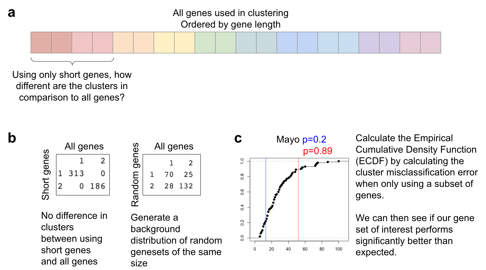

# cluster using only the short/long genes and calculate probability of performance

``` r
read_format_expr <- function(in_df, metadata_table){
    
     rnaseq_expr_df = in_df

    # format it so we can add metadata
    gene_ids = row.names(rnaseq_expr_df)
    sample_ids = colnames(rnaseq_expr_df)
    rnaseq_expr_df = data.frame(t(rnaseq_expr_df))
    colnames(rnaseq_expr_df) = gene_ids
    
    # now add column names back so we can have annotations
    rnaseq_expr_df$ID = sample_ids
    
    full_df = merge(metadata_table, rnaseq_expr_df, by = "ID")
    
    return(list(full_df, gene_ids))
}


get_prob_gene_clust <- function(metadata_table, gene_len_df, mad_df, in_df, percentile_val, short_genes=NA, long_genes=NA){
    
 
    col_keep = grep("long_madKmeans|short_madKmeans|rand_madKmeans", colnames(metadata_table), value=T, invert=T)
    metadata_table = metadata_table[,col_keep]
    
    genes_len_intersect = intersect(gene_len_df$HGNC.symbol, mad_df$hgnc_symbol)
    gene_len_df_mad = gene_len_df[gene_len_df$HGNC.symbol %in% genes_len_intersect, ]
    filt_len = quantile(gene_len_df_mad$Median, c(1-percentile_val, percentile_val))
    
    if(is.na(short_genes)){
        short_genes = gene_len_df_mad$HGNC.symbol[gene_len_df_mad$Median < filt_len[2]]
    }
    if(is.na(long_genes)){
      long_genes = gene_len_df_mad$HGNC.symbol[gene_len_df_mad$Median > filt_len[1]]
    }

    
    ###### now use short MAD genes
    
    orig_kmeans_res = kmeans(in_df[,short_genes], centers=2, nstart=10)
    in_df$short_madKmeans_2 = orig_kmeans_res$cluster
    
    if(sum(in_df$short_madKmeans_2 != in_df$ClusterK2_kmeans) > length(in_df$ClusterK2_kmeans)/2){
        in_df$short_madKmeans_2 = in_df$short_madKmeans_2-1
        in_df$short_madKmeans_2[in_df$short_madKmeans_2 == 0] = 2
    }
    print(sum(in_df$short_madKmeans_2 == in_df$ClusterK2_kmeans))
    
    metadata_table = merge(metadata_table, in_df[,c("ID", "short_madKmeans_2")], by="ID")
    
    
        

    ###### now use long MAD genes

    orig_kmeans_res = kmeans(in_df[,long_genes], centers=2, nstart=10)
    in_df$long_madKmeans_2 = orig_kmeans_res$cluster

    if(sum(in_df$long_madKmeans_2 != in_df$ClusterK2_kmeans) > length(in_df$ClusterK2_kmeans)/2){
        in_df$long_madKmeans_2 = in_df$long_madKmeans_2-1
        in_df$long_madKmeans_2[in_df$long_madKmeans_2 == 0] = 2
    }
    print(sum(in_df$long_madKmeans_2 == in_df$ClusterK2_kmeans))

    metadata_table = merge(metadata_table, in_df[,c("ID", "long_madKmeans_2")], by="ID")

    print(table(metadata_table$short_madKmeans_2, metadata_table$ClusterK2_kmeans))
    print(table(metadata_table$long_madKmeans_2, metadata_table$ClusterK2_kmeans))
    
    
    ###### now use random MAD genes
    dist_of_diff = c()
    for(idx in 1:100){
        col_keep = grep("rand_madKmeans", colnames(metadata_table), value=T, invert=T)
        metadata_table = metadata_table[,col_keep]
        
        nonshort_genes = gene_len_df_mad$HGNC.symbol #[gene_len_df_mad$Median > filt_len[2] & gene_len_df_mad$Median < filt_len[1]]
    
        rand_genes = sample(nonshort_genes, length(short_genes))
        orig_kmeans_res = kmeans(in_df[,rand_genes], centers=2, nstart=10)
        in_df$rand_madKmeans_2 = orig_kmeans_res$cluster
        
        if(sum(in_df$rand_madKmeans_2 != in_df$ClusterK2_kmeans) > length(in_df$ClusterK2_kmeans)/2){
            in_df$rand_madKmeans_2 = in_df$rand_madKmeans_2-1
            in_df$rand_madKmeans_2[in_df$rand_madKmeans_2 == 0] = 2
        }
        metadata_table = merge(metadata_table, in_df[,c("ID", "rand_madKmeans_2")], by="ID")
        dist_of_diff = c(dist_of_diff, 
                         sum(metadata_table$rand_madKmeans_2 != metadata_table$ClusterK2_kmeans))
    }
    d_fun <- ecdf(dist_of_diff)

    sum_short = sum(metadata_table$short_madKmeans_2 != metadata_table$ClusterK2_kmeans)
    sum_long = sum(metadata_table$long_madKmeans_2 != metadata_table$ClusterK2_kmeans)
    
    
    return(list(d_fun, sum_short, sum_long, short_genes, long_genes))
}

get_len_expr <- function(in_df, in_genes){
    
    gene_expr_med = in_df[,in_genes]
    gene_expr_med = apply(gene_expr_med, 2, median)
    gene_expr_med = data.frame(HGNC.symbol = names(gene_expr_med),
                               median_expr = gene_expr_med)
    gene_expr_med = merge(gene_expr_med, gene_len_df, by="HGNC.symbol")
    colnames(gene_expr_med)[4] = "median_len"

    return(gene_expr_med)
}
```

## Get metadata

``` r
clust_id_file = file.path(proj_dir, 
                    "/data/way_pipeline_results_10removed_NeoRemoved/2.Clustering_DiffExprs-Tables-ClusterMembership/FullClusterMembership.csv")

clust_df = data.frame(fread(clust_id_file))
colnames(clust_df)[1] = "ID"


# gene length info
gene_meta_file = file.path(proj_dir, 
                    "/reference_data/temp_gene_lengths.tsv")
gene_len_df = data.frame(fread(gene_meta_file))
gene_len_df = gene_len_df[order(gene_len_df$Median, decreasing = T),]
gene_len_df = gene_len_df[!duplicated(gene_len_df$HGNC.symbol),]

# get the number of transcripts
ens_trans_file = file.path(proj_dir, 
                    "/reference_data/ensembl_transcript_len.tsv")
ens_trans_df = data.frame(fread(ens_trans_file))
ens_trans_freq = table(ens_trans_df$Gene.stable.ID)
ens_trans_df = data.frame(ens_trans_freq)
colnames(ens_trans_df) = c("Gene.stable.ID", "num_trans")

# translate the transcript freq table
ens_hgnc_file = file.path(proj_dir, 
                    "/reference_data/ensembl_to_hgnc.tsv")
ens_hgnc_df = data.frame(fread(ens_hgnc_file))
ens_trans_df = merge(ens_trans_df, ens_hgnc_df)
ens_trans_df = ens_trans_df[order(ens_trans_df$num_trans, decreasing = T),]
ens_trans_df = ens_trans_df[!duplicated(ens_trans_df$HGNC.symbol),]
ens_trans_df = ens_trans_df[,c("Gene.stable.ID", "HGNC.symbol", "num_trans")]

# rename it to median so that we can use the methods for gene length analysis
colnames(ens_trans_df)[3] = c("Median")


# filter for genes used in the analysis
# MAD genes
gene_file = file.path(proj_dir, 
                    "/data/way_pipeline_results_10removed_NeoRemoved/1.DataInclusion-Data-Genes/GlobalMAD_genelist.csv")
mad_df <- data.frame(fread(gene_file))
colnames(mad_df)[1] = "hgnc_symbol"

# parameters for clustering
percentile_val = 0.1
```

## Analyze in tothill

### length of transcripts

``` r
tothill_data = data(GSE9891_eset)
ExpressionData <- get(tothill_data)
dta <- exprs(ExpressionData)

metadata_table = subset(clust_df, Dataset == "Tothill")


# format the expr table
res = read_format_expr(dta, metadata_table)
in_df = res[[1]]
in_genes = res[[2]]


clust_res = get_prob_gene_clust(metadata_table, gene_len_df, mad_df, in_df, percentile_val)
```

    ## [1] 235
    ## [1] 210
    ##    
    ##       1   2
    ##   1 113   1
    ##   2   5 122
    ##    
    ##       1   2
    ##   1  92   5
    ##   2  26 118

``` r
dist_au = clust_res[[1]]
sum_short = clust_res[[2]]
sum_long = clust_res[[3]]
short_genes_tot = clust_res[[4]]
long_genes_tot = clust_res[[5]]
print(dist_au(sum_short))
```

    ## [1] 0.07

``` r
print(dist_au(sum_long))
```

    ## [1] 0.94

``` r
# plot the ECDF
plot(dist_au)
abline(v=sum_short, col="blue")
abline(v=sum_long, col="red")
```

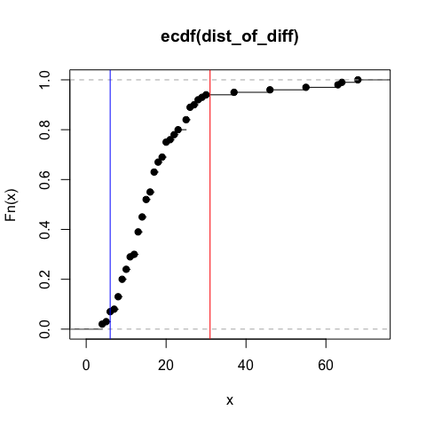

``` r
# calculate the relationship between gene length and expression
gene_expr_med = get_len_expr(in_df, in_genes)
print(cor.test(gene_expr_med$median_expr, gene_expr_med$median_len))
```

    ## 
    ##  Pearson's product-moment correlation
    ## 
    ## data:  gene_expr_med$median_expr and gene_expr_med$median_len
    ## t = -9.384, df = 17259, p-value < 2.2e-16
    ## alternative hypothesis: true correlation is not equal to 0
    ## 95 percent confidence interval:
    ##  -0.08607496 -0.05638970
    ## sample estimates:
    ##         cor 
    ## -0.07124811

``` r
colnames(gene_expr_med)[2] = "Median"
```

### Number of transcripts

``` r
clust_res = get_prob_gene_clust(metadata_table, ens_trans_df, mad_df, in_df, percentile_val)
```

    ## [1] 225
    ## [1] 212
    ##    
    ##       1   2
    ##   1 106   4
    ##   2  12 119
    ##    
    ##       1   2
    ##   1 118  29
    ##   2   0  94

``` r
dist_au = clust_res[[1]]
sum_short = clust_res[[2]]
sum_long = clust_res[[3]]
short_genes_tot = clust_res[[4]]
long_genes_tot = clust_res[[5]]
print(dist_au(sum_short))
```

    ## [1] 0.33

``` r
print(dist_au(sum_long))
```

    ## [1] 0.84

``` r
# plot the ECDF
plot(dist_au)
abline(v=sum_short, col="blue")
abline(v=sum_long, col="red")
```

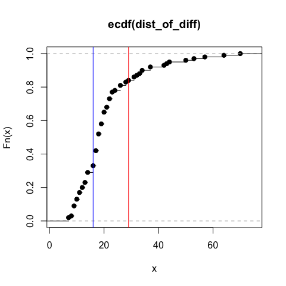

### Expression of genes

``` r
clust_res = get_prob_gene_clust(metadata_table, gene_expr_med, mad_df, in_df, percentile_val)
```

    ## [1] 206
    ## [1] 198
    ##    
    ##       1   2
    ##   1 102  19
    ##   2  16 104
    ##    
    ##       1   2
    ##   1 118  43
    ##   2   0  80

``` r
dist_au = clust_res[[1]]
sum_short = clust_res[[2]]
sum_long = clust_res[[3]]
short_genes_tot = clust_res[[4]]
long_genes_tot = clust_res[[5]]
print(dist_au(sum_short))
```

    ## [1] 0.95

``` r
print(dist_au(sum_long))
```

    ## [1] 0.98

``` r
# plot the ECDF
plot(dist_au)
abline(v=sum_short, col="blue")
abline(v=sum_long, col="red")
```

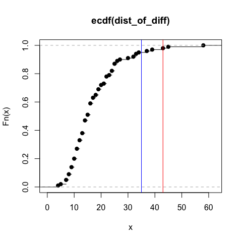

## Analyze in Yoshihara

``` r
yoshihara_data = data(GSE32062.GPL6480_eset)
ExpressionData <- get(yoshihara_data)
dta <- exprs(ExpressionData)

metadata_table = subset(clust_df, Dataset == "Yoshihara")


# format the expr table
res = read_format_expr(dta, metadata_table)
in_df = res[[1]]
in_genes = res[[2]]


clust_res = get_prob_gene_clust(metadata_table, gene_len_df, mad_df, in_df, percentile_val)
```

    ## [1] 242
    ## [1] 227
    ##    
    ##       1   2
    ##   1  94   9
    ##   2   4 148
    ##    
    ##       1   2
    ##   1  86  16
    ##   2  12 141

``` r
dist_au = clust_res[[1]]
sum_short = clust_res[[2]]
sum_long = clust_res[[3]]
short_genes_yosh = clust_res[[4]]
print(dist_au(sum_short))
```

    ## [1] 0.79

``` r
print(dist_au(sum_long))
```

    ## [1] 0.98

``` r
plot(dist_au)
abline(v=sum_short, col="blue")
abline(v=sum_long, col="red")
```

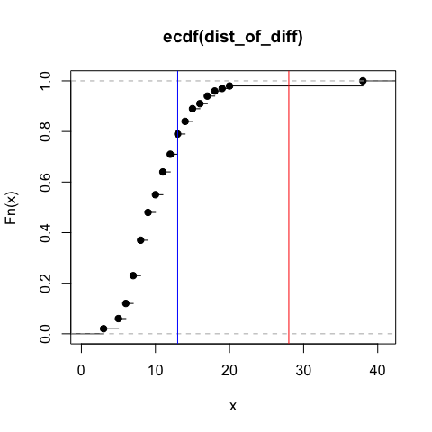

``` r
# calculate the relationship between gene length and expression
gene_expr_med = get_len_expr(in_df, in_genes)
print(cor.test(gene_expr_med$median_expr, gene_expr_med$median_len))
```

    ## 
    ##  Pearson's product-moment correlation
    ## 
    ## data:  gene_expr_med$median_expr and gene_expr_med$median_len
    ## t = -13.093, df = 17313, p-value < 2.2e-16
    ## alternative hypothesis: true correlation is not equal to 0
    ## 95 percent confidence interval:
    ##  -0.11374598 -0.08424787
    ## sample estimates:
    ##         cor 
    ## -0.09901868

``` r
colnames(gene_expr_med)[2] = "Median"
```

### Number of transcripts

``` r
clust_res = get_prob_gene_clust(metadata_table, ens_trans_df, mad_df, in_df, percentile_val)
```

    ## [1] 243
    ## [1] 245
    ##    
    ##       1   2
    ##   1  95   9
    ##   2   3 148
    ##    
    ##       1   2
    ##   1  93   5
    ##   2   5 152

``` r
dist_au = clust_res[[1]]
sum_short = clust_res[[2]]
sum_long = clust_res[[3]]
short_genes_tot = clust_res[[4]]
long_genes_tot = clust_res[[5]]
print(dist_au(sum_short))
```

    ## [1] 0.39

``` r
print(dist_au(sum_long))
```

    ## [1] 0.23

``` r
# plot the ECDF
plot(dist_au)
abline(v=sum_short, col="blue")
abline(v=sum_long, col="red")
```

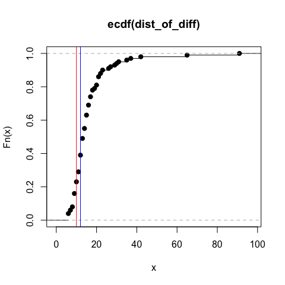

### Expression of genes

``` r
clust_res = get_prob_gene_clust(metadata_table, gene_expr_med, mad_df, in_df, percentile_val)
```

    ## [1] 235
    ## [1] 240
    ##    
    ##       1   2
    ##   1  81   3
    ##   2  17 154
    ##    
    ##       1   2
    ##   1  88   5
    ##   2  10 152

``` r
dist_au = clust_res[[1]]
sum_short = clust_res[[2]]
sum_long = clust_res[[3]]
short_genes_tot = clust_res[[4]]
long_genes_tot = clust_res[[5]]
print(dist_au(sum_short))
```

    ## [1] 0.98

``` r
print(dist_au(sum_long))
```

    ## [1] 0.82

``` r
# plot the ECDF
plot(dist_au)
abline(v=sum_short, col="blue")
abline(v=sum_long, col="red")
```

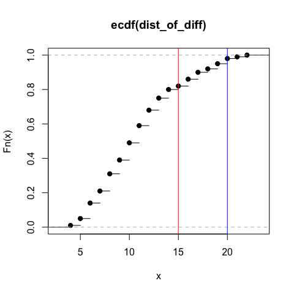

## Analyze in TCGA

``` r
tcga_data = data(TCGA_eset)
ExpressionData <- get(tcga_data)
dta <- exprs(ExpressionData)


metadata_table = subset(clust_df, Dataset == "TCGA")


# format the expr table
res = read_format_expr(dta, metadata_table)
in_df = res[[1]]
in_genes = res[[2]]


clust_res = get_prob_gene_clust(metadata_table, gene_len_df, mad_df, in_df, percentile_val)
```

    ## [1] 443
    ## [1] 332
    ##    
    ##       1   2
    ##   1 258   1
    ##   2  55 185
    ##    
    ##       1   2
    ##   1 154   8
    ##   2 159 178

``` r
dist_au = clust_res[[1]]
sum_short = clust_res[[2]]
sum_long = clust_res[[3]]
short_genes_tcga = clust_res[[4]]
print(dist_au(sum_short))
```

    ## [1] 0.61

``` r
print(dist_au(sum_long))
```

    ## [1] 1

``` r
plot(dist_au)
abline(v=sum_short, col="blue")
abline(v=sum_long, col="red")
```

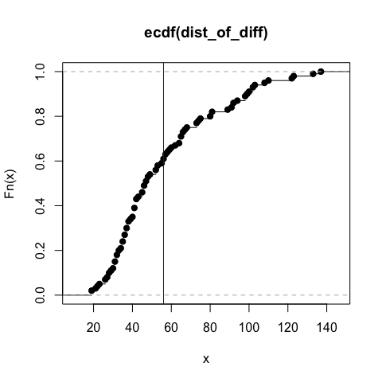

``` r
# calculate the relationship between gene length and expression
gene_expr_med = get_len_expr(in_df, in_genes)
print(cor.test(gene_expr_med$median_expr, gene_expr_med$median_len))
```

    ## 
    ##  Pearson's product-moment correlation
    ## 
    ## data:  gene_expr_med$median_expr and gene_expr_med$median_len
    ## t = -13.741, df = 11603, p-value < 2.2e-16
    ## alternative hypothesis: true correlation is not equal to 0
    ## 95 percent confidence interval:
    ##  -0.1444011 -0.1085951
    ## sample estimates:
    ##        cor 
    ## -0.1265393

``` r
colnames(gene_expr_med)[2] = "Median"
```

### Number of transcripts

``` r
clust_res = get_prob_gene_clust(metadata_table, ens_trans_df, mad_df, in_df, percentile_val)
```

    ## [1] 418
    ## [1] 448
    ##    
    ##       1   2
    ##   1 290  58
    ##   2  23 128
    ##    
    ##       1   2
    ##   1 297  35
    ##   2  16 151

``` r
dist_au = clust_res[[1]]
sum_short = clust_res[[2]]
sum_long = clust_res[[3]]
short_genes_tot = clust_res[[4]]
long_genes_tot = clust_res[[5]]
print(dist_au(sum_short))
```

    ## [1] 0.75

``` r
print(dist_au(sum_long))
```

    ## [1] 0.35

``` r
# plot the ECDF
plot(dist_au)
abline(v=sum_short, col="blue")
abline(v=sum_long, col="red")
```

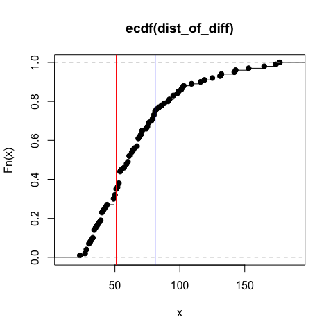

### Expression of genes

``` r
clust_res = get_prob_gene_clust(metadata_table, gene_expr_med, mad_df, in_df, percentile_val)
```

    ## [1] 375
    ## [1] 433
    ##    
    ##       1   2
    ##   1 297 108
    ##   2  16  78
    ##    
    ##       1   2
    ##   1 309  62
    ##   2   4 124

``` r
dist_au = clust_res[[1]]
sum_short = clust_res[[2]]
sum_long = clust_res[[3]]
short_genes_tot = clust_res[[4]]
long_genes_tot = clust_res[[5]]
print(dist_au(sum_short))
```

    ## [1] 0.96

``` r
print(dist_au(sum_long))
```

    ## [1] 0.66

``` r
# plot the ECDF
plot(dist_au)
abline(v=sum_short, col="blue")
abline(v=sum_long, col="red")
```

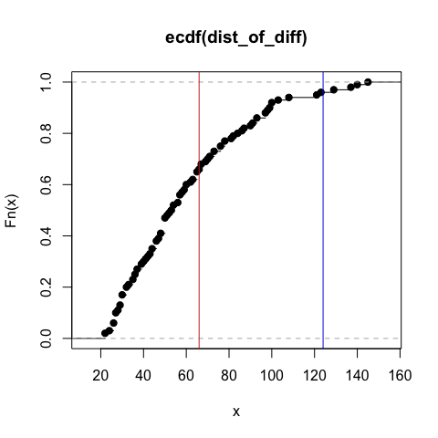

## Analyze in Mayo

``` r
mayo_data = load(file=file.path(proj_dir, 
                                "/data/mayo/MayoEset.Rda"))

ExpressionData <- get(mayo_data)
dta <- exprs(ExpressionData)


metadata_table = subset(clust_df, Dataset == "mayo.eset")


# format the expr table
res = read_format_expr(dta, metadata_table)
in_df = res[[1]]
in_genes = res[[2]]


clust_res = get_prob_gene_clust(metadata_table, gene_len_df, mad_df, in_df, percentile_val)
```

    ## [1] 364
    ## [1] 325
    ##    
    ##       1   2
    ##   1 185   8
    ##   2   5 179
    ##    
    ##       1   2
    ##   1 151  13
    ##   2  39 174

``` r
dist_au = clust_res[[1]]
sum_short = clust_res[[2]]
sum_long = clust_res[[3]]
short_genes_mayo = clust_res[[4]]
print(dist_au(sum_short))
```

    ## [1] 0.24

``` r
print(dist_au(sum_long))
```

    ## [1] 0.93

``` r
plot(dist_au)
abline(v=sum_short, col="blue")
abline(v=sum_long, col="red")
```

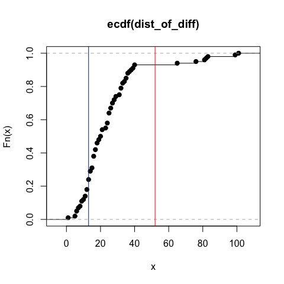

``` r
# calculate the relationship between gene length and expression
gene_expr_med = get_len_expr(in_df, in_genes)
print(cor.test(gene_expr_med$median_expr, gene_expr_med$median_len))
```

    ## 
    ##  Pearson's product-moment correlation
    ## 
    ## data:  gene_expr_med$median_expr and gene_expr_med$median_len
    ## t = -1.7744, df = 13829, p-value = 0.07602
    ## alternative hypothesis: true correlation is not equal to 0
    ## 95 percent confidence interval:
    ##  -0.03174515  0.00157902
    ## sample estimates:
    ##         cor 
    ## -0.01508725

``` r
colnames(gene_expr_med)[2] = "Median"
```

### Number of transcripts

``` r
clust_res = get_prob_gene_clust(metadata_table, ens_trans_df, mad_df, in_df, percentile_val)
```

    ## [1] 355
    ## [1] 345
    ##    
    ##       1   2
    ##   1 182  14
    ##   2   8 173
    ##    
    ##       1   2
    ##   1 174  16
    ##   2  16 171

``` r
dist_au = clust_res[[1]]
sum_short = clust_res[[2]]
sum_long = clust_res[[3]]
short_genes_tot = clust_res[[4]]
long_genes_tot = clust_res[[5]]
print(dist_au(sum_short))
```

    ## [1] 0.4

``` r
print(dist_au(sum_long))
```

    ## [1] 0.64

``` r
# plot the ECDF
plot(dist_au)
abline(v=sum_short, col="blue")
abline(v=sum_long, col="red")
```

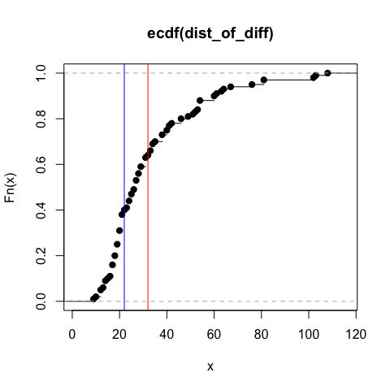

### Expression of genes

``` r
clust_res = get_prob_gene_clust(metadata_table, gene_expr_med, mad_df, in_df, percentile_val)
```

    ## [1] 332
    ## [1] 307
    ##    
    ##       1   2
    ##   1 158  13
    ##   2  32 174
    ##    
    ##       1   2
    ##   1 168  48
    ##   2  22 139

``` r
dist_au = clust_res[[1]]
sum_short = clust_res[[2]]
sum_long = clust_res[[3]]
short_genes_tot = clust_res[[4]]
long_genes_tot = clust_res[[5]]
print(dist_au(sum_short))
```

    ## [1] 0.89

``` r
print(dist_au(sum_long))
```

    ## [1] 0.98

``` r
# plot the ECDF
plot(dist_au)
abline(v=sum_short, col="blue")
abline(v=sum_long, col="red")
```

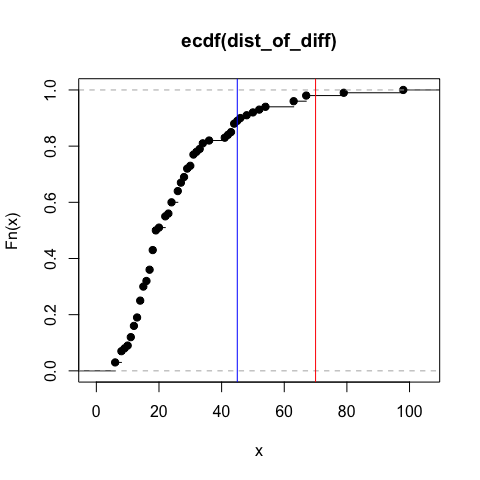

### Quick test of Nanostring geneset for Mayo

``` r
match_clusters_k4 <- function(in_df, col_interest){
    
    col_idx = which(colnames(in_df) == col_interest)
    colnames(in_df)[col_idx] = "temp_in"
    
    a = table(in_df$temp_in, in_df$ClusterK4_kmeans)
    a = data.frame(a)
    a = a[order(a$Freq, a$Var1, decreasing=T),]
    a = a[!duplicated(a$Var1),]
    
    in_df$temp_out = in_df$temp_in
    in_df$temp_out[in_df$temp_in == 1] = a$Var2[a$Var1==1]
    in_df$temp_out[in_df$temp_in == 2] = a$Var2[a$Var1==2]
    in_df$temp_out[in_df$temp_in == 3] = a$Var2[a$Var1==3]
    in_df$temp_out[in_df$temp_in == 4] = a$Var2[a$Var1==4]
    
    col_idx = which(colnames(in_df) == "temp_out")
    colnames(in_df)[col_idx] = col_interest
    
    col_keep = grep("temp", colnames(in_df), value=T, invert=T)
    in_df = in_df[,col_keep]
    
    return(in_df)

}

# get the nanostring file
nano_file = file.path(proj_dir, "/data/nanostring/NCONanostingClassifierData_forAriel.csv")
nano_df <- data.frame(fread(nano_file))
nano_genes = colnames(nano_df)[-1]

col_keep = grep("rand_madKmeans|nano_Kmeans|matched_Kmeans", colnames(metadata_table), value=T, invert=T)
metadata_table = metadata_table[,col_keep]

nano_intersect = intersect(nano_genes, in_genes)


###### now use nano genes

orig_kmeans_res = kmeans(in_df[,nano_intersect], centers=4, nstart=10)
in_df$nano_Kmeans_4 = orig_kmeans_res$cluster
in_df = match_clusters_k4(in_df, col_interest="nano_Kmeans_4")


metadata_table = merge(metadata_table, in_df[,c("ID", "nano_Kmeans_4")], by="ID")


###### now use random MAD genes
dist_of_diff = c()
for(idx in 1:1000){
    col_keep = grep("rand_madKmeans", colnames(metadata_table), value=T, invert=T)
    metadata_table = metadata_table[,col_keep]
    
    rand_genes = sample(mad_df$hgnc_symbol, length(nano_intersect))
    orig_kmeans_res = kmeans(in_df[,rand_genes], centers=4, nstart=10)
    in_df$rand_madKmeans_4 = orig_kmeans_res$cluster
    
    in_df = match_clusters_k4(in_df, col_interest="rand_madKmeans_4")

    metadata_table = merge(metadata_table, in_df[,c("ID", "rand_madKmeans_4")], by="ID")
    dist_of_diff = c(dist_of_diff, 
                     sum(metadata_table$rand_madKmeans_4 != metadata_table$ClusterK4_kmeans))
}
d_fun <- ecdf(dist_of_diff)

sum_nano = sum(metadata_table$nano_Kmeans_4 != metadata_table$ClusterK4_kmeans)
table(metadata_table$nano_Kmeans_4, metadata_table$ClusterK4_kmeans)
```

    ##    
    ##      1  2  3  4
    ##   1 74  5  1  3
    ##   2  0 69  0 25
    ##   3 31  1 63  1
    ##   4  1  4 31 68

``` r
table(metadata_table$rand_madKmeans_4, metadata_table$ClusterK4_kmeans)
```

    ##    
    ##       1   2   3   4
    ##   1 100   0   4   2
    ##   2   2  69   1   0
    ##   3   3   0  85   0
    ##   4   1  10   5  95

``` r
# plot the ECDF
plot(dist_au)
abline(v=sum_nano, col="blue")
```

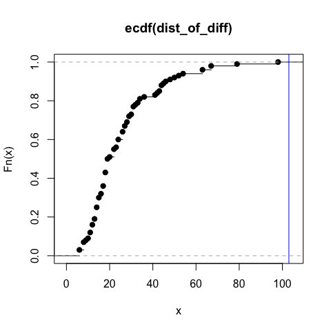
