compare_centroids
================
Natalie Davidson
8/31/2023

# Comparing centoirs for uncertainty

This notebook generates ???.

## Write all methods out

``` r
read_format_MA_expr <- function(in_df, metadata_table){
    
     rnaseq_expr_df = in_df

    # format it so we can add metadata
    gene_ids = row.names(rnaseq_expr_df)
    sample_ids = colnames(rnaseq_expr_df)
    rnaseq_expr_df = data.frame(t(rnaseq_expr_df))
    colnames(rnaseq_expr_df) = gene_ids
    
    # now add column names back so we can have annotations
    rnaseq_expr_df$ID = sample_ids
    
    full_df = merge(metadata_table, rnaseq_expr_df, by = "ID")
    
    return(list(full_df, gene_ids))
}


read_format_expr <- function(in_file, metadata_table){
    
     rnaseq_expr_df = data.frame(fread(in_file))

    # format it so we can add metadata
    gene_ids = rnaseq_expr_df[,1]
    rnaseq_expr_df = rnaseq_expr_df[,-1]
    sample_ids = colnames(rnaseq_expr_df)
    rnaseq_expr_df = data.frame(t(rnaseq_expr_df))
    colnames(rnaseq_expr_df) = gene_ids
    
    # now add column names back so we can have annotations
    rnaseq_expr_df$ID = gsub("Sample_", "", row.names(rnaseq_expr_df))
    
    full_df = merge(metadata_table, rnaseq_expr_df, by = "ID")
    
    return(list(full_df, gene_ids))
}


filter_expr <- function(in_df, gene_df, metadata_table){
        
    # get samples that were used
    # get genes of interest
    gene_count_df = in_df[,gene_df$hgnc_symbol]
    gene_count_df = log10(gene_count_df+1)

    
    
    # add metadata back
    gene_count_df$ID = in_df$ID
    gene_count_df = merge(gene_count_df, metadata_table, by="ID")
    
    return(gene_count_df)
}
```

``` r
get_kmeans <- function(in_df, n_clust){
    km.out <- kmeans(in_df, centers = n_clust, nstart = 1)
    return(km.out$cluster)
}


remap_ids <- function(ref, to_be_mapped){
    
    mapped_df = as.data.frame(table(ref, to_be_mapped))
    mapped_df = mapped_df[order(mapped_df$Freq, decreasing = T),]
    
    ref_ids = c()
    mapped_ids = c()
    undup_df = mapped_df
    corr_maps = NA
    idx = 1
    while(length(ref_ids) < length(unique(mapped_df$ref))){
        ref_ids = c(ref_ids, undup_df$ref[idx])
        mapped_ids = c(mapped_ids, undup_df$to_be_mapped[idx])
        
        corr_maps = rbind(corr_maps, undup_df[idx,])
        
        undup_df = subset(undup_df, ! ref %in% ref_ids)
        undup_df = subset(undup_df, ! to_be_mapped %in% mapped_ids)

    }
    
    
    new_mapping = to_be_mapped
    corr_maps = na.omit(corr_maps)
    for(curr_val in corr_maps$to_be_mapped){
        old_val = curr_val
        new_val = corr_maps$ref[corr_maps$to_be_mapped == curr_val]
        new_mapping[to_be_mapped == old_val] =  new_val

    }
    return(new_mapping)
}
```

``` r
mode <- function(x) {
  ux <- unique(x)
  tab <- tabulate(match(x, ux))
  ux[tab == max(tab)]
}

freq_of_mode <- function(x){
    x = na.omit(as.numeric(x))
    return(sum(x == mode(x)[1]) /length(x) )
}
```

``` r
get_clust_plot <- function(expr_df, MAD_genes, num_clust, num_resamp, frac_dropout, dataset_name){
    
    # set up the clustering reference column
    if(num_clust == 2){
        expr_df$Cluster_Kmeans = expr_df$ClusterK2_kmeans
    }else if(num_clust == 3){
        expr_df$Cluster_Kmeans = expr_df$ClusterK3_kmeans
    }else{
        expr_df$Cluster_Kmeans = expr_df$ClusterK4_kmeans
    }
    
    # using random subsampling, re-do clusters    
    for(idx in 1:num_resamp){
        
        rand_samp = sample(1:nrow(expr_df), ceiling(nrow(expr_df)*0.8))
        kmeans_res = get_kmeans(expr_df[rand_samp,MAD_genes$hgnc_symbol], num_clust)
        kmeans_res = data.frame(kmeans_res)
        kmeans_res$ID = expr_df$ID[rand_samp]
        
        kmeans_res[,1] = remap_ids(expr_df$Cluster_Kmeans[rand_samp], kmeans_res[,1])
        expr_df = merge(kmeans_res, expr_df, all.y=TRUE)
        
        colnames(expr_df)[2] = paste("clust", idx, sep="_")

        expr_df[,2] = as.factor(expr_df[,2])
    }
    
        
    mode_vec = apply(expr_df[, 2:num_resamp], 1, freq_of_mode)

    mode_df = as.data.frame(mode_vec)
    mode_df$clustID = expr_df$Cluster_Kmeans
    mode_df$ID = expr_df$ID
    colnames(mode_df)[1] = "freq_match_clustID"
    
    
    gg_hist_W = ggplot(mode_df, aes(x=freq_match_clustID, fill=as.factor(clustID))) +
        geom_histogram(binwidth = 0.1)  +
        theme_bw() + 
        ggtitle(paste("K=", num_clust, dataset_name)) + facet_wrap( ~ as.factor(clustID))
    
    
    return(list(mode_df, gg_hist_W))
    
}
```

``` r
plot_pca_freq <- function(expr_df, metadata_table, mode_df, MAD_genes, num_clust, dataset_name){
        
    
    # set up the clustering reference column
    if(num_clust == 2){
        color_id = "ClusterK2_kmeans"
    }else if(num_clust == 3){
        color_id = "ClusterK3_kmeans"
    }else{
        color_id = "ClusterK4_kmeans"
    }
    
    pr_res = prcomp(expr_df[,MAD_genes$hgnc_symbol], scale = TRUE)
    pr_res_df = data.frame(pr_res$x)
    pr_res_df$ID = expr_df$ID
    
    pca_df = merge(metadata_table, pr_res_df, by="ID")
    pca_df = merge(pca_df, mode_df, by="ID", all.x=TRUE)
    pca_df$ClusterK2_kmeans = as.factor(pca_df$ClusterK2_kmeans)
    pca_df$ClusterK3_kmeans = as.factor(pca_df$ClusterK3_kmeans)
    pca_df$ClusterK4_kmeans = as.factor(pca_df$ClusterK4_kmeans)
    pca_df$Dataset = dataset_name
    
    
    percentage <- round(pr_res$sdev^2 / sum(pr_res$sdev^2) * 100, 2)
    percentage <- paste( colnames(pr_res), "(", paste( as.character(percentage), "%", ")", sep="") )
    
    gg_pca = ggplot(pca_df, aes_string(x="PC1",y="PC2", color=color_id, alpha="freq_match_clustID")) +
        geom_point()  +
        theme_bw() + xlab(percentage[1]) + ylab(percentage[2]) +
        ggtitle(dataset_name)
    
    return(gg_pca)
    

}
```

``` r
remove_pca_outliers <- function(expr_df, MAD_genes){
        
    
    pr_res = prcomp(expr_df[,MAD_genes$hgnc_symbol], scale = TRUE)
    pr_res_df = data.frame(pr_res$x)
    pr_res_df$ID = expr_df$ID
    
    samps_outlier = c()
    for(pc_idx in 1:5){
        curr_samps_outlier = which(pr_res_df[,pc_idx] %in% boxplot.stats(pr_res_df[,pc_idx])$out)
        samps_outlier = c(samps_outlier, curr_samps_outlier)
    }
    samps_outlier = unique(samps_outlier)
    samps_keep = which(! 1:nrow(expr_df) %in% samps_outlier)
    expr_df = expr_df[samps_keep, ]

    
    return(expr_df)
    

}
```

## First read in all metadata for Schildkraut

``` r
# Black metadata
samp_meta_file = file.path(proj_dir, 
                    "/reference_data/main_AA_metadata_table.tsv")
metadata_table = data.frame(fread(samp_meta_file))

# format NAs for better plotting
metadata_table$failed_seq[is.na(metadata_table$failed_seq)] = "passed"
metadata_table$resequenced[is.na(metadata_table$resequenced)] = "passed"
metadata_table$low_qual[is.na(metadata_table$low_qual)] = "passed"
metadata_table$REMOVE_LOW_EXPRESSION[is.na(metadata_table$REMOVE_LOW_EXPRESSION)] = "passed"
metadata_table$REMOVE_LOW_EXPRESSION[metadata_table$REMOVE_LOW_EXPRESSION==TRUE] = "failed"

metadata_table_AA = metadata_table

# white metadata
samp_meta_file = file.path(proj_dir, 
                    "/reference_data/main_white_metadata_table.tsv")
metadata_table = data.frame(fread(samp_meta_file))

# format NAs for better plotting
metadata_table$failed_seq[is.na(metadata_table$failed_seq)] = "passed"
metadata_table$resequenced[is.na(metadata_table$resequenced)] = "passed"
metadata_table$low_qual[is.na(metadata_table$low_qual)] = "passed"
metadata_table$REMOVE_LOW_EXPRESSION[is.na(metadata_table$REMOVE_LOW_EXPRESSION)] = "passed"
metadata_table$REMOVE_LOW_EXPRESSION[metadata_table$REMOVE_LOW_EXPRESSION==TRUE] = "failed"

metadata_table_W = metadata_table


# genes of interest

common_genes_file = file.path(proj_dir, 
                                    "/data/way_pipeline_results_10removed_NeoRemoved_inclWhites/1.DataInclusion-Data-Genes/CommonGenes_genelist.csv")
common_genes = data.frame(fread(common_genes_file))
colnames(common_genes) = "hgnc_symbol"


MAD_genes_file = file.path(proj_dir, 
                                    "/data/way_pipeline_results_10removed_NeoRemoved_inclWhites/1.DataInclusion-Data-Genes/GlobalMAD_genelist.csv")
MAD_genes = data.frame(fread(MAD_genes_file))
colnames(MAD_genes) = "hgnc_symbol"

# cluster ID labels

new_file = file.path(proj_dir, 
                    "/data/way_pipeline_results_10removed_NeoRemoved_inclWhites/2.Clustering_DiffExprs-Tables-ClusterMembership/FullClusterMembership.csv")

clust_df = data.frame(fread(new_file))
colnames(clust_df)[1] = "ID"
```

## Read in expression for Schildkraut

``` r
# make formatted
in_file = file.path(proj_dir, 
                    "/data/rna_seq_pilot_and_new/salmon_normalized_filtered_for_way_pipeline.tsv")
res = read_format_expr(in_file, metadata_table_AA)
full_expr_B = res[[1]]

MAD_expr_B = filter_expr(full_expr_B, MAD_genes, metadata_table_AA)
MAD_expr_B = filter(MAD_expr_B, ran_in_way_pipeline == TRUE)
MAD_expr_B = subset(MAD_expr_B, select = -c(REMOVE_WHITE))
metadata_table_AA = subset(metadata_table_AA, select = -c(REMOVE_WHITE, REMOVE_NEOADJ))

outlier_ids_B = MAD_expr_B$ID

# filter outliers
MAD_expr_B = remove_pca_outliers(MAD_expr_B, MAD_genes)
metadata_table_AA = filter(metadata_table_AA, ID %in%  MAD_expr_B$ID)
outlier_ids_B = setdiff(outlier_ids_B, MAD_expr_B$ID)


# make formatted
in_file = file.path(proj_dir, 
                    "/data/rna_seq_whites/salmon_normalized_filtered_for_way_pipeline_whites.tsv")
res = read_format_expr(in_file, metadata_table_W)
full_expr_W = res[[1]]
MAD_expr_W = filter_expr(full_expr_W, MAD_genes, metadata_table_W)
MAD_expr_W = filter(MAD_expr_W, ran_in_way_pipeline == TRUE)
MAD_expr_W = subset(MAD_expr_W, select = -c(REMOVE_BLACK))
metadata_table_W = subset(metadata_table_W, select = -c(REMOVE_BLACK))

outlier_ids_W = MAD_expr_W$ID

# filter outliers
MAD_expr_W = remove_pca_outliers(MAD_expr_W, MAD_genes)
metadata_table_W = filter(metadata_table_W, ID %in%  MAD_expr_W$ID)
outlier_ids_W = setdiff(outlier_ids_W, MAD_expr_W$ID)
```

# Run Clusterings for SchildkrautW

``` r
# K=2
res = get_clust_plot(MAD_expr_W, MAD_genes, 2, num_resamp, frac_dropout, "schW")

mode_schW_k2 = res[[1]]
gg_hist_schW_k2 = res[[2]]
gg_pca_schW_k2 = plot_pca_freq(MAD_expr_W, metadata_table_W, mode_schW_k2, MAD_genes, 2, "SchildkrautW")
gg_hist_schW_k2
```

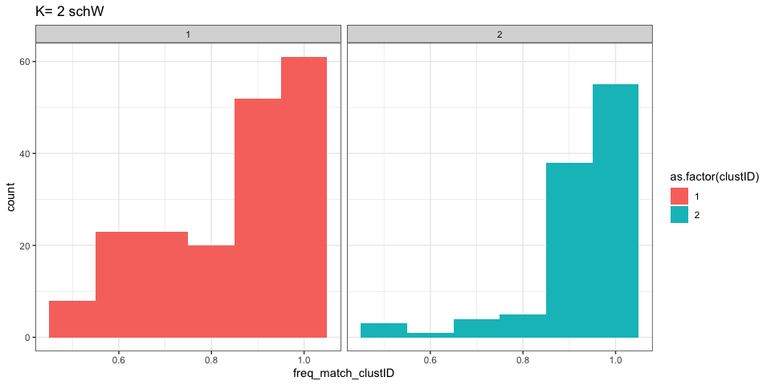

``` r
gg_pca_schW_k2
```

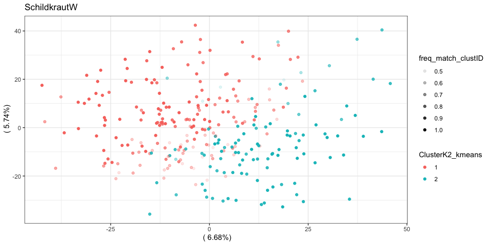

``` r
# K=3
res = get_clust_plot(MAD_expr_W, MAD_genes, 3, num_resamp, frac_dropout, "schW")

mode_schW_k3 = res[[1]]
gg_hist_schW_k3 = res[[2]]
gg_pca_schW_k3 = plot_pca_freq(MAD_expr_W, metadata_table_W, mode_schW_k3, MAD_genes, 3, "SchildkrautW")
gg_hist_schW_k3
```

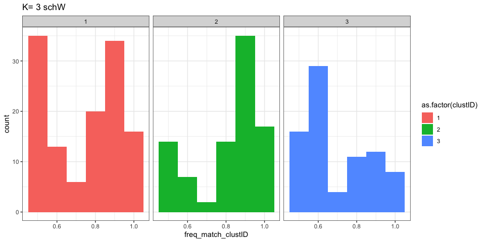

``` r
gg_pca_schW_k3
```

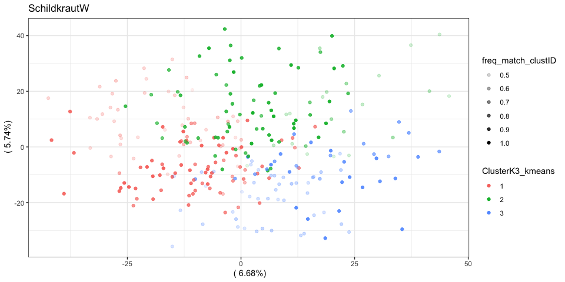

``` r
# K=4
res = get_clust_plot(MAD_expr_W, MAD_genes, 4, num_resamp, frac_dropout, "schW")

mode_schW_k4 = res[[1]]
gg_hist_schW_k4 = res[[2]]
gg_pca_schW_k4 = plot_pca_freq(MAD_expr_W, metadata_table_W, mode_schW_k4, MAD_genes, 4, "SchildkrautW")
gg_hist_schW_k4
```

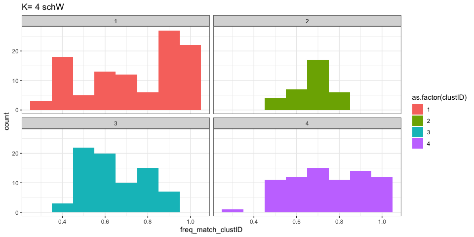

``` r
gg_pca_schW_k4
```

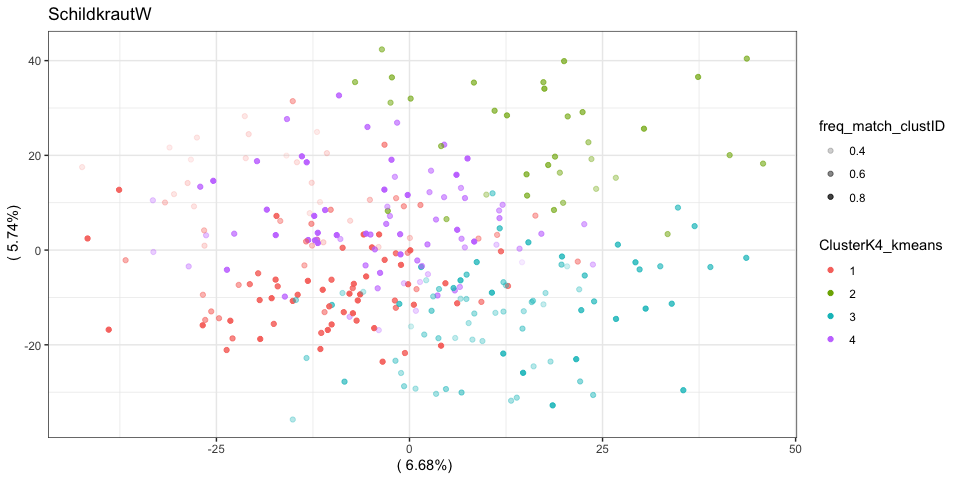

``` r
# make into a dataframe for all K
mode_schW_k2$K = "K=2"
mode_schW_k3$K = "K=3"
mode_schW_k4$K = "K=4"
mode_schW = bind_rows(list(mode_schW_k2,
                                mode_schW_k3, 
                                mode_schW_k4), .id = "K")
mode_schW$Dataset = "SchildkrautW"
```

# Run Clusterings for SchildkrautB

``` r
# K=2
res = get_clust_plot(MAD_expr_B, MAD_genes, 2, num_resamp, frac_dropout, "schB")

mode_schB_k2 = res[[1]]
gg_hist_schB_k2 = res[[2]]
gg_pca_schB_k2 = plot_pca_freq(MAD_expr_B, metadata_table_AA, mode_schB_k2, MAD_genes, 2, "SchildkrautB")
gg_hist_schB_k2
```

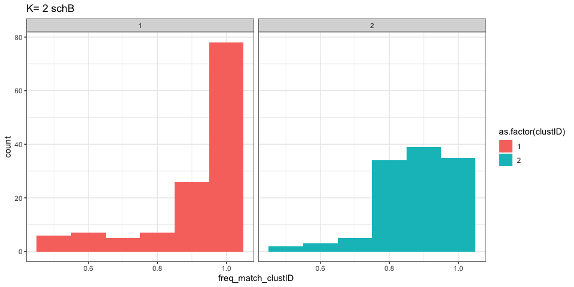

``` r
gg_pca_schB_k2
```

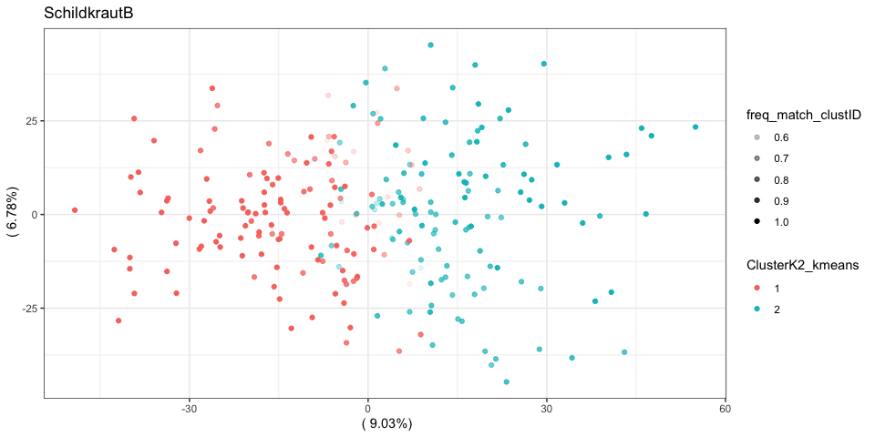

``` r
# K=3
res = get_clust_plot(MAD_expr_B, MAD_genes, 3, num_resamp, frac_dropout, "schB")

mode_schB_k3 = res[[1]]
gg_hist_schB_k3 = res[[2]]
gg_pca_schB_k3 = plot_pca_freq(MAD_expr_B, metadata_table_AA, mode_schB_k3, MAD_genes, 3, "SchildkrautB")
gg_hist_schB_k3
```

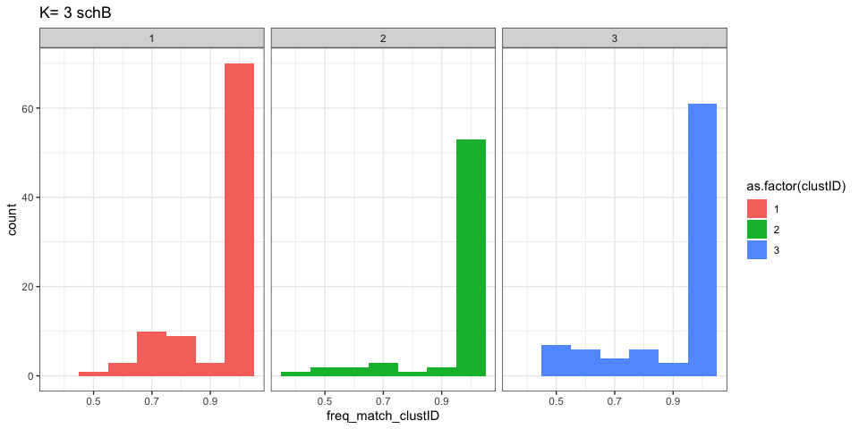

``` r
gg_pca_schB_k3
```

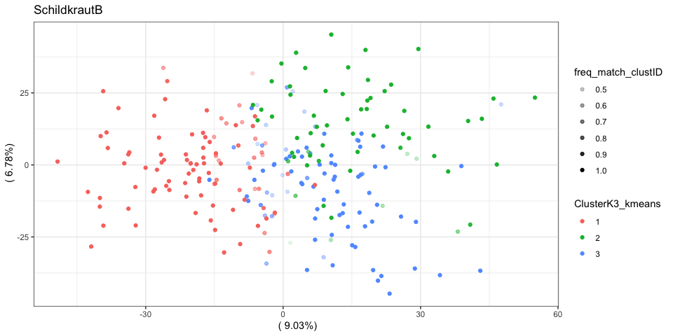

``` r
# K=4
res = get_clust_plot(MAD_expr_B, MAD_genes, 4, num_resamp, frac_dropout, "schB")

mode_schB_k4 = res[[1]]
gg_hist_schB_k4 = res[[2]]
gg_pca_schB_k4 = plot_pca_freq(MAD_expr_B, metadata_table_AA, mode_schB_k4, MAD_genes, 4, "SchildkrautB")
gg_hist_schB_k4
```

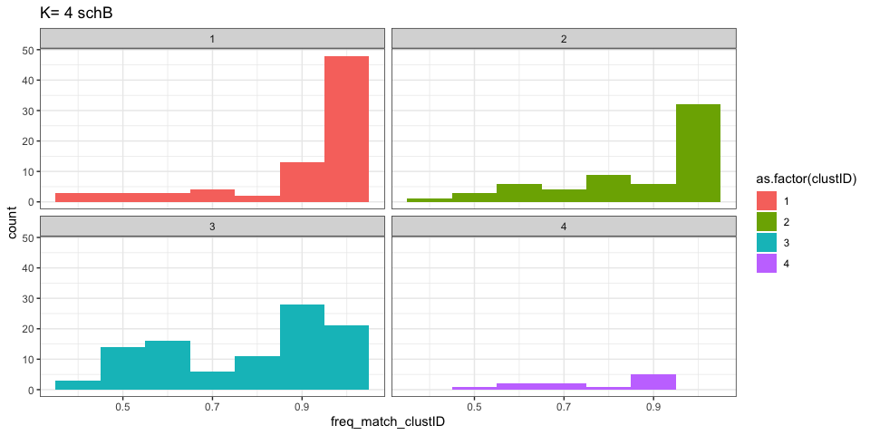

``` r
gg_pca_schB_k4
```

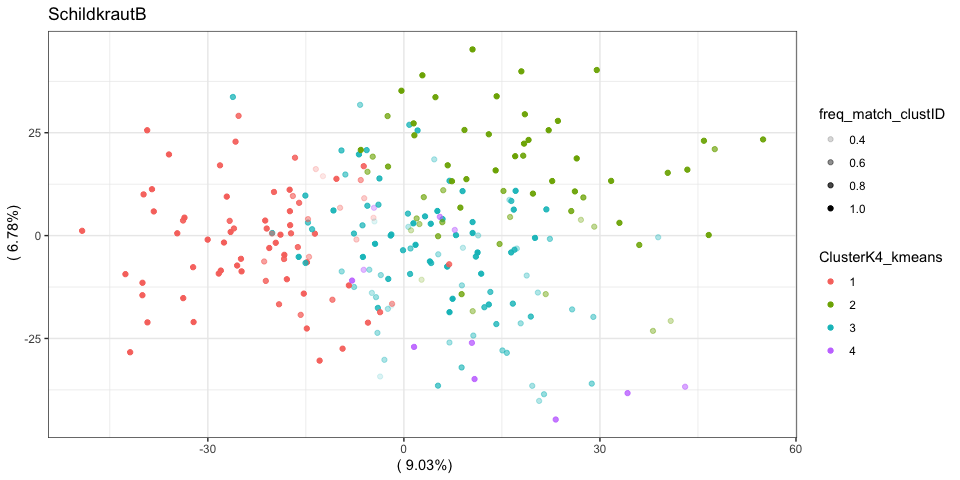

``` r
# make into a dataframe for all K
mode_schB_k2$K = "K=2"
mode_schB_k3$K = "K=3"
mode_schB_k4$K = "K=4"
mode_schB = bind_rows(list(mode_schB_k2,
                                mode_schB_k3, 
                                mode_schB_k4), .id = "K")
mode_schB$Dataset = "SchildkrautB"
```

## Analyze TCGA

``` r
tcga_data = data(TCGA_eset)
ExpressionData <- get(tcga_data)
tcga_dta <- exprs(ExpressionData)

tcga_metadata_table = subset(clust_df, Dataset == "TCGA")

# format the expr table
res = read_format_MA_expr(tcga_dta, tcga_metadata_table)
tcga_df = res[[1]]

outlier_ids_tcga = tcga_df$ID

# filter outliers
tcga_df = remove_pca_outliers(tcga_df, MAD_genes)
tcga_metadata_table = filter(tcga_metadata_table, ID %in%  tcga_df$ID)
outlier_ids_tcga = setdiff(outlier_ids_tcga, tcga_df$ID)


# run re-clustering

# K=2
res = get_clust_plot(tcga_df, MAD_genes, 2, num_resamp, frac_dropout, "TCGA")

mode_tcga_k2 = res[[1]]
gg_hist_tcga_k2 = res[[2]]
gg_pca_tcga_k2 = plot_pca_freq(tcga_df, tcga_metadata_table, mode_tcga_k2, MAD_genes, 2, "TCGA")
gg_hist_tcga_k2
```

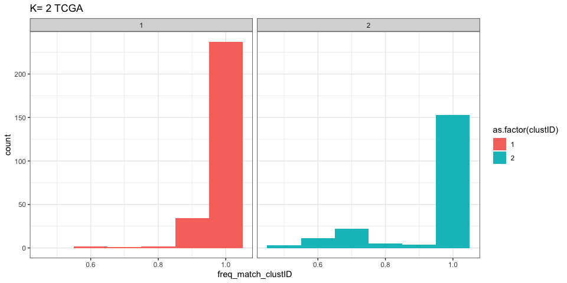

``` r
gg_pca_tcga_k2
```


``` r
# K=3
res = get_clust_plot(tcga_df, MAD_genes, 3, num_resamp, frac_dropout, "TCGA")

mode_tcga_k3 = res[[1]]
gg_hist_tcga_k3 = res[[2]]
gg_pca_tcga_k3 = plot_pca_freq(tcga_df, tcga_metadata_table, mode_tcga_k3, MAD_genes, 3, "TCGA")
gg_hist_tcga_k3
```

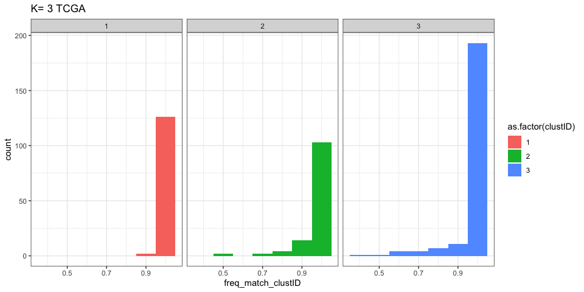

``` r
gg_pca_tcga_k3
```

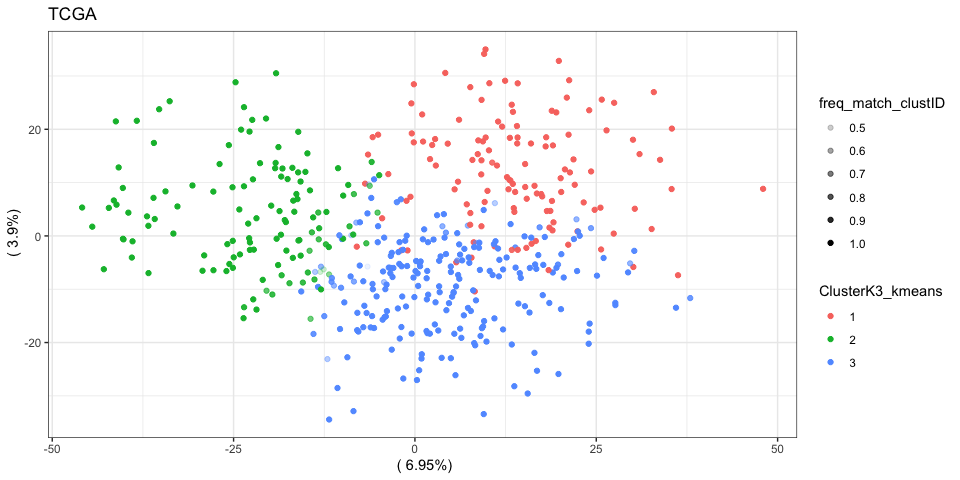

``` r
# K=4
res = get_clust_plot(tcga_df, MAD_genes, 4, num_resamp, frac_dropout, "TCGA")

mode_tcga_k4 = res[[1]]
gg_hist_tcga_k4 = res[[2]]
gg_pca_tcga_k4 = plot_pca_freq(tcga_df, tcga_metadata_table, mode_tcga_k4, MAD_genes, 4, "TCGA")
gg_hist_tcga_k4
```

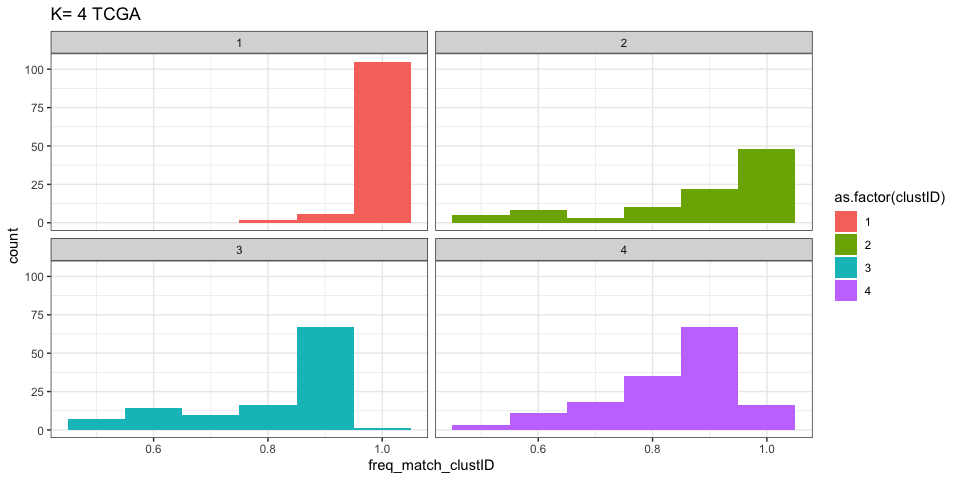

``` r
gg_pca_tcga_k4
```

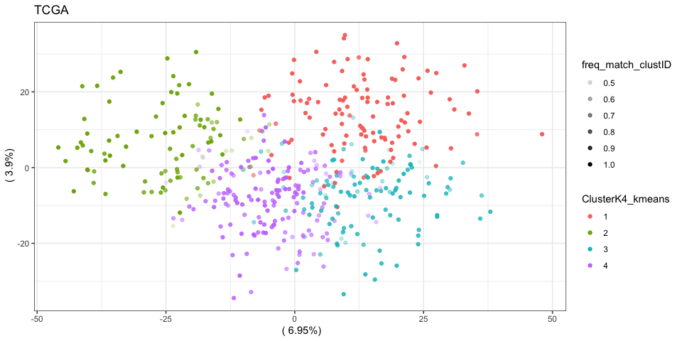

``` r
# make into a dataframe for all K
mode_tcga_k2$K = "K=2"
mode_tcga_k3$K = "K=3"
mode_tcga_k4$K = "K=4"
mode_tcga = bind_rows(list(mode_tcga_k2,
                                mode_tcga_k3, 
                                mode_tcga_k4), .id = "K")
mode_tcga$Dataset = "TCGA"
```

# Analyze Mayo

``` r
mayo_data = load(file=file.path(proj_dir, 
                                "/data/mayo/MayoEset.Rda"))

ExpressionData <- get(mayo_data)
mayo_dta <- exprs(ExpressionData)

# read in the metadata
mayo_metadata_table = subset(clust_df, Dataset == "mayo.eset")

# format the expr table
res = read_format_MA_expr(mayo_dta, mayo_metadata_table)
mayo_df = res[[1]]

outlier_ids_mayo = mayo_df$ID

# filter outliers
mayo_df = remove_pca_outliers(mayo_df, MAD_genes)
mayo_metadata_table = filter(mayo_metadata_table, ID %in%  mayo_df$ID)
outlier_ids_mayo = setdiff(outlier_ids_mayo, mayo_df$ID)

# run re-clustering

# K=2
res = get_clust_plot(mayo_df, MAD_genes, 2, num_resamp, frac_dropout, "mayo")

mode_mayo_k2 = res[[1]]
gg_hist_mayo_k2 = res[[2]]
gg_pca_mayo_k2 = plot_pca_freq(mayo_df, mayo_metadata_table, mode_mayo_k2, MAD_genes, 2, "mayo")
gg_hist_mayo_k2
```

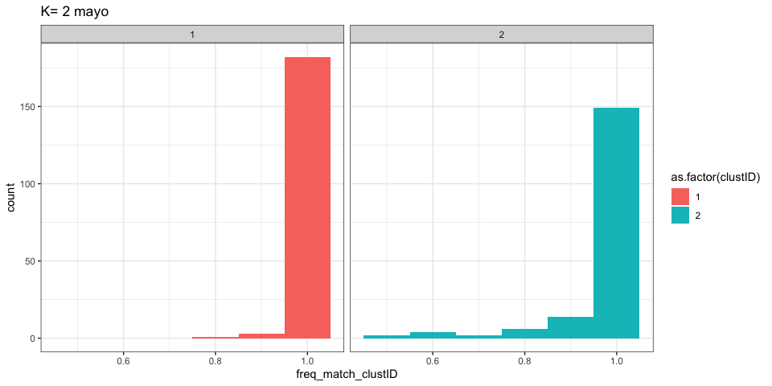

``` r
gg_pca_mayo_k2
```

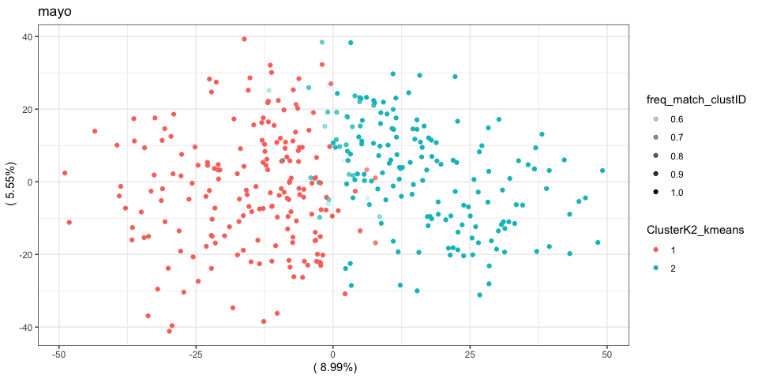

``` r
# K=3
res = get_clust_plot(mayo_df, MAD_genes, 3, num_resamp, frac_dropout, "mayo")

mode_mayo_k3 = res[[1]]
gg_hist_mayo_k3 = res[[2]]
gg_pca_mayo_k3 = plot_pca_freq(mayo_df, mayo_metadata_table, mode_mayo_k3, MAD_genes, 3, "mayo")
gg_hist_mayo_k3
```

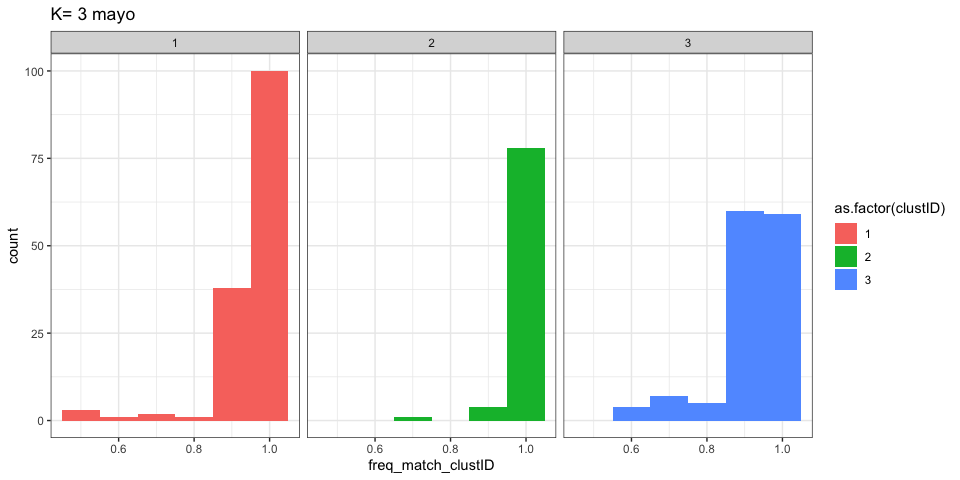

``` r
gg_pca_mayo_k3
```

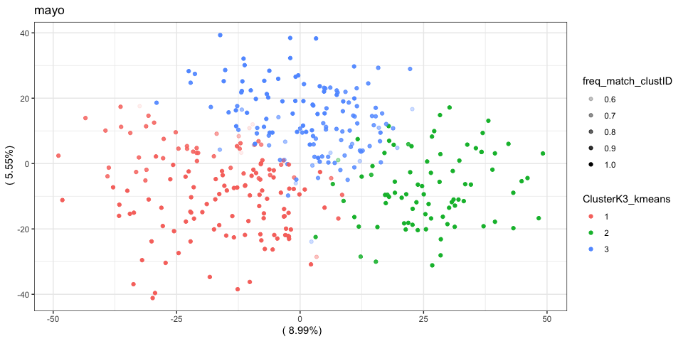

``` r
# K=4
res = get_clust_plot(mayo_df, MAD_genes, 4, num_resamp, frac_dropout, "mayo")

mode_mayo_k4 = res[[1]]
gg_hist_mayo_k4 = res[[2]]
gg_pca_mayo_k4 = plot_pca_freq(mayo_df, mayo_metadata_table, mode_mayo_k4, MAD_genes, 4, "mayo")
gg_hist_mayo_k4
```

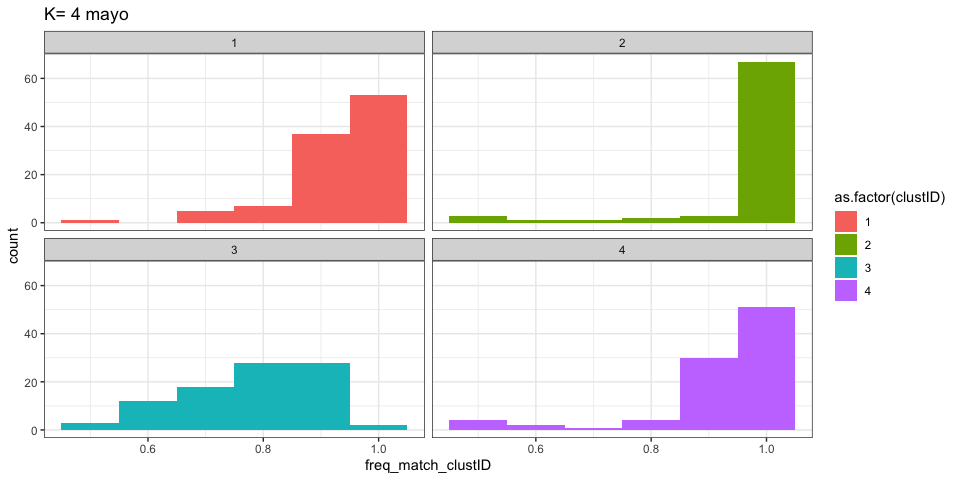

``` r
gg_pca_mayo_k4
```

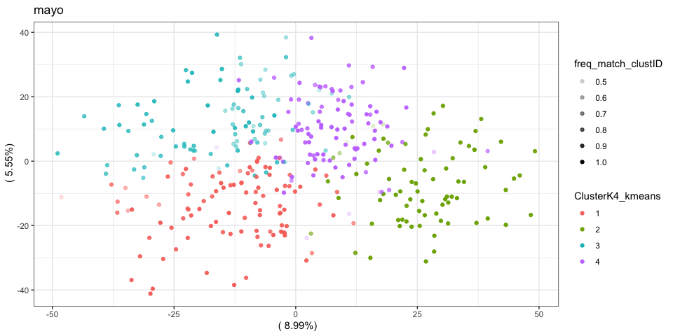

``` r
# make into a dataframe for all K
mode_mayo_k2$K = "K=2"
mode_mayo_k3$K = "K=3"
mode_mayo_k4$K = "K=4"
mode_mayo = bind_rows(list(mode_mayo_k2,
                                mode_mayo_k3, 
                                mode_mayo_k4), .id = "K")
mode_mayo$Dataset = "Mayo"
```

# Analyze Tothill

``` r
tothill_data = data(GSE9891_eset)
ExpressionData <- get(tothill_data)
tothill_dta <- exprs(ExpressionData)

tothill_metadata_table = subset(clust_df, Dataset == "Tothill")

# format the expr table
res = read_format_MA_expr(tothill_dta, tothill_metadata_table)
tothill_df = res[[1]]

outlier_ids_tothill = tothill_df$ID

# filter outliers
tothill_df = remove_pca_outliers(tothill_df, MAD_genes)
tothill_metadata_table = filter(tothill_metadata_table, ID %in%  tothill_df$ID)
outlier_ids_tothill = setdiff(outlier_ids_tothill, tothill_df$ID)

# run re-clustering

# K=2
res = get_clust_plot(tothill_df, MAD_genes, 2, num_resamp, frac_dropout, "tothill")

mode_tothill_k2 = res[[1]]
gg_hist_tothill_k2 = res[[2]]
gg_pca_tothill_k2 = plot_pca_freq(tothill_df, tothill_metadata_table, mode_tothill_k2, MAD_genes, 2, "tothill")
gg_hist_tothill_k2
```

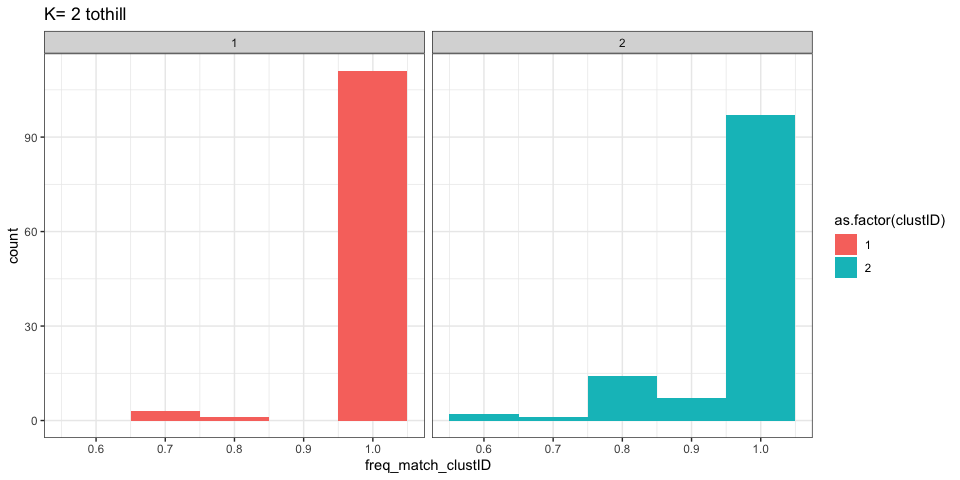

``` r
gg_pca_tothill_k2
```

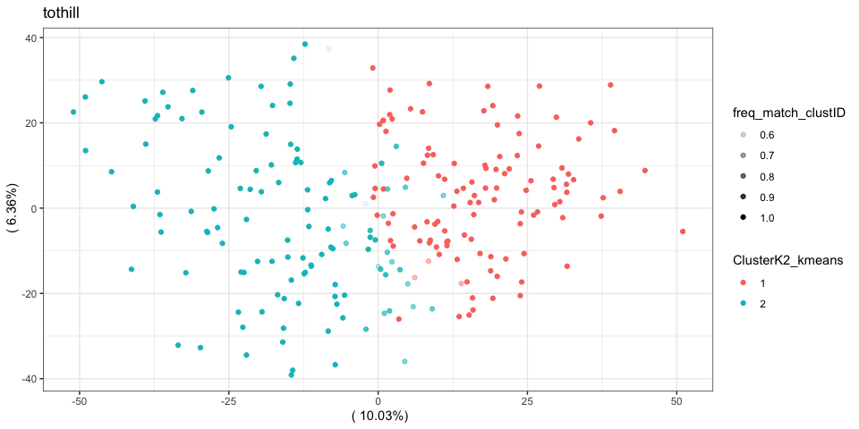

``` r
# K=3
res = get_clust_plot(tothill_df, MAD_genes, 3, num_resamp, frac_dropout, "tothill")

mode_tothill_k3 = res[[1]]
gg_hist_tothill_k3 = res[[2]]
gg_pca_tothill_k3 = plot_pca_freq(tothill_df, tothill_metadata_table, mode_tothill_k3, MAD_genes, 3, "tothill")
gg_hist_tothill_k3
```

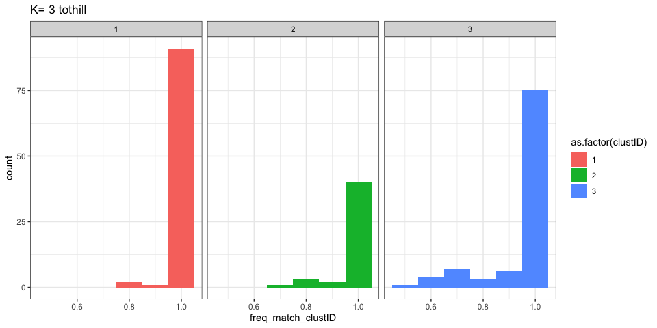

``` r
gg_pca_tothill_k3
```

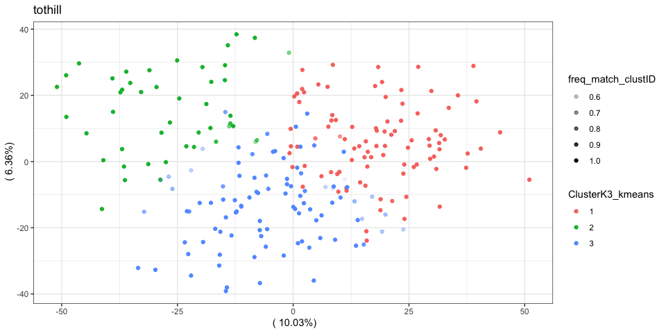

``` r
# K=4
res = get_clust_plot(tothill_df, MAD_genes, 4, num_resamp, frac_dropout, "tothill")

mode_tothill_k4 = res[[1]]
gg_hist_tothill_k4 = res[[2]]
gg_pca_tothill_k4 = plot_pca_freq(tothill_df, tothill_metadata_table, mode_tothill_k4, MAD_genes, 4, "tothill")
gg_hist_tothill_k4
```

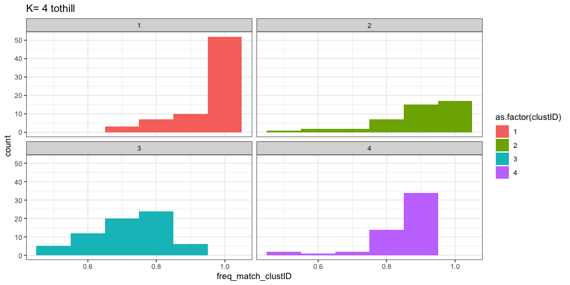

``` r
gg_pca_tothill_k4
```

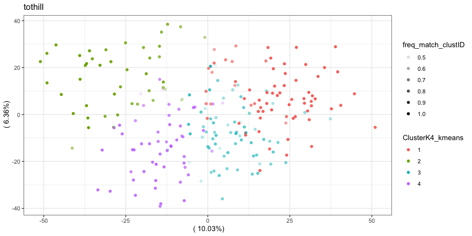

``` r
# make into a dataframe for all K
mode_tothill_k2$K = "K=2"
mode_tothill_k3$K = "K=3"
mode_tothill_k4$K = "K=4"
mode_tothill = bind_rows(list(mode_tothill_k2,
                                mode_tothill_k3, 
                                mode_tothill_k4), .id = "K")
mode_tothill$Dataset = "Tothill"
```

# Analyze Yoshihara

``` r
yoshihara_data = data(GSE32062.GPL6480_eset)
ExpressionData <- get(yoshihara_data)
yoshihara_dta <- exprs(ExpressionData)

yoshihara_metadata_table = subset(clust_df, Dataset == "Yoshihara")

# format the expr table
res = read_format_MA_expr(yoshihara_dta, yoshihara_metadata_table)
yoshihara_df = res[[1]]


outlier_ids_yoshihara = yoshihara_df$ID

# filter outliers
yoshihara_df = remove_pca_outliers(yoshihara_df, MAD_genes)
yoshihara_metadata_table = filter(yoshihara_metadata_table, ID %in%  yoshihara_df$ID)
outlier_ids_yoshihara = setdiff(outlier_ids_yoshihara, yoshihara_df$ID)

# run re-clustering

# K=2
res = get_clust_plot(yoshihara_df, MAD_genes, 2, num_resamp, frac_dropout, "yoshihara")

mode_yoshihara_k2 = res[[1]]
gg_hist_yoshihara_k2 = res[[2]]
gg_pca_yoshihara_k2 = plot_pca_freq(yoshihara_df, yoshihara_metadata_table, mode_yoshihara_k2, MAD_genes, 2, "yoshihara")
gg_hist_yoshihara_k2
```

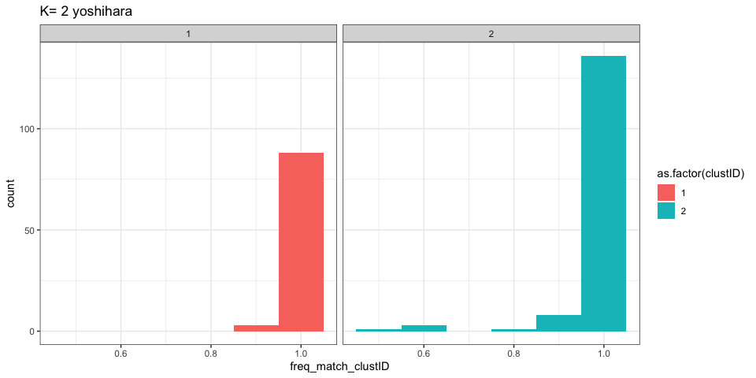

``` r
gg_pca_yoshihara_k2
```

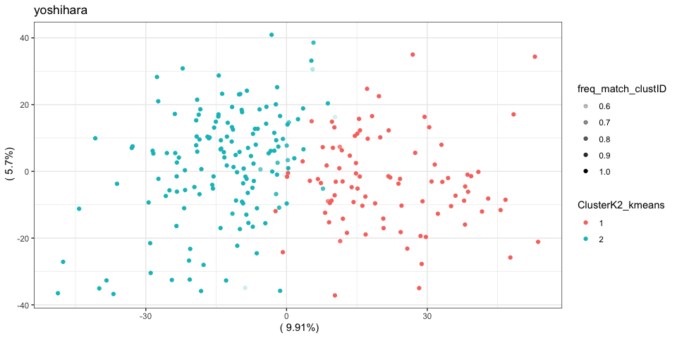

``` r
# K=3
res = get_clust_plot(yoshihara_df, MAD_genes, 3, num_resamp, frac_dropout, "yoshihara")

mode_yoshihara_k3 = res[[1]]
gg_hist_yoshihara_k3 = res[[2]]
gg_pca_yoshihara_k3 = plot_pca_freq(yoshihara_df, yoshihara_metadata_table, mode_yoshihara_k3, MAD_genes, 3, "yoshihara")
gg_hist_yoshihara_k3
```

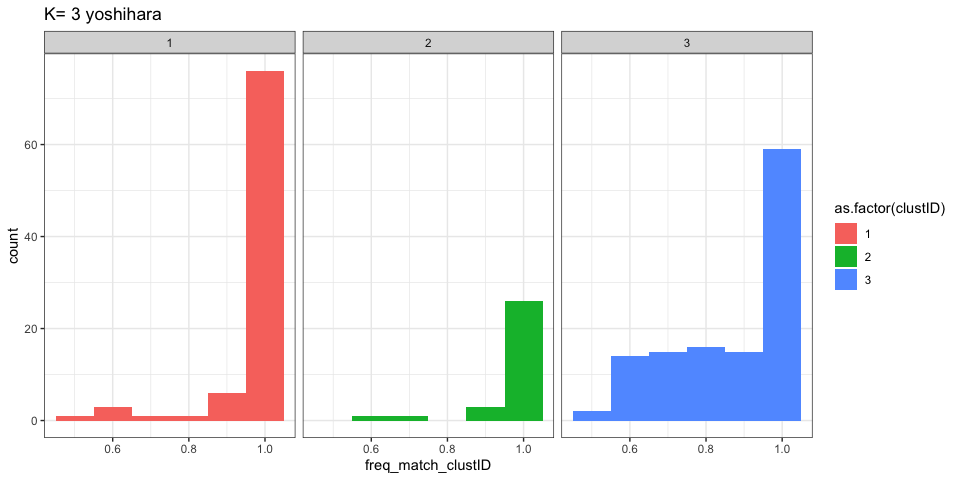

``` r
gg_pca_yoshihara_k3
```

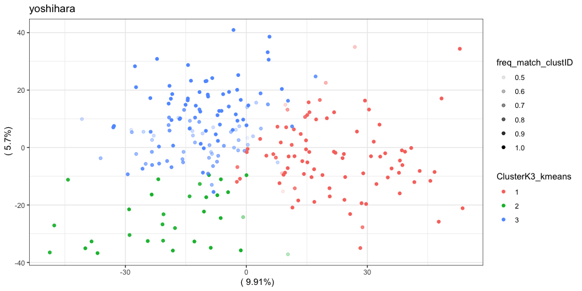

``` r
# K=4
res = get_clust_plot(yoshihara_df, MAD_genes, 4, num_resamp, frac_dropout, "yoshihara")

mode_yoshihara_k4 = res[[1]]
gg_hist_yoshihara_k4 = res[[2]]
gg_pca_yoshihara_k4 = plot_pca_freq(yoshihara_df, yoshihara_metadata_table, mode_yoshihara_k4, MAD_genes, 4, "yoshihara")
gg_hist_yoshihara_k4
```

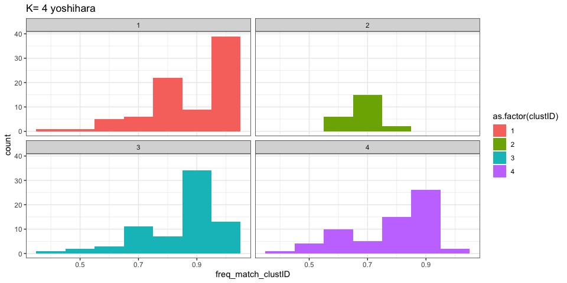

``` r
gg_pca_yoshihara_k4
```

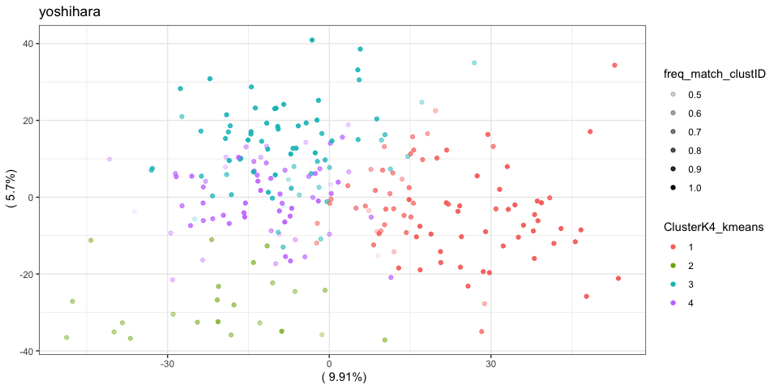

``` r
# make into a dataframe for all K
mode_yoshihara_k2$K = "K=2"
mode_yoshihara_k3$K = "K=3"
mode_yoshihara_k4$K = "K=4"
mode_yoshihara = bind_rows(list(mode_yoshihara_k2,
                                mode_yoshihara_k3, 
                                mode_yoshihara_k4), .id = "K")
mode_yoshihara$Dataset = "Yoshihara"
```

## format final figure

``` r
all_dfs = list("SchildkrautB"=mode_schB, "SchildkrautW"=mode_schW, "TCGA"=mode_tcga, "Mayo"=mode_mayo, "Tothill"=mode_tothill, "Yoshihara"=mode_yoshihara)
all_dfs = bind_rows(all_dfs, .id = "Dataset")

all_dfs$Dataset <- factor(all_dfs$Dataset, levels=c("SchildkrautB", "SchildkrautW", "TCGA", "Mayo", "Tothill", "Yoshihara"))


all_dfs$clustID = as.factor(all_dfs$clustID)
all_dfs$K = as.factor(all_dfs$K)
gg_boxplot_full = ggplot(all_dfs, aes(x=Dataset, y =freq_match_clustID, fill=clustID)) +
    geom_boxplot()  +
    theme_bw() + 
    facet_wrap( ~ K, ncol=1, switch="y") +
    ylab("Frequency subsampled and full cluster labels match")


outfile = paste0(proj_dir, "/figure_notebooks/manuscript_figs/subsample_kmeans.pdf")
ggsave(outfile,
       gg_boxplot_full, width = 10, height = 5, units = "in", device = "pdf")

gg_boxplot_full
```

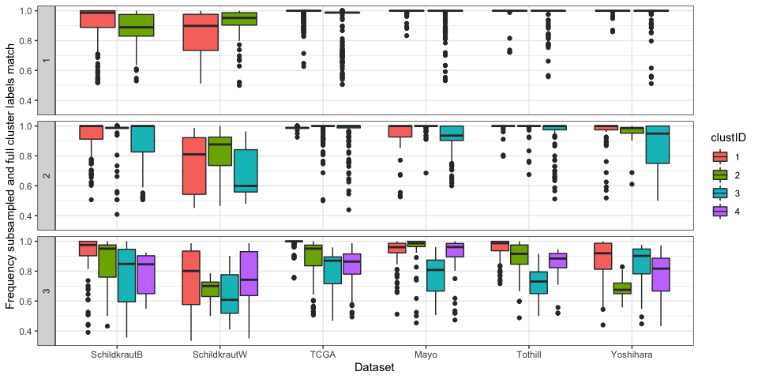
