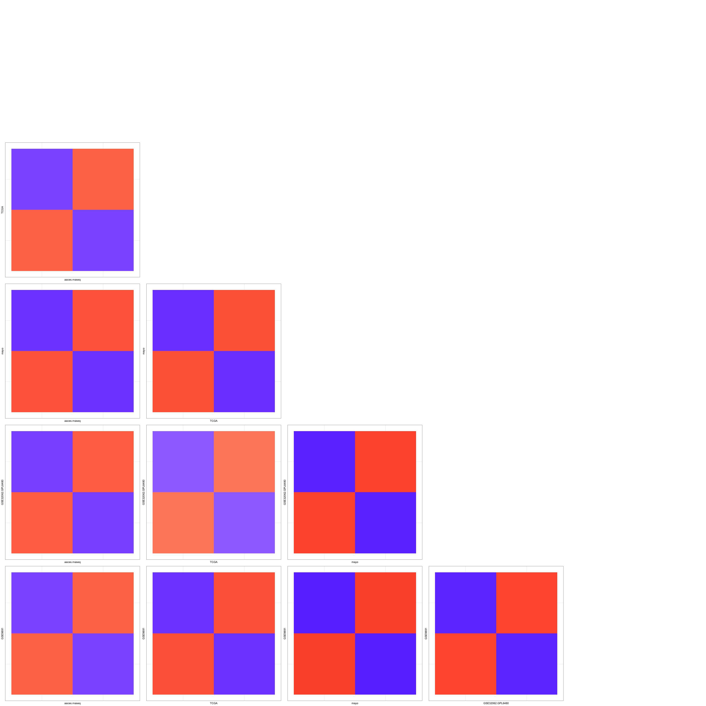
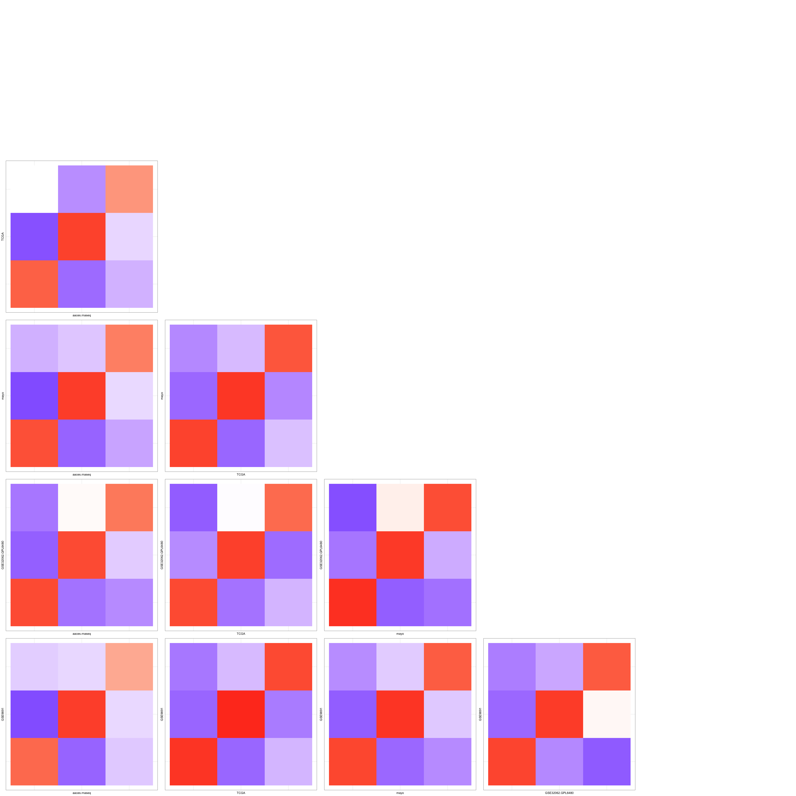
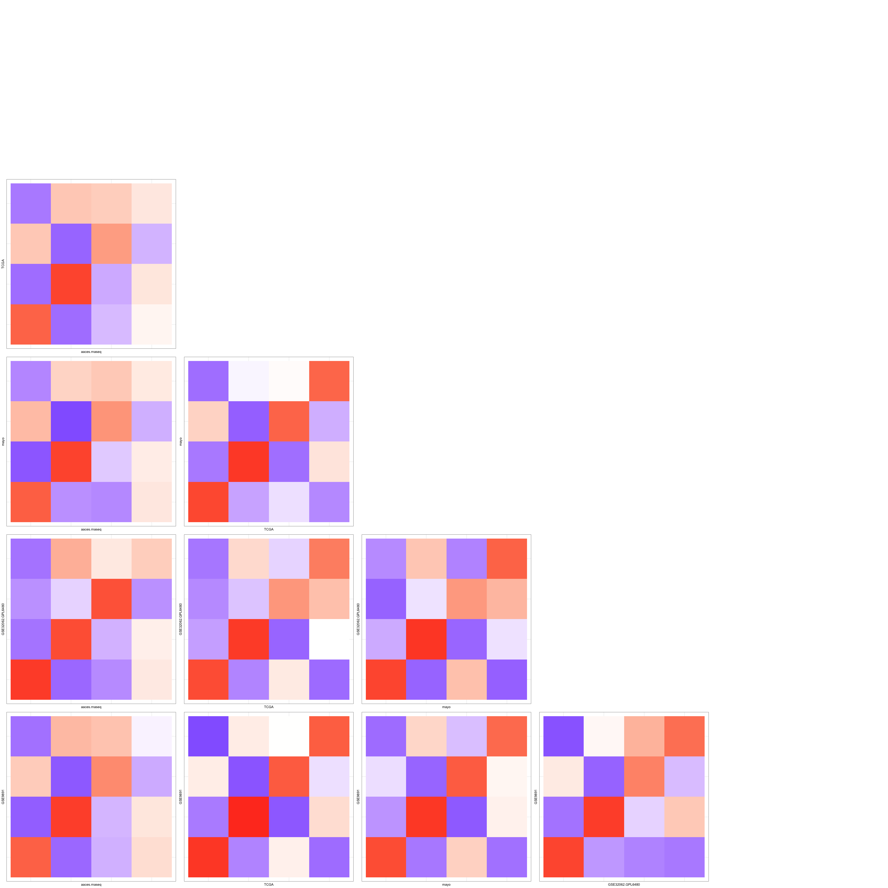

recreate_figs_1\_2
================
Natalie Davidson
8/15/2021

# Recreate Figure 1

Figure 1 shows consistency of clustering across datasets

## First get file paths

``` r
fig1_dir = file.path(proj_dir, 
                    "/data/way_pipeline_results_10removed_NeoRemoved/2.Clustering_DiffExprs-Tables-AcrossCor/")

fig1_files = list.files(fig1_dir,full.names = T )

# only doing this for kmeans, so remove nmf files
fig1_files = grep("nmf", fig1_files, value=T, invert=T)

# lets do the commongenes instead of MAD genes
fig1_files = grep("commongenes", fig1_files, value=T)
```

## Plotting method

``` r
plot_triangle_matr <- function(curr_file, samp_interest){
        
    # the matrix is sample x sample, so len(sample)^2
    list_plots = vector('list', length(samp_interest)^2)
    
    # read in the file
    in_df = data.frame(fread(curr_file))
    row.names(in_df) = in_df$V1
    in_df = in_df[,-1]
    
    in_idx = 1
    for(samp1_idx in 1:length(samp_interest)){
        for(samp2_idx in 1:length(samp_interest)){
            
            # this check enforces lower triangular
            if(samp1_idx >= samp2_idx){
                in_idx = in_idx +1 
                next
            }else{
                samp1 = samp_interest[samp1_idx]
                samp2 = samp_interest[samp2_idx]
            }
            
            # get the comparisons of interest
            col_idx = grep(samp1, colnames(in_df))
            row_idx = grep(samp2, rownames(in_df))
            
            curr_df = in_df[row_idx, col_idx]
            colnames(curr_df) = 1:ncol(curr_df)
            curr_df$compare_samp = row.names(curr_df) 
    
            
            # plot the correlation matrix as a heatmap
            gg_out = ggplot(data = melt(curr_df)) + geom_tile(aes(y=variable,x=compare_samp, fill = value)) +
                            scale_fill_gradient2(low="blue", mid="white", high="red", 
                                                midpoint=0,    
                                                breaks=seq(-1,1,0.1), 
                                                limits=c(-1, 1)) + 
                            theme_bw() + labs(y = samp1, x=samp2) +
                            theme(legend.position = "none", 
                                    axis.text.x=element_blank(),
                                    axis.ticks.x=element_blank(),
                                    axis.text.y=element_blank(),
                                    axis.ticks.y=element_blank())
            list_plots[[in_idx]] = gg_out
            in_idx = in_idx +1 
    
        }
    }
    triangle_plot = do.call(ggarrange, 
                            c(rev(list_plots), 
                                nrow=length(samp_interest),
                                ncol=length(samp_interest)))

    return(triangle_plot)
}
```

## Now for each file make the corr. plot

``` r
# we are going to sort the filenames
# this way we can be sure the results
# are in the following order K=2, 3, 4
fig1_files = sort(fig1_files)

# we will only plot the sample comparisons of interest
samp_interest = rev(c("aaces.rnaseq", "TCGA", "mayo", "GSE32062.GPL6480", "GSE9891"))

k2_matr = plot_triangle_matr(fig1_files[1], samp_interest)
k3_matr = plot_triangle_matr(fig1_files[2], samp_interest)
k4_matr = plot_triangle_matr(fig1_files[3], samp_interest)

k2_matr
```



``` r
k3_matr
```



``` r
k4_matr
```



# Recreate Figure 2 – NMF vs KMeans

Figure 1 shows consistency of clustering approach across datasets. So
compariing NMF vs Kmeans

## First get file paths

``` r
fig2_kmeans_dir = file.path(proj_dir, 
                    "/data/way_pipeline_results_10removed_NeoRemoved/2.Clustering_DiffExprs-Tables-DScores/")
fig2_kmeans_files = list.files(fig2_kmeans_dir,full.names = T )

fig2_nmf_dir = file.path(proj_dir, 
                    "/data/way_pipeline_results_10removed_NeoRemoved/2.Clustering_DiffExprs-Figures-nmf-DscoreVectors/")
fig2_nmf_files = list.files(fig2_nmf_dir,full.names = T )
```

## Plotting method + correlation calculation

``` r
plot_nmf_v_kmeans_internal <- function(cor_df, cluster_compare){
        
    list_plots = vector('list', length(cluster_compare))
    
    in_idx = 1
    for(curr_k in cluster_compare){
        
        # get the comparisons of interest
        col_idx = grep(curr_k, colnames(cor_df))
        row_idx = grep(curr_k, rownames(cor_df))
        
        curr_df = cor_df[row_idx, col_idx]
        colnames(curr_df) = 1:ncol(curr_df)
        curr_df$compare_samp = row.names(curr_df) 

        
        # plot the correlation matrix as a heatmap
        gg_out = ggplot(data = melt(curr_df)) + geom_tile(aes(x=variable,y=compare_samp, fill = value)) +
                        scale_fill_gradient2(low="blue", mid="white", high="red", 
                                            midpoint=0,    
                                            breaks=seq(-1,1,0.1), 
                                            limits=c(-1, 1)) + 
                        theme_bw() + labs(x = "NMF", y="K-Means") +
                        theme(legend.position = "none", 
                                axis.text.x=element_blank(),
                                axis.ticks.x=element_blank(),
                                axis.text.y=element_blank(),
                                axis.ticks.y=element_blank())
        list_plots[[in_idx]] = gg_out
        in_idx = in_idx +1 

    }

    cluster_plot = do.call(ggarrange, 
                            c(list_plots, 
                                ncol=length(samp_interest),
                                nrow=1))

    return(cluster_plot)
}


plot_nmf_v_kmeans <- function(fig2_kmeans_files, fig2_nmf_files, dataset_id, dataset_idx, cluster_compare){
    
    curr_kmeans_file = fig2_kmeans_files[dataset_idx]
    curr_nmf_file = fig2_nmf_files[dataset_idx]
    
    kmeans_df = data.frame(fread(curr_kmeans_file))
    row.names(kmeans_df) = kmeans_df$V1
    kmeans_df = kmeans_df[,-1]
    
    nmf_df = data.frame(fread(curr_nmf_file))
    row.names(nmf_df) = nmf_df$V1
    nmf_df = nmf_df[,-1]
    
    stopifnot(all(colnames(kmeans_df) == colnames(nmf_df)))
    
    colnames(nmf_df) = paste(colnames(nmf_df), "NMF", sep="_")
    cor_df = data.frame(cor(kmeans_df, nmf_df))
    
    dataset_plot = plot_nmf_v_kmeans_internal(cor_df, cluster_compare)
    return(dataset_plot)
    
}
```

## Now plot NMF vs. Kmeans for each dataset

### AACES RNA-Seq

``` r
dataset_id = "aaces"
dataset_idx = 2
cluster_compare = c("ClusterK2", "ClusterK3", "ClusterK4")
aaces_plot = plot_nmf_v_kmeans(fig2_kmeans_files, fig2_nmf_files, dataset_id, dataset_idx, cluster_compare)
aaces_plot
```


### GSE32062.GPL6480 RNA-Seq

``` r
dataset_id = "GSE32062.GPL6480"
dataset_idx = 4
cluster_compare = c("ClusterK2", "ClusterK3", "ClusterK4")

dataset_plot = plot_nmf_v_kmeans(fig2_kmeans_files, fig2_nmf_files, dataset_id, dataset_idx, cluster_compare)
dataset_plot
```


### GSE9891 RNA-Seq

``` r
dataset_id = "GSE9891"
dataset_idx = 5
cluster_compare = c("ClusterK2", "ClusterK3", "ClusterK4")
dataset_plot = plot_nmf_v_kmeans(fig2_kmeans_files, fig2_nmf_files, dataset_id, dataset_idx, cluster_compare)
dataset_plot
```


### mayo RNA-Seq

``` r
dataset_id = "mayo"
dataset_idx = 6
cluster_compare = c("ClusterK2", "ClusterK3", "ClusterK4")

dataset_plot = plot_nmf_v_kmeans(fig2_kmeans_files, fig2_nmf_files, dataset_id, dataset_idx, cluster_compare)
dataset_plot
```


### TCGA RNA-Seq

``` r
dataset_id = "TCGA"
dataset_idx = 7
cluster_compare = c("ClusterK2", "ClusterK3", "ClusterK4")

dataset_plot = plot_nmf_v_kmeans(fig2_kmeans_files, fig2_nmf_files, dataset_id, dataset_idx, cluster_compare)
dataset_plot
```


